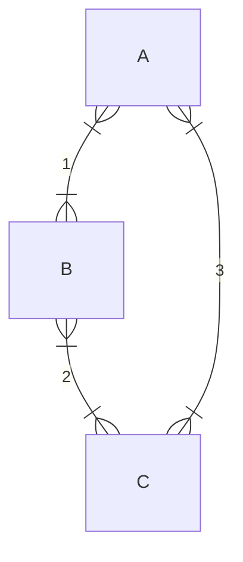

国庆前的最后一次课.

上节课说到生物问题中我们通常会把流体力学中的惯性项去掉，而主要考虑摩擦效应.

微观状态：一个格子上是 $0$ 还是 $1$；宏观状态：格子网络中一共有多少个 $1$. 这是我们传统的统计上的一些概念.

要固定系统的能量，我们让它和一个大热源接触，就能保证它的温度恒定. 在这个条件下我们得到了 Boltzmann 分布.

***

回到上节课结束时讨论的问题，一个 RNA 复制机器产生的错误是多少：我们只关心宏观状态，也就是一共有多少个错误. 错误概率：
$$
P\_i=Me^{-\beta n\varepsilon}
$$
这里 $M$ 是熵造成的因子，可以想象是 $N$ 个点上出现 $n$ 个错误，也就是 $M=C\_N^n$. 于是系统的熵是
$$
\begin{aligned}
S(n)&=k\_B\ln C\_N^n\\\\
&\approx k\_B\[N\ln N-n\ln n-(N-n)\ln(N-n)]\\\\
&=-k\_BN\left(\frac{n}{N}\ln\frac{n}{N}+\frac{N-n}{N}\ln\frac{N-n}{N}\right)
\end{aligned}
$$
自由能：
$$
F=E-TS
$$
我们要求系统的自由能最低，$\partial F/\partial n = 0$，解得系统的分布是
$$
\frac{n}{N}=\frac{1}{e^{\varepsilon/k\_BT}+1}
$$
一般在 DNA 的复制过程中，$\varepsilon$ 为出现一个错误氢键的能量的话，大概是 $9k\_BT$ 量级，出错率非常低 ($10^{-4}$)，上面甚至可以约等于 $e^{-\varepsilon/k\_BT}$.

但是生物的调控远远比这个平衡态系统要精细，实验中复制的错误率是 $10^{-9}$ 量级，这意味着生物的复制机器和调控机制根本不是平衡态的，而是存在更加优化的过程.

对于一个弹簧 $E\_p=\frac{1}{2}kx^2$，我们可以计算这种势能的 Boltzmann 分布，算出所谓的能量均分定理，每个自由度的平均能量都是 $\frac{1}{2}k\_BT$.

熵的另外一个效应是渗透压 (将溶液视为理想气体)：
$$
G=E-TS=-Nk\_BT\ln V,,\quad p=-\frac{\partial G}{\partial V}=\frac{Nk\_BT}{V}=ck\_BT
$$
在微观系统中我们把经典的能量换成自由能，是因为这时候熵的那部分能量占据了一些作用.

熵的下一个重要的效应和水的氢键相关. 如果有一个非极性分子进入水，它会阻挡水分子之间的氢键. 本来作为一个四面体中心的一个水分子拥有六个朝向，但是现在少了一个四面体的角，造成这个水分子少了三种可能的朝向. 于是水分子的熵和自由能变化：
$$
\Delta S=k\_B\ln(3/6)=-k\_B\ln 2,,\quad\Delta G=k\_BT\ln2
$$
这个效果产生的排斥作用
$$
\Delta G/A\sim3k\_BT/nm^2
$$
这是疏水效应.

下一个熵效应来源于细胞内的拥挤状况，在这里大小两种分子会相互挤压，这种「排空力」的大小：
$$
f=-\frac{\partial\Delta G}{\partial d},,\quad\Delta G(d)=k\_BT\ln\frac{\Delta V(x)}{V}
$$
同时大小分子的熵会产生竞争，小分子的量大，更倾向于混乱排布，这反而导致大分子被挤压、排布更加均匀，总体的熵还是增大的.

## 化学反应

在考虑粒子数变化的系统时，我们不再能像之前一样使用巨正则系综 ($\mu$ $V$ $T$ 系综)，而要换成 $N$ $V$ $T$ 系综，也就是正则系综. 化学势：
$$
\begin{aligned}
\mu&=\frac{\partial G}{\partial N\_\mu}=\frac{\partial E}{\partial N\_\mu}-T\frac{\partial S}{\partial N\_\mu}\\\\
&=\varepsilon\_p-\varepsilon\_s+\ln N\_p-\ln(N-N\_p)
\end{aligned}
$$
($p$ 是溶质，$s$ 是溶剂)
$$
\begin{aligned}
&=\varepsilon\_p-\varepsilon\_s+\ln\frac{N\_p/V}{N\_s/V}\frac{c\_p}{c\_{p,0}}\\\\
&=\mu\_{p,0}+\ln\frac{N\_p/V}{N\_s/V}\frac{c\_p}{c\_{p,0}}
\end{aligned}
$$
物理化学上把 $c\_{p,0}$ 定义为标准浓度.

对于一个化学反应
$$
\nu\_1X\_1+\nu\_2X\_2+\cdots\longleftrightarrow\nu\_kX\_k+\cdots+\nu\_NX\_N
$$
这个反应的平衡点由自由能的最小值给出，
$$
\text{d}G=\sum\_i\left(\frac{\partial G}{\partial N\_i}\right)\text{d}N\_i=\sum\_i\mu\_i\nu\_i\text{d}N\_i
$$
平衡条件：
$$
\sum\_i\mu\_i\nu\_i=0
$$

> 这里我们定义反应 LHS 的 $\nu$ 是负的，因为它们在反应中减少.

代入上面的化学势，计算可以得到所谓的化学平衡方程
$$
\prod\_i(C\_i^{(e)})^{\nu\_i}=K\_{eq}
$$
(类似这种，反应物浓度乘积比生成物浓度乘积为常数).

***

下面来先看看最简单的一种反应 —— 受体和配体的结合.

结合的概率：
$$
p\_b=\frac{e^{-\beta(\varepsilon\_b-\mu)}}{e^{-\beta(\varepsilon\_b-\mu)}+e^{-\beta(\varepsilon\_u-\varepsilon\_b)}}=\frac{c}{c+K\_d}
$$
(也就是：结合的 / (结合的 + 没结合的)) 上述概率在 $c\ll K\_d$ 时 $\sim c/K\_d$ (线性)，在 $c\gg K\_d$ 时 $\sim1$ (饱和).

更加复杂的情况是配体一次结合两个受体，
$$
K\_d=\frac{\[R]\[L]^2}{\[RL\_2]}
$$
这时候
$$
p\_b=\frac{\[RL\_2]}{\[R]+\[RL\_2]}=\frac{c^2}{c^2+K\_d^2}
$$
这个函数的图像和趋势已经和上面那个有很大区别. 更一般地，有广义的 Hill 函数
$$
p\_b=\frac{c^n}{c^n+K\_d^n}
$$
但是，这要求这两个位点的结合是相关的；如果两个位点和受体的结合是相互独立的，那么函数应该是
$$
p\_b=\left(\frac{c}{c+K\_d}\right)^2
$$
这两个函数完全不一样.

另外，如果加入更多中性的填充剂，我们能够计算出反应的解离常数和中性分子的体积分数 $r$ 有关：
$$
\frac{K\_d(\phi\_c)}{K\_d^0}=(1-\phi\_c)^r
$$
更多填充剂意味着更好地结合效果.

***

但是我们实际上更关心的是反应的速率而不是平衡状态. 反应速度通过速率常数来刻画，应该有
$$
\frac{\text{d}\[P]}{\text{d}t}=-\frac{\text{d}\[S]}{\text{d}t}=k\_+\[S]-k\_-\[P]
$$
解得体积分数 $x=\[P]/(\[S]+\[P])$ 满足
$$
x(t)=\frac{k\_+}{k\_++k\_-}\[1-e^{-(k\_++k\_-)t}]
$$

* 稳态 $x(\infty)=k\_+/(k\_++k\_-)$；
* 反应平衡常数：$[S](\infty)/[P](\infty)=K\_d$；
* Boltzmann 分布：$x=1/(1+e^{-\Delta E/k\_BT})$.

这三个条件全部给出稳态的状况，于是「速率」和「平衡常数」被联系在一起，有
$$
\frac{k\_-}{k\_+}=K\_d=e^{-\Delta E/k\_BT}
$$
如果动力学 (LHS) 和热力学 (RHS) 想要有关系，就必须有上述条件成立. 当然仅凭这一个方程无法定出速率常数，所以我们还要知道特征时间. 我们定义
$$
k\_-=Ae^{(-\Delta E^\dagger-\Delta E)/k\_BT},,\quad k\_+=Ae^{-\Delta E^\dagger/k\_BT}
$$
(这样逆反应也更难发生，是合理的) 则特征时间：
$$
\tau=\frac{1}{k\_++k\_-}=\frac{e^{\Delta E^\dagger/k\_BT}}{A(1+e^{-\Delta E/k\_BT})}
$$
其中 $\Delta E^\dagger$ 是势垒高度，所以说势垒高度决定了反应速率，这也是酶催化的关键因素.

更加普遍地，对于反应
$$
\sum\_s\nu\_s\[S]\longleftrightarrow\sum\_p\nu\_p\[P]
$$
存在反应「流」：
$$
J\_+=k\_+\prod\_sc\_s^{\nu\_s},,\quad J\_-=k\_-\prod\_pc\_p^{\nu\_p}
$$
动力学平衡是 $J\_+=J\_-$，代入 $K\_d$ 的表达式，上述等式还是给出 $k\_-/k\_+=K\_d$ (这是应该发生的，因为我们没有引入什么新的理论). 然后这里化学势的变化
$$
\Delta\mu = \sum\_s\nu\_s\mu\_s-\sum\_p\nu\_p\mu\_p=k\_BT\ln\left(\frac{k\_+}{k\_-}\right)+k\_BT\left(\prod\_sc\_s^{\nu\_s}/\prod\_pc\_p^{\nu\_p}\right)=k\_BT\ln\frac{J\_+}{J\_-}
$$
这是每进行单位反应的化学势变化，那么每单位时间的反应造成的功率就是
$$
(J\_+-J\_-)\Delta\mu = (J\_+-J\_-)\ln\frac{J\_+}{J\_-}\textcolor{red}{\geq0}
$$
这个功率再乘以 $1/k\_BT$ 就是反应的熵产生率，这正是 **熵增**！

> 这里的概念是否需要在近平衡态才成立？
>
> 并不！这只是对反应做出了「没有中间态」的假设，除此之外对是否是近平衡态没有任何要求，也就是只要是基元反应 (无中间态)，就一定满足上述熵增的规律.

**细致平衡** - 如果有很多个同时进行的反应，比如：

转一圈，得到
$$
\frac{k\_1k\_2k\_3}{k\_{-1}k\_{-2}k\_{-3}}=1
$$
这是细致平衡.

::: warning

细致平衡条件强于单反应的平衡条件，结合稳态流的表达式，利用细致平衡条件可以证明稳态流为零，而普通的平衡不一定有这个效果.

:::
