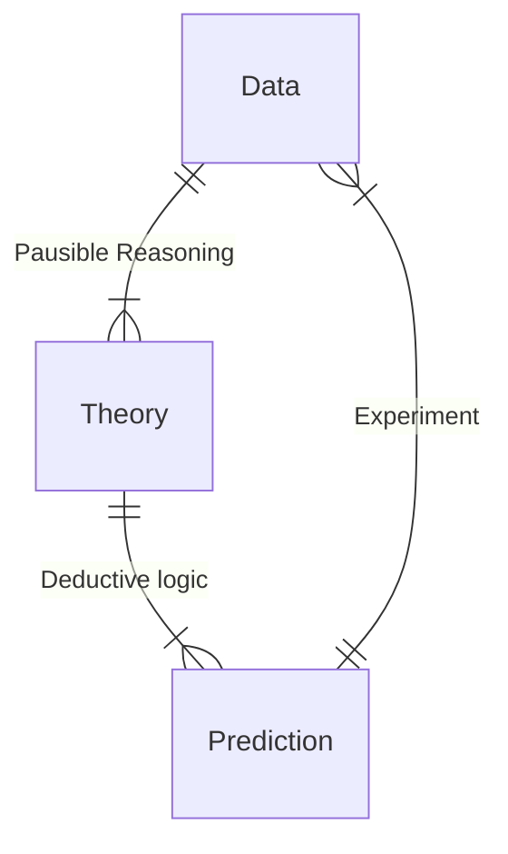

::: right

—— Lessons Learned & Frontiers Ahead

:::

> 赵成老师恰好是「天体物理统计方法」的授课老师.

这是第一场正式的讲座，我们从最大的 senario 开始讲起. 这也是人类最早探寻的科学之一.

我们目前有很多国际上的大型观测天文学项目：

- DES：multi-probe cosmology
- DESI：dynamical dark energy
- Euclid：Q1 quick data release
- ACT：CMB power spectrum
- KiDS：cosmic shear

This is a big party！

我们现在需要更加大的观测或者说实验，来更加深入地了解宇宙. 这次讲座我们要了解我们从观测天文学学到了什么，我们要如何进行下一步的研究.

## A Historical Review

宇宙学是研究宇宙结构、演化和宇宙起源的一门学科.

但是我们不能自己做「宇宙学」的实验，只能观测宇宙；而且我们的宇宙只有一个，我们只能确认宇宙在演化过程中发生了什么，但是无法重复这样的演化过程. 所以我们的研究只能是这样的：

> 他还真喜欢这张关系图 (

我们已经用望远镜观测了很多年宇宙，但是我们观测够了吗？

最早期的时候，人类只能用裸眼观测宇宙. 如果在远离人类踪迹的野地整晚观察夜空，你可能会发现整个夜空是旋转的，绕着 Polaris (北极星). 这是我们唯一能够发现的事实. 因此在这样的观测条件下，人们合理地做出假说：地球在宇宙的中心，天空中的星星绕着我们旋转.

> 实际上我们现在做的事情也是一样 —— 观测、给出模型，再用观测来验证. 我们并没有比以前的人类聪明多少，只是观测到的数据远远多于从前.

沿着历史的发展，人们开始能够使用望远镜来辅助自己的观测. 这时人们发现星体的运动和之前的简单旋转不太一样，比如火星出现了周期性的退行. 人们需要修改自己的模型，于是提出了本轮和均轮 (epicycle). 到这个时候，本轮和均轮使得理论变得越来越复杂.

::: window img no-padding

:::

Copernicus Revolution：Copernicus 用日心说极大地简化了当时复杂的地心说.

Tycho's argument: parallax (1600s)：Tycho 发明了用角秒来描述星体距离的方法，他利用夏天和冬天地球相对于太阳的位置不同，观察到的星体位置不同，来证明日心说的成立. 同时，如果日心说成立，星体离我们的距离不会这么远. 因此他得到近似于目前的宇宙理论，但是限于时代，他没有提出新的理论，而是选择了更加贴合他观测的日心说.

之后 Galileo 得到了新的观测数据、Kepler 得到了星体的运行定律，再加上 Newton 的新理论出现，日心说终于得到认可. 同时，人们的观念进化了，我们现在知道，不管是地球还是太阳，都不是宇宙中特殊的观察者. 这构成了现代宇宙学的基础，所以我们说，这时现代宇宙学的开端.

第一条宇宙学定律是 Newton 的引力定律：

$$
F=-G\frac{m_1m_2}{r^2}
$$

当然，到 1915 年，Einstein 创造了广义相对论. 不过 Newton 的定律仍然在大多数的情况下适用.

::: tip

Quiz：如果只有引力，宇宙到底是会稳定存在、扩张还是坍缩？

因为 Copernicus 原理，宇宙没有中心，所以宇宙一定不会稳定存在 (不会有一个中心让宇宙能够稳定旋转). 由不同的初始条件，宇宙可能减速膨胀或者坍缩.

:::

但是 1920's，Hubble 发现 Hubble 定律，越远的星体就以越大的速度远离我们，因此宇宙是正在扩张的. 那么我们可以预测，在时间的早期，宇宙一定非常小、非常热，宇宙存在一个起点.

Lemaitre & Gamov 提出大爆炸理论 (1927)，预测早期的光子频率越来越低，到现在为止应该是射电波段，也就是 CMB. 1964 年 Penzias & Wilson 观测到了这样的微波背景辐射，这时已经过去了将近 40 年.

::: tip

为什么观测证据和理论结果时间上相差这么多？

这和十年前发现的引力波差不多，引力波的预言也是在 1920-1930's.

因为宇宙学是极度依赖于技术的，人们需要花数十年来发展强大的技术才能探测这样的微小结果，宇宙学不仅是 science 的，也是 technology 的.

:::

1998 年，人们利用造父变星作为新的宇宙标准尺度，发现现在的宇宙正在加速膨胀：

::: window img no-padding

:::

从历史的发展来看，我们对宇宙的了解永远受限于对宇宙的观测. 新的观测手段总是革命性的加深我们对宇宙的认识. 到目前为止，宇宙学仍然是一门观测驱动的科学，所以：**DO OBSERVE!**

不管是地心说还是现代宇宙模型，其中的逻辑并没有变化：

- 基于观测数据合理推测建模
- 发现异常
- 加入新的理论修正来描述异常
- 宇宙模型复杂化
- 会有一个新的 Copernican Model 吗？

就像现在，我们发现了暗能量和暗物质，对现有的模型做了很多修正. 但是这是否让理论变得更加复杂了？

::: window img no-padding

:::

## Cosmological Probes

### Distance Ladder

- Distance Ladder: Parallax

  用地球在不同季节的不同位置，观察星空中同一颗星的不同位置，来测量星体距离我们的距离、星体之间的相对距离.

  Gaia Mission 卫星就是做这个工作的. 但是这个方法只能测量不太远的星体，测量范围甚至没有超出银河系.

- Distance Ladder: Variable Stars

  用变星来测量距离，变星的亮度随着引力坍缩和核反应膨胀而周期性变化，这个周期和亮度在地球上可以测量，所以可以用亮度随距离的变化来测量距离.

  这样的方法的测量范围取决于我们用到的变星位置.

- Distance Ladder: Galaxy Properties

  利用星系的位置关系来测量距离.

Type Ia Supernova：$\text{I}a$ 型超新星，它们爆炸后有同样的亮度，且我们了解这样的超新星的亮度变化曲线，可以作为标准烛光. 这种测量方法已经将范围拓展到红移 1 的星体.

### CMB

CMB 的温度大致是 $2.7\text{ K}$，在这样的 CMB 温度图下，我们能看到非常好的单极温度谱，这提供了一个很好的 Copernicus 原理的证明：宇宙是均匀的. 另外有一个偶极项，当然可能是宇宙不均匀，不过我们更愿意相信是地球与 CMB 之间有一个相对的速度.

同时 CMB 的功率谱有一些两点关联函数，这些表征了宇宙早期的量子涨落.

CMB 对于宇宙的曲率 $\Omega$ 也有揭示 (见 [星系与宇宙](/cosmos/)).

CMB 的发现表征宇宙的 $69\%$ 是暗能量，$24\%$ 是暗物质，只有剩下的一点是我们已经熟知的物质.

::: tip

CMB 是我们能看到的最早的宇宙吗？

并不是，中微子的解耦更早，如果我们利用中微子来测量宇宙，我们能看到更早的所谓 C$\nu$B.

:::

### Galaxy Clustering

早期宇宙存在量子涨落，重子和光子组成的耦合体随着量子涨落的增长而膨胀，但是光子解耦后，重子留在原地，形成了一个声学波，这个声学波的速度慢于逃逸的光速；另外，暗物质的运动速度更加缓慢，解耦也更早，留下来的声学波边界也更小.

这样的声学波在解耦之后被固化，可以测量不同位置的重子声学震荡 (BAO)，来确定宇宙早期是如何膨胀的，了解暴涨时期的暗能量作用.

DESI 的研究就是在利用 BAO 来探究暗能量的本质.

Tsinghua 的有关新项目是 MUST，我们想要研究更大量的星系，获得更大量的数据集.

---

还有很多另外的 massenger，比如弱引力透镜、引力波 (探测黑洞融合)、……

::: tip

我们能合并不同的这些方法得到的结果吗？

NO! 这些方法得到的结果并不一样！这意味着总有一些方法有问题，或者受到了未知的涨落干扰.

:::

到目前为止，观测天文学还是有很多未知的内容.
