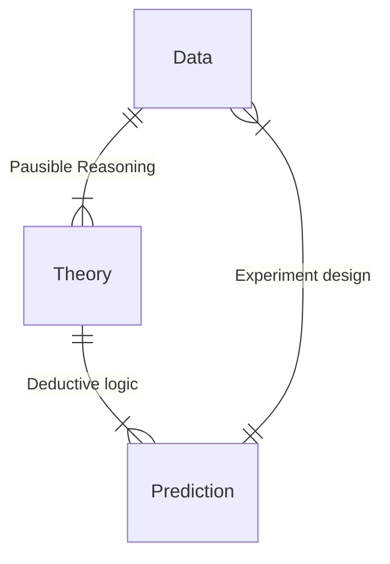

## Introduction

有必要分享一下开这门课的目的：统计课应该是每一位成熟的大学生学习的，因为教的是「逻辑」. 当然统计系也会开统计课，不同领域都会用到统计相关的方法，毕竟是一种基础的工具. 在学习统计时，要把它和它的应用结合在一起，才会不至于太枯燥.

统计从诞生之初就和天文相关，到目前为止还有很强的交叉性.

这门课程的目的：

- 了解「数据」(或者说经验) 如何转变为「知识」.

  > 比如北京每年都下雨，那么明年大概率也会下雨.

- 作假设和决策：忠实地知道自己知道什么、不知道什么，量化这样的判断.

- 天文相关的数据处理：通常，这是不完备的 (一个天体很暗，看不到) 并且有噪声的.

  > 对比自己的生活，也是「不完备的」，很多时候我们并不了解真正的科研或者生活中发生的一些事情，观察是很有限的，要在这样的情况下做出合理的决策.

- 解决科研和生活中的问题，学会分析问题解决问题的方法.

- 一些批判性思维与技能：作出可读的图、清晰的解释、合理的总结.

希望大家能够学会：

- 把一个具体的问题变成一个统计的问题；

- 评估和理解所谓的「不确定性」，不管是生活中的还是研究中的；

- 面对不同的问题，能够选择合适的不同方法；

  > 如果大家上过统计相关的课程，可能会发现不同的人对不同的问题会给出很多花样繁多的方法，方法一多就不知道该用什么. 我们需要了解方法的选择.

- 一些简单的代码能力；

- 学到的知识指导生活和工作.

后面的每一节课都会有具体的问题，这是一个问题驱动的课堂；另外，我们会尽量少地使用数学，而是使用生活常识来试图解决问题；在课堂上利用的方法，都会是实际科研中能够应用得上的方法，并讨论为什么使用这样的方法，加深对这些东西的印象. 最后在课堂上希望大家能够做出能够跑起来的代码.

| Lecture |    Date    |               Topic                |
| :-----: | :--------: | :--------------------------------: |
|   01    | 2025.09.18 |            Introduction            |
|   02    | 2025.09.25 |         Probability Theory         |
|   03    | 2025.09.28 | Probability Distribution Functions |
|   04    | 2025.10.09 |        Parameter Estimation        |
|   05    | 2025.10.16 |          Model Selection           |
|   06    | 2025.10.23 |       Multivariate Analysis        |
|   07    | 2025.10.30 |             Regression             |
|   08    | 2025.11.06 |      Nonparametric Statistics      |
|   09    | 2025.11.13 |         Density Estimation         |
|   10    | 2025.11.20 |    Clustering & Classification     |
|   11    | 2025.11.27 |     Censored & Truncated Data      |
|   12    | 2025.12.04 |        Time Series Analysis        |
|   13    | 2025.12.11 |  Guest Lecture: Al for astronomy   |
|   14    | 2025.12.18 |         Spatial Statistics         |
|   15    | 2025.12.25 |           Project Report           |

(前面几节课可能有数学，后面基本是将问题转化为代码的能力)

成绩评定：

- $10\%$ 是课堂参与；

- $40\%$ 是作业，每次作业有三个题，第一个是上课解决的，第二个是难度相当的，第三个是更加困难一点的问题；迟交扣分，deadline 是 2 周；

  > 希望大家把设备带到课堂上.

- $50\%$ 是大作业，给大家 $4\sim5$ 个小课题，数据来源都是真实的前沿数据，当然会设定边界使得这个问题可做. 另外小组成员看到的问题方面是不同的，所以每个人的报告都会有差异；

- $5\%$ 的加分来自于用英文写报告.

上学期经验来讲，会用 AI 的话一般两小时能够完成作业.

参考书：

- _Statistics, Data Mining, and Machine Learning in Astronomy_ (A Practical Python Guide for the Analysis of Survey Data), _Ivezić, et al._ 这本书甚至单独写了一个 py 库；

  > 这本书建议有志于研究天文的学生读.

- _Data Analysis_ (A Bayesian Tutorial), Sivia & Skilling

  > 这是一本比较数学的书，可以当作一种「字典」.

- _Practical Statistics for Astronomers_, Wall & Jenkins

- _Modern Statistical Methods for Astronomy With R Applications_, Feigelson & Babu

- _Probability Theory_ (The Logic of Science), Jaynes

- _Numerical Recipes_ (The Art of Scientific Computing), Press, et al.

FAQs：

- "No astro background?"

  > 没有必要，当然最后几节课可能稍微有一点联系.

- "Prior knowledge?"

  > 微积分和线性代数，剩下的只有一个有逻辑思维的大脑.

- "Math?"

  > 主要是逻辑推理.

- "Coding skill?"

  > 没有代码能力的要求.

- "AI?"

  > 要理解 AI 说了什么.

## Lead - In

The true logic of this world is the calculus of probalility.

::: right

—— Maxwell

:::

### 为什么要在天文中用统计？

在所有领域都有统计，不只是天文.

Deductive logic (演绎逻辑) v.s. Pausible reasoning (合情推理)



$\uparrow$ 这是我们对这个世界的认识模式.

演绎逻辑：

> $A\Rightarrow B$ (已知 $A$ 为真，$B$ 为真)
>
> > All men are mortal. & Socrates is a man.
> >
> > $\Rightarrow$ Socrates is mortal.
>
> 这时，同一个 cause 可以推出很多不同的 outcome.

合情推理：

> $A\Rightarrow B$，现在我知道 $B$ 真，那么 $A$ 真的可能性变大；如果知道 $A$ 假，那么 $B$ 假的可能性变大.
>
> > 下雨地面会湿. & 地面是湿的.
> >
> > $\Rightarrow$ 刚刚应该下了雨.
>
> 这样的推理方式适用于一些 causes 很多、outcomes 也很多的情况；它的三段论更加弱.

一副图片：一个写着吕洞宾的月饼被咬了一口. 看到这样的图片，你的推理能被怎样描述为三段论？

> 作一个非常强的前提：狗和吕洞宾在一起，吕洞宾会被咬. 现在我已知月饼 (吕洞宾) 被咬了. 那么弱三段论的结果应该得到：拿着这个月饼的人是狗.
>
> 这个例子是明显的合情推理，但是我们在日常可能会遇到不少判断不清是何种推理的情况，需要做出清晰的认识.

::: tip

/Group discussion/ most fundamental difference between deductive & plausible reasoning

1. Direction of reasoning
2. Amount of prior knowledge
3. <span style="color: red">Completeness of information</span>
4. Ability to make predictions
5. Certainty of conclusions

其实最本质的区别在于，是从果到因推理还是从因到果推理，也就是我们知晓的信息是否完备，这就是我们需要在天文中做统计的原因.

:::

在演绎推理的过程中，我们只是在合理往后推断；但是合情推理中，我们需要关心证据的强度. 这对应两种问题，前者是利用一个被认为是正确的理论来导出合理的结果；后者则是用不完备的信息来反推可能成立的理论.

将上面的合情推理定量化的方式，就是统计.

典型的天文数据：被引力透镜扭曲、遥远的位置产生光削弱、不同天体带来的噪声、…… 为了能够看到尽可能多的东西，我们一般会将仪器使用到极限，这时接收到的光子数已经非常少，噪声极大；同时我们没办法做「重复实验」，不能让宇宙重新演化一遍，超新星爆发了就已经爆发了，宇宙当前的演化是这样，早期的量子涨落也没办法重来；同时暗的源永远比亮的源多，做观测时突然有一个星链的卫星飞过，数据就不完备了；前景的污染强烈，人造灯光和大气层等等造成了很多杂音.

$\Longrightarrow$ 天文的数据是极度不完备的！

所以我们在天文中必须学会统计和建模，判断哪些理论是对的、下一步该进行什么样的观测.

"Science, and in particular Modern Astronomy and Astrophysics, is impossible without knowledge of probability and statistics."

::: right

—— John Peacock

:::

### 什么是概率？

从历史的角度，来看看不同的人对概率有什么样的看法；概率的不同概念...

1713 年，Jakob Bernoulli 逐步开始建立起统计学，提出了「Principle of Insufficient Reason」，也就是当你无法区分 $N$ 个事件中哪个更有可能，则它们的概率相等，都是 $1/N$.

1763 年，Thomas Bayes 想到，通过我们现有的知识可以更新我们对概率的认识，比如如果我们在上面 Bernoulli 的情况中多了解了一些证据支持某一个事件，则这个事件的概率变高.

1795 年，Gauss 建立了 Gauss 分布和最小二乘法. 这些方法就是用来处理天文数据的.

1820 年，Laplace 自己重新发现了 Bayes 原理，并将功劳归功于之前的 Bayes. 和 Gauss 一样，他开始用这些原理统计天文数据.

1850's，上面的理论在很长时间内被忽视了，取而代之的是 frequentists (频率学家们). 这是因为之前我们的「均等概率假说」这样的概念听起来有很大的主观性，难道我们了解的知识会影响事件发生的概率吗？同时，Bayes 原理对计算的要求天然就很高，一个简单的问题可能就会让计算机算不少时间，何况那时没有计算机.

1920's，电子计算机出现、数据量大量增加后，Bayes 原理重新开始发挥它的作用.

Frequentists v.s. Bayesian：Laplace 利用当时的轨道数据来推算土星的质量可能值，得到了一个质量 - 概率图. 但是这个概率意味着什么？土星的质量会变吗？

> 变化的并不是土星的质量本身，而是我们对这个质量值的信任程度.
>
> 但是频率学家认为，土星的质量是一个常数，你的信念和我的信念不一样，那该用什么样的概率呢？他们认为 Bayes 学派的概率并不客观，真正客观的是长期的实验得到的大量数据中出现的频率.
>
> 但是土星质量用频率学家的观点似乎没办法解决. 他们想到的方法是，认为观测数据有随机的噪声，测量的是噪声的概率. 但是这样就会导致不同的问题需要不同的噪声分析，频率学家的工具箱变得极为复杂，对白噪声、红噪声等等要分开分析.
>
> 这时候不得不问：在没办法重复实验时，怎么预测？如果只有随机变量才有概率，那么什么是「随机变量」？如果测量误差有概率，那么测量误差真的是「随机变量」吗？

::: tip

/Group discussion/ What are real randoms?

1. Flipping a fair coin
2. Numerical random number generator
3. Dynamics of chaotic systems (e.g., three-body problem)
4. State of elementary particles

大家没有共识，意味着大家对「随机」的认识并不一样.

大家都觉得 B 不对，但是假设我要用 Ment-Carlo 来计算 $\pi$，如果数据不随机，我就算不对 $\pi$；但是在电脑里生成伪随机数来算，可以得到对的结果.

对于 D，电脑里那么多量子效应，但是我们会选择相信电脑给出的结果，这是随机吗？

是否随机，取决于我们对这个事件了解的多少，以及和我们正在做的这个问题的联系. 比如让小朋友做算数，得到的结果就像一个随机分布，这就是因为掌握的信息不够. 因此，按照 Bayes 的观念，一个事情只要对我们研究的问题没有影响，就能认为这是随机的.

也就是说，虽然 Bayes 原理有主观性，但是我们承认主观性，对我们来说概率还是基于手头的知识和数据. 在这个程度上，我们永远无法证明一个理论是正确的，因为信息永远不完备，不管是力学混沌系统还是抛硬币，我们只要对数据知道得任意精确、有足够强的算力，就能计算出结果.

:::

### 统计和天文的关系

这两者很多时候是共同发展的，不管是早期、还是最近三十年以来. 老师个人认为，所有的天文都是在玩统计.

::: steps

- Laplace & Gauss 的时代
  大家用 Bayes 观点处理谷神星、土星等等天文问题
- frequentists 的时代

  因为 Bayes 算法很难计算，两者逐渐脱节

- 20 世纪初

  二者又开始结合

- 早期的人工智能 (和大语言模型不一样)

:::

现在面临的问题是数据量越来越大 ($\text{PB/week}$ 量级)、模型越来越精细，和计算的结合也更加紧密，所以需求更好的统计方法和算法.

---

这节课最终的目的：就是理解这样的图片 $\downarrow$

::: window img no-padding


:::

后面我们会讲简单的统计，后半学期我们将了解很多更加细节的方法，也会见到出现在公开文章中的错误例子 (混用弱三段论和强三段论).

## Python Tutorial

现在开始教大家简单的 python 脚本，课程最后的作业也会上交一个 Jupyter Notebook.

```python
# 导入需要的包
import numpy as np
import matplotlib.pyplot as plt

# 在 Jupyter Notebook 中更方便地画图
%matplotlib inline

# 固定种子和生成随机数
N = 10000
seed = 12
rng = np.random.default_rng(seed)
data = rng.random(N)

# 画直方图
plt.hist(data, bins=20, range=(0, 1));
```

作业会在 Jupyter 服务器上布置.
