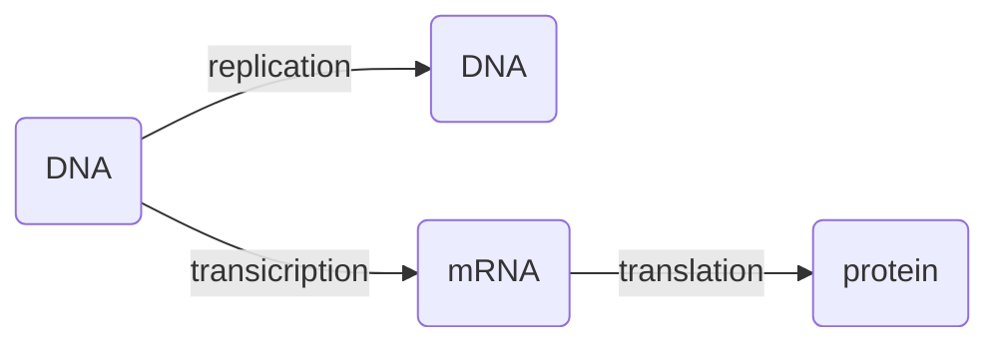

甲基化在放大效应中的作用：调整下式的 $K_d$，
$$
\frac{X^*}{X_{\max}} = \frac{1}{1+(S/K_d)^n}\tag{1}
$$
也就是接收到的信号和最终放大到的信号之间的比值是一个 Hill 函数. 甲基化使得 Hill 函数图像的快变区域变化，也就是根据测量结果来改变系统的状态，使得响应适应外界环境的变化，始终保持灵敏. 如果有 $m$ 个甲基，那么根据 Boltzmann 分布律大概可以估算
$$
K_d\propto e^{-\beta\Delta F(m)}\sim e^{\gamma m}
$$
甲基化的方程为
$$
\frac{\text{d}m}{\text{d}t}=V_RR-V_BBX^*\tag{2}
$$
($m$ 是甲基个数，$V_R$ 和 $V_B$ 分别是甲基化和去甲基化的作用效率.) 上述两个方程合在一起，得到每次环境发生变化时，甲基化的个数会改变到一个稳定值.

::: warning

也就是，甲基化是一种「memory」，表征了外界当前的背景信号是多少. 这和 Maxwell's Demon 不谋而合，记忆由外界而改变，产生熵.

:::

甲基化的「记忆」取决于外部背景信息的倍数关系 (而不是绝对值)，有
$$
\frac{\text{d}\tilde K}{\text{d}t} = c\tilde K(a_{ss}-a)
$$
普遍地总结是所谓的 Weber-Fechner law，也就是生物的感知系统都是感知相对变化，比如声音的单位就是分贝，这是一个对数单位.

---

下面我们来说生物网络之间的运作.

中心法则：

下面这个网络就是海胆的很多个基因之间的相互作用关系：

转录过程的方程：
$$
\frac{\text{d}p(m,t)}{\text{d}t} = -\underset{m\to m+1}{\underline{kp(m,t)}}+\underset{m-1\to m}{\underline{kp(m-1,t)}}-\underset{m\to m-1}{\underline{\gamma mp(m,t)}}+\underset{m+1\to m}{\underline{\gamma(m+1)p(m+1,t)}}
$$
边界条件是 $p(m<0,t)=0$. 这是一个可解的线性方程，其中 $\gamma$ 是 mRNA 的 lifetime.

下一个时刻的 mRNA 数量变化相对速度和这一时刻的没有关系，因为转录和降解都和 mRNA 当前数量无关. 在 DNA 未激活的状态下，mRNA 只有降解效应；仅仅在 DNA 激活状态下才有 mRNA 的增加和因此产生的减少.

* 当 $k^\pm\gg\gamma$ 时，平衡态是正向产生 mRNA，mRNA 的数量呈现 Poisson 分布 (转录的事件相互独立)；
* 当 $k^\pm\ll\gamma$ 时，对于 off 态和 on 态各有一个 Poisson 分布.

---

Gillespie Algorithm：一种无偏的随机模拟算法.

背景是，考虑反应 $A\longleftrightarrow B$，正向速率为 $k_1$，反向速率为 $k_2$，我们想要模拟知道 $t\to t+\Delta t$ 时间内，这个反应发生的概率.

常用的 Monte-Carlo 方法是，取一个 $k_1\Delta t$ 和一个 $k_2\Delta t$ 在 $[0,1]$ 之间，然后每一次取两个随机数 $\xi_1,\xi_2\in(0,1)$. 如果 $\xi_i> k_i\Delta t$，那么这个反应发生；反之不发生. 如果两个同时发生或者同时不发生，那么相当于什么也没做. 之后再进行下一步.

但是这种传统手段的问题是，我们需要很小的 $\Delta t$，但是不能太小以保证能够计算出结果.

Gillespie 的想法是，对一个指数分布 $e^{\tau/(k_1+k_2)}$ 采样：因为
$$
P_0(\Delta t+\text{d}t) = P_0(\Delta t)\left(1-\sum_ik_i\text{d}t\right)\Longrightarrow P_0(\Delta t)\sim e^{\displaystyle{-\sum_ik_i\Delta t}}
$$
所以每一次先从上面这样的指数分布 $e^{\tau/(k_1+k_2)}$ 里面产生一个 $\tau$ (反应间隔时间)，然后产生完间隔时间之后再掷一次骰子，决定一个 $(0,1)$ 的随机数和 $k_1/(k_1+k_2)$ 之间的大小关系，如果是大于那么反应反向进行、小于那么反应正向进行，最终得到一个「每次时间间隔不均匀」的时序曲线.