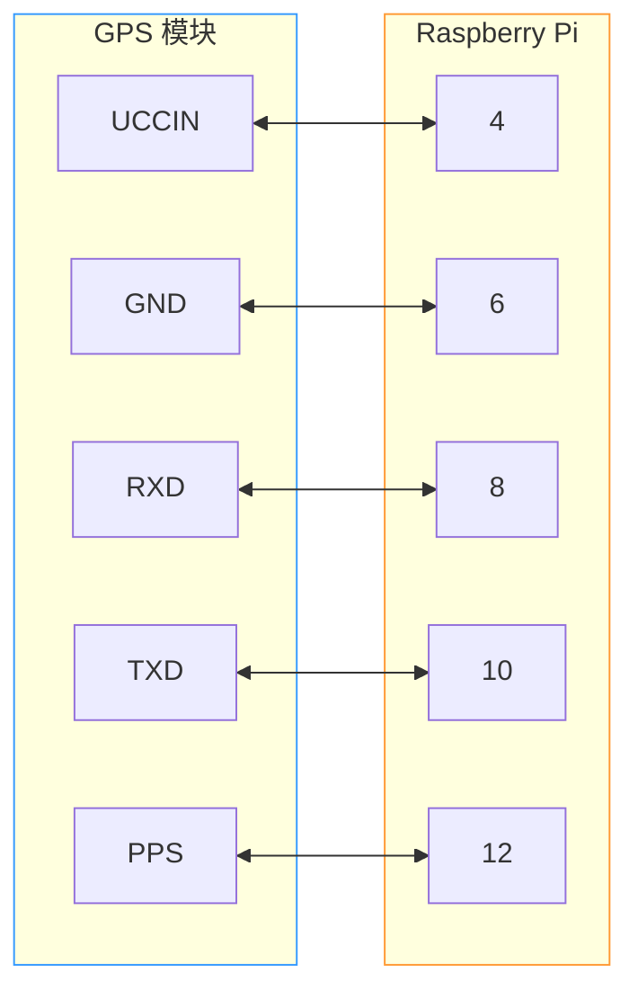

::: warning

本文正在长期更新阶段.

:::

我们对于边缘站点考虑用树莓派 5 进行数据的初步处理，但是我手上只有一台树莓派 4B. 鉴于这两代之间的 gpio (General Purpose Input & Output) 是一样的，所以暂时先用 4B 来尝试一下.

首先说明一下，我的这台树莓派 4B 已经安装了 [GMN](https://globalmeteornetwork.org/) 为树莓派设计的 RMS 流星监测系统.

::: tip

这个系统的下载地址和安装文档见：[https://globalmeteornetwork.org/wiki/index.php?title=Installing_OS_onto_a_Raspberry_Pi](https://globalmeteornetwork.org/wiki/index.php?title=Installing_OS_onto_a_Raspberry_Pi)

要注意的是，这个系统是基于 Bullseye 的，也就是 debian 11.x. debian 11.0 在 2021 年 8 月 14 日发行，11.11 在 2024 年 8 月 31 日发行，Bullseye 的生命周期为 5 年：前面 3 年 (也就是到 2024 年 8 月 14 日) 为 full debian support；后面 2 年 (直到 2026 年 8 月 31 日) 为 LTS (Long Time Support). 因此我想我也得更新一下系统了.

:::

## GPS 的 PPS 时间同步

本部分主要参考 [这篇文章](https://www.workswiththeweb.com/piprojects/2023/08/06/RBPi-NTP-Server).

为了精确地同步任意两个站点之间的时间 (必须达到亚毫秒量级，否则最严重的情况是两地完全无法确定捕捉到的信号是同一颗流星、最好的情况则是定轨出现大幅度的误差.)，我们会在树莓派上面安装 GPS 模块. 说是安装，实际上就是把买来的 GPS 模块用一组排线连接到树莓派上面. 而不像 Windows 一样使用 NTP 协议进行时间同步是因为，NTP 协议本身的精度就只能达到毫秒量级，远远不足以达到我们的要求. 其实之前在 [流星监控项目 I](/posts/dyzf1tgp/) 的阶段，我们也想过在 Windows 上用 PPS 做时间同步，但是并没有实现，因为一直没有找到相关的时间同步工具，唯一找到的只有 [Meinberg NTP](https://www.meinbergglobal.com/english/sw/ntp.htm)，这个玩意实在是过于难以使用 (而且是基于 NTP 协议)，只好作罢. 那时候就已经发现了 Linux 系统上面有一个绝佳的工具 [chrony](https://chrony-project.org/)，只可惜我当时读了很久的文档发现它仅仅支持 Linux. 不过既然我们已经有了装好 debian 的树莓派 4B，那么就该开始舒适地使用 chrony.

首先依旧是排线. 这一次的排线和 Windows 相比实际上差不多，用到的是树莓派的 4, 6, 8, 10, 12 接口. 具体接线如图：



其中树莓派上面引脚的编号按照下图所示：

::: demo-wrapper img no-padding


:::

::: tip

下面的操作假设已经安装了 debian 11 及之后的系统 (在 debian 13 上也测试过)；假设已经安装了 vim (因为 nano 在做这种编辑的时候我实在是用不习惯.)

:::

:::: steps

- 用管理员权限编辑 DHCP 客户端守护进程配置文件 `/etc/dhcpcd.conf`

  ```bash:no-line-numbers
  sudo vi /etc/dhcpcd.conf
  ```

  在文件中加入下面几行：

  ```plaintext
  interface eth0
  static ip_address=192.168.0.2/24
  static routers=192.168.0.1
  static domain_name_servers=192.168.0.1
  ```

  重启 DHCP 服务：

  ```bash:no-line-numbers
  service networking restart
  ```

- 配置时区
  查看当前时区：

  ```bash:no-line-numbers
  timedatectl
  ```

  查看时区列表：

  ```bash:no-line-numbers
  timedatectl list-timezones
  ```

  设定当前时区：

  ```bash:no-line-numbers
  sudo timedatectl set-timezone Asia/Shanghai
  ```

- 更新 `apt`
  就是普通的更新步骤，为了防止出现额外的差错.

  ```bash:no-line-numbers
  sudo apt update
  sudo apt upgrade

  sudo reboot
  ```

- 安装 PPS 时间同步所需要的软件包

  ```bash:no-line-numbers
  sudo apt install pps-tools gpsd gpsd-clients python3-gps chrony
  ```

  它们分别的功能：
  - [pps-tools](http://linuxpps.org/doku.php) - 包含了 Linux 系统中用来调用读取 PPS 信号的 API (换句话说，这是个驱动.)
  - [gpsd](https://gpsd.gitlab.io/gpsd/) - 通过 TCP 2947 端口识别 GPS 硬件设备 (换句话说，这是 GPS 的驱动.)
  - [gpsd-clients](https://gpsd.gitlab.io/gpsd/) - 上面那个 gpsd 的用户交互界面.
  - [python3-gps](https://gpsd.gitlab.io/gpsd/) - 用来和 gpsd 交互的 python 代码包.
  - [chrony](https://chrony-project.org/) - 一个 ntpd (我们在 Windows 上见过的那个超级难用的东西) 在 Linux 下的替代品. 不过我认为这是一个极佳的优化品.

- 系统层面的准备
  修改 `/boot/config.txt`：

  ```bash:no-line-numbers
  sudo bash -c "echo 'dtoverlay=pps-gpio,gpiopin=18' >> /boot/config.txt"
  sudo bash -c "echo 'enable_uart=1' >> /boot/config.txt"
  sudo bash -c "echo 'init_uart_baud=9600' >> /boot/config.txt"
  ```

  修改 `/etc/modules`：

  ```bash:no-line-numbers
  sudo bash -c "echo 'pps-gpio' >> /etc/modules"
  ```

  进入树莓派硬件设置，enable 特定端口：

  ```bash:no-line-numbers
  sudo raspi-config
  ```

  这之后会弹出一个界面，在界面中选择：

  ```mermaid
  flowchart TB
      A[3 – Interface options] --> B[I6 – Serial Port]
      B --> Option-1
      Option-1 --> Option-2
      Option-2 --> D[Finish]

      subgraph Option-1
        B1[Would you like a login shell to be available over serial?]
        B2[No]
        B1 --> B2
      end

      subgraph Option-2
        C1[Would you like the serial port hardware to be enabled?]
        C2[Yes]
        C1 --> C2
      end

  ```

  重启树莓派：

  ```bash:no-line-numbers
  sudo reboot
  ```

- 配置 PPS 端口
  首先确认 PPS 被正确识别了：

  ```bash:no-line-numbers
  lsmod | grep pps
  ```

  这里的输出如果有 `pps_gpio` 后面一串数字就是有内容，反之则会显示无法找到. 为了看到 PPS 那个端口输出了什么东西，可以输入

  ```bash:no-line-numbers
  sudo ppstest /dev/pps0
  ```

  这里能够看到一个每秒输出的信号，按 `Ctrl + C` 退出.
  ::: warning
  这里的信号有可能每一条都返回的是 `error -1` 之类的内容，看起来有很大问题，但是实际上的原因可能只是天线没有拿到室外，导致 GPS 模块没接收到信号.
  :::

- gpsd 配置
  首先配置开机自启动：

  ```bash:no-line-numbers
  sudo vi /etc/default/gpsd
  ```

  ::: warning
  原文这里没写 `sudo`，实测发现不行，还是要 root 权限.
  :::
  修改成下面这样：

  ```plaintext
  START_DAEMON="true"
  DEVICES="/dev/ttyS0 /dev/pps0"
  GPSD_OPTIONS="-n"
  USBAUTO="true"
  ```

  之后重启系统：

  ```bash:no-line-numbers
  sudo reboot
  ```

  用 gpsd-clients 查看 GPS 信号的接收情况：

  ```bash:no-line-numbers
  gpsmon
  ```

  应该看到类似这样的界面：
  ::: demo-wrapper img no-padding
  
  :::
  (别来盒我 $Q\omega Q$)
  如果只有一长串报错信息，比如下面这种，就说明 GPS 模块没有被识别.

  ```:no-line-numbers
  tcp://localhost:2947          JSON slave driver>
  (82) {"class":"VERSION","release":"3.22","rev":"3.22","proto_major":3,"proto_minor":14}
  (262) {"class":"DEVICES","devices":[{"class":"DEVICE","path":"/dev/ttyS0","activated":"2023-08-06T15:25:27.449Z","native":0,"bps":9600,"parity":"N","stopbits":1,"cycle":1.00},{"class"
  :"DEVICE","path":"/dev/pps0","driver":"PPS","activated":"2023-08-06T15:25:27.472Z"}]}
  (122) {"class":"WATCH","enable":true,"json":false,"nmea":false,"raw":2,"scaled":false,"timing":false,"split24":false,"pps":true}
  ```

  ::: warning
  实际上这里有两种可能：我们在树莓派 5 上面测试的时候也出现了同样的问题，但是接线并没有出错，原因是树莓派 5 默认的接口不再是前面提到的 `ttyS0`，而有可能变成 `serial0`，导致配置文件里面写的和硬件连接对不上号，无法识别硬件.
  :::

- chrony 设置
  首先要编辑 chrony 的配置文件，

  ```bash:no-line-numbers
  sudo vi /etc/chrony/chrony.conf
  ```

  进入之后加入下述内容：

  ```plaintext{12-13}
  server time-a-b.nist.gov iburst
  server time-a-g.nist.gov
  server time-c-wwv.nist.gov
  server utcnist3.colorado.edu
  server 0.us.pool.ntp.org
  server time.cloudflare.com
  server time.windows.com
  server time.apple.com

  local stratum 10

  refclock SHM 0 refid NMEA precision 1e-1 offset 0.5 delay 0.2 noselect
  refclock SHM 1 refid PPS precision 1e-7 lock NMEA

  allow 192.168.0.0/16
  ```

  前面几行指定 server 是为了在 GPS 不工作的情况下，通过网络连接到全球各地的服务器上面进行时间同步. 另外，我这里的 `refclock` 配置和参考文章中写得不太一样，这是因为我之前用参考文章里面的代码没有成功，所以问了 Gemini，得到现在配置文件中的这个代码.
  之后重启 chrony：

  ```bash:no-line-numbers
  sudo systemctl restart chrony
  ```

  ::: danger
  这里要特别注意一下，`refclock` 配置中 `SHM` 后面的那一个数字，代表了读取的时候的窗口序号. 用命令 `sudo ntpshmmon` 测试，应该能够看到每秒有两条输出，每条输出中都含有类似 `NTP0`、`NTP1`、`NTP2` 之类的内容，这里的数字表明了之前 `SHM` 那里的数字我们应该填写什么.
  我配置的时候输出的是 `NTP0` 和 `NTP2`，所以应该把配置文件的第二个 `refclock` 改成 `SHM 2`.
  :::

- 验证时间同步服务
  有三条验证的命令. 首先是查看所有时间同步方式的状态：
  ```bash:no-line-numbers
  chronyc -n sourcestats
  ```
  输出结果是每个同步服务器的偏移和延迟等等.
  ```:no-line-numbers
  Name/IP Address            NP  NR  Span  Frequency  Freq Skew  Offset  Std Dev
  ==============================================================================
  NMEA                        0   0     0     +0.000   2000.000     +0ns  4000ms
  GPS                         0   0     0     +0.000   2000.000     +0ns  4000ms
  132.163.96.1                1   0     0     +0.000   2000.000  +1585us  4000ms
  129.6.15.28                 1   0     0     +0.000   2000.000  -1381us  4000ms
  132.163.97.3                1   0     0     +0.000   2000.000   -750us  4000ms
  128.138.140.211             1   0     0     +0.000   2000.000  -1720us  4000ms
  5.78.71.97                  1   0     0     +0.000   2000.000  +1208us  4000ms
  162.159.200.1               1   0     0     +0.000   2000.000  -2466us  4000ms
  40.119.6.228                1   0     0     +0.000   2000.000  -2860us  4000ms
  17.253.126.253              1   0     0     +0.000   2000.000  -2831us  4000ms
  ```
  第二个命令是查看当前所使用的源和其他所有源的可用性：
  ```bash:no-line-numbers
  chronyc -n sources -v
  ```
  输出结果比较复杂，是下面的形式：
  ```:no-line-numbers
    .-- Source mode  '^' = server, '=' = peer, '#' = local clock.
  / .- Source state '*' = current best, '+' = combined, '-' = not combined,
  | /             'x' = may be in error, '~' = too variable, '?' = unusable.
  ||                                                 .- xxxx [ yyyy ] +/- zzzz
  ||      Reachability register (octal) -.           |  xxxx = adjusted offset,
  ||      Log2(Polling interval) --.      |          |  yyyy = measured offset,
  ||                                \     |          |  zzzz = estimated error.
  ||                                 |    |           \
  MS Name/IP address         Stratum Poll Reach LastRx Last sample
  ===============================================================================
  #? NMEA                          0   4   377    14    +44ms[  +44ms] +/-  108ms
  #* GPS                           0   4   377    14   +936ns[+1316ns] +/-  177ns
  ^- 132.163.96.1                  1  10   377   967  +1556us[+1573us] +/-   18ms
  ^- 129.6.15.28                   1  10   377   241  -1953us[-1952us] +/-   23ms
  ^- 132.163.97.3                  1  10   377   121  -1576us[-1576us] +/-   22ms
  ^- 128.138.140.211               1  10   377   24m  -1938us[-1923us] +/-   21ms
  ^- 5.78.71.97                    2  10   377   409  +1838us[+1835us] +/-   37ms
  ^- 162.159.200.1                 3  10   377   458  -5633us[-5637us] +/-   19ms
  ^- 40.119.6.228                  3  10   377   396  -6626us[-6629us] +/-   37ms
  ^- 17.253.126.253                1  10   377   447  -4726us[-4729us] +/- 7672us
  ```
  ::: warning
  这里的 `-v` 是用来 print 上面那一大坨提示信息的. 第一列和第二列的符号含义分别是：
  - `*` 表示我们正在从这个源同步信号.
  - `+` 表示这个源的信号可用.
  - `-` 表示这个源的信号可用但是被排除.
  - `?` 表示这个源无法连接. 任何一个源最开始都是这个状态，接收到三个以上的连续信号之后才能摆脱这一状态.
  - `x` 表示一个坏的源.
  - `~` 表示一个不稳定的源.
  :::
  第三个命令用来查看当前的时间同步源信息：
  ```bash:no-line-numbers
  chronyc -n tracking
  ```
  输出结果应该是一些时间同步的信息，比如当前时间、和源之间的延迟之类，
  ```plaintext:no-line-numbers
  Reference ID    : 47505300 (GPS)
  Stratum         : 1
  Ref time (UTC)  : Sat Aug 06 00:55:22 2023
  System time     : 0.000000141 seconds fast of NTP time
  Last offset     : +0.000000302 seconds
  RMS offset      : 0.000000300 seconds
  Frequency       : 11.530 ppm fast
  Residual freq   : +0.000 ppm
  Skew            : 0.004 ppm
  Root delay      : 0.000000001 seconds
  Root dispersion : 0.000016511 seconds
  Update interval : 16.0 seconds
  Leap status     : Normal
  ```

- 调整 `offset`
  最后通过 `chronyc -n sourcestats` 输出结果的 `offset` 值，修改之前 chrony 配置文件中的 `offset` 后面的数字即可. 如果不做调整，很可能出现无法对上时间的问题.

::::
