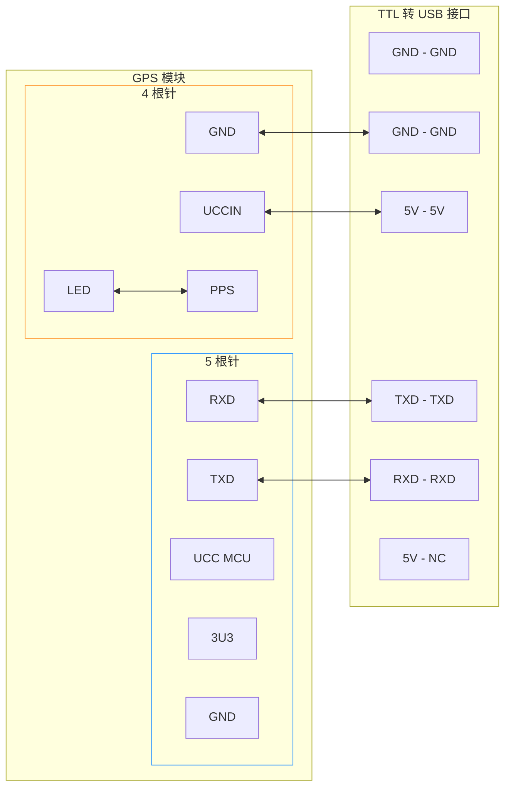
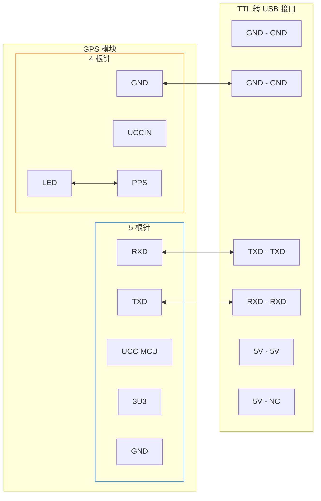

::: tip

「置顶」这是我的 SRT 项目「流星监测」的一些记录，估计会长期更新.

:::

## 2025-07-19 更新

我的 SRT 项目主要做的是流星监测有关内容，利用分布在各地的监控拍到的流星图像 / 视频，通过软件 UFOAnalyzer 进行定轨，以及通过安装在监控内的光栅做光谱分析 (成分监测).

### 硬件准备

#### 摄像头改装

摄像头使用的是 Hikvision 的产品，大致如下图：

::: demo-wrapper img no-padding


:::

另外还有一台上一代的产品，没有下面的补光灯.

由于我们是要拍摄星空，所以需要改装摄像头，先把补光灯拆掉，再在镜头前装上光栅. 过程较为简单，就是拧掉螺丝然后拆线，把光栅对齐放在镜头前固定.

需要注意的几个要点：

* 接线的方向不能错；

* 拆补光灯时要小心拔线，最好从接口处下手，防止线被扯断；

* 光栅需要用胶带固定一下，否则容易偏，虽然对结果并不产生特别大的影响，但是最好还是放正一点.

#### 数据接入

用下面这样一台路机连接电脑和摄像头：

::: demo-wrapper img no-padding


:::

其中右下那个口连接电源，POE 口连接监控、电脑，LAN 口可以不接线.

之后在电脑上配置 IP 地址，要求和监控摄像头的 IP 前三位一致：

> Windows 11 电脑，
>
> ```mermaid
> flowchart LR
>   A[设置] --> B[网络和 Internet]
>   B --> C[高级网络设置]
> ```
> 
> 在「网络适配器」中选择连接路机的网口，点击「更多适配器选项」右边的「编辑」，双击「Internet 协议版本 4 (TCP/IPV4)」.
>
> (如图所示)
>
> ::: center
> 
> {width="60%"}
>
> ::: 
>
> 之后选择「使用下面的 IP 地址」，输入和监控摄像头 IP 前三位相同的一个地址即可.
>
> (如图所示)
>
> ::: center
>
> {width="60%"}
>
> :::

进行完上面的配置，应该可以直接从 IP 地址在浏览器中访问监控的控制界面.

### 软件准备

下载软件：[IVMS](https://partners.hikvision.com/support/hikTools/detail?toolType=iVms4200&id=680371184935768064&q=ivms&pageNum=1&position=1&hiksearch=true) 和 [SADP](https://www.hikvision.com/en/support/tools/hitools/clea8b3e4ea7da90a9/).

连接网线后在 SADP 中多次刷新就能得到监控摄像头的 IP 地址，点击可以进行连接. 可以在 IP 地址访问摄像头之后进行一些设置，如果要观看画面也可以在 IVMS 上看到.

我们后来使用 OBS-studio 做了录屏，并将视频流导入到 UFOcpature 软件中做流星的监测 (捕获流星并截取这段时间的几帧，导出到一个文件夹). 目前的主要问题是 UFO 系列软件不开源而且售价略贵，我们正在寻找替代方案.

## 2025-10-19 更新

经过几个月的蛰伏我们的项目目前正在如火如荼地进行.

现在我们已经汇总了国际上各大流星监控网络 / 组织的各种方案，最终考虑得到，目前可行的方案是：

::: tip

向 FRIPON (Fireball Recovery and InterPlanetary Observation Network) 和 GMN (Global Meteor Network) 的开源代码学习，先考虑在我们的几个核心的观测站点部署上 GMN 开源的系统，实现一个工作流.

> 已有的核心站点包括我们在乌兰察布营地已经安装完成的那一个监控 (连接的是营地老板的台式 Windows)，以及下一周要去安装在两个牧民家里的监控设备 (牧民和营地老板的关系算比较好的，三个站点之间各自相距 $100\text{ km}$ 左右，在内蒙古形成了一个三角网络).

之后我们需要做边缘的小站点散布在西北的各种无人区，这种小站点由鱼眼镜头、CMOS、树莓派和太阳能电池板组成，再加上物联网级别的联网芯片用来 4G 传输数据. 设定上我们想要把这些设备做成集成的一整套，并降低成本.

下一步是优化我们的算法，目前考虑在 GMN 的代码上进行改动，已经有做计算机的一名博士愿意和我们合作，考虑在一个连接监控的树莓派上部署 YOLO 这类比较小的 AI 模型，在本地把 GMN 的 Capture 算法 (GMN 仅仅只有 Capture 部分的代码不能在 Windows 上运行) 筛选出来的数据再经历第二次筛选 (用神经网络)，得到更好的数据集发回我们这边，再在我们这边做流星的定轨计算.

另外，我们已经和海康威视 (HikVison) 取得联系，希望加入他们的一个公益计划，目前还在写申请材料的阶段. 如果这个合作能够顺利进行，那么我们可以让他们为我们定制一批摄像头，或者集成我们已有的系统，或者是帮助我们部署 GMN 代码，可能就不再需要额外的树莓派来部署，也不需要再写代码将海康摄像头输出的视频流转为 raw (GMN Capture 代码只接受 raw 的数据，因为 GMN 自己已经做了一套集成的硬件用来出售).

关于定轨，我们需要亚毫秒级别的授时，用来精确计算流星的轨迹，并在爆炸后 (大火球会在离地面 $70\sim80\text{ km}$ 这样的距离尺度上爆炸，没有这个时刻精确的速度我们无法确认陨石落点) 计算可能轨迹. 因此我们考虑的是 GPS 模块授时，这也是硬件需要完成的，下星期我们会尝试在三个核心站点上做安装和调试.

:::

以上是 10-19 的当前进展.

我正在做的是 GPS 模块的调试，18 号晚例会之前我买了 $300\text{ m}$ 网线作为下周安装的备用 (甚至是骑自行车现场提货运回来的)，例会之后我们完成了这些工作：

1. 讨论可能的小型集成化站点的方案；
2. 调试 GPS 模块 (刚刚到货)；
3. 远程到乌兰察布目前的核心站点，将近半年所有拍摄到的较大流星视频数据和图片数据保存在当地，以便于之后写材料给海康那边.

我主要在做 GPS 模块的调试，当时我没带 Win 本所以是在别人的电脑上做的，但是之后我会在宿舍再做一遍调试，尽量在安装之前摸索一套方法 (因为我工作日没时间去内蒙古做安装，只能交给协会的研究生和博士生学长们做，至少我要把 GPS 安装的方法做出来). 同时这两天我想汇总一下我们 SRT 小组和协会成员总结的一些 FRIPON 和 GMN 工作的基本情况，估计也会放在这篇文章.

### GPS 模块的调试

关于接线：

::: card-masonry cols="2" gap="16"
  <ImageCard
    image="https://vip.123pan.cn/1845440081/yk6baz03t0l000d7w33fsaloio67rmnhDIYxAIFxDda1DGxPDwUzAa==.webp"
    title="TTL 转 USB"
    description="有 6 根接线，在我们的实践中应该只用接 4 根."
    date="2025/10/19"
  />
  <ImageCard
    image="https://vip.123pan.cn/1845440081/ymjew503t0n000d7w32ycelkx27v00nlDIYxAIFxDda1DGxPDwUzAa==.webp"
    title="GPS 模块"
    description="两个位置有接线，一个位置有 4 根 (两根接在一起)，一个位置有 5 根 (给 TTL 输出)."
    date="2025/10/19"
  />
  <ImageCard
    image="https://vip.123pan.cn/1845440081/yk6baz03t0m000d7w33gizwh9slu6a04DIYxAIFxDda1DGxPDwUzAa==.webp"
    title="GPS 天线"
    description="仅仅是一个天线，在 GPS 模块上有个唯一的接口."
    date="2025/10/19"
  />
  <ImageCard
    image="https://vip.123pan.cn/1845440081/yk6baz03t0n000d7w33hdw02591gkl0cDIYxAIFxDda1DGxPDwUzAa==.webp"
    title="5 根引脚接线"
    description="接线用，实际上似乎只要用 4 根."
    date="2025/10/19"
  />
:::

正确的接线是：



#### 踩坑点记录

(1) 接线问题：

一开始接线是：



但是这个接线方式连接到电脑启动 u-center (GPS 的一个软件) 之后接收不到 GPS 信号，模块上的 LED 也不亮 (TTL - USB 上的灯亮了). 原因是我们没有供电：TTL - USB 的 ``5V`` 口是用来供电的，应该连接到 ``UCCIN`` 上去. 其他的，``GND`` 接口 (Ground) 似乎怎么接都没关系，因为说明上写着所有的接地线都连在一起，不过我还没做实验验证是否怎么接都可以.

(2) GPS 无信号问题：

一开始我们在开例会的教室 (天文系) 做测试，但是即使连对了线也一直没信号，

### GMN 和 FRIPON 的基本情况