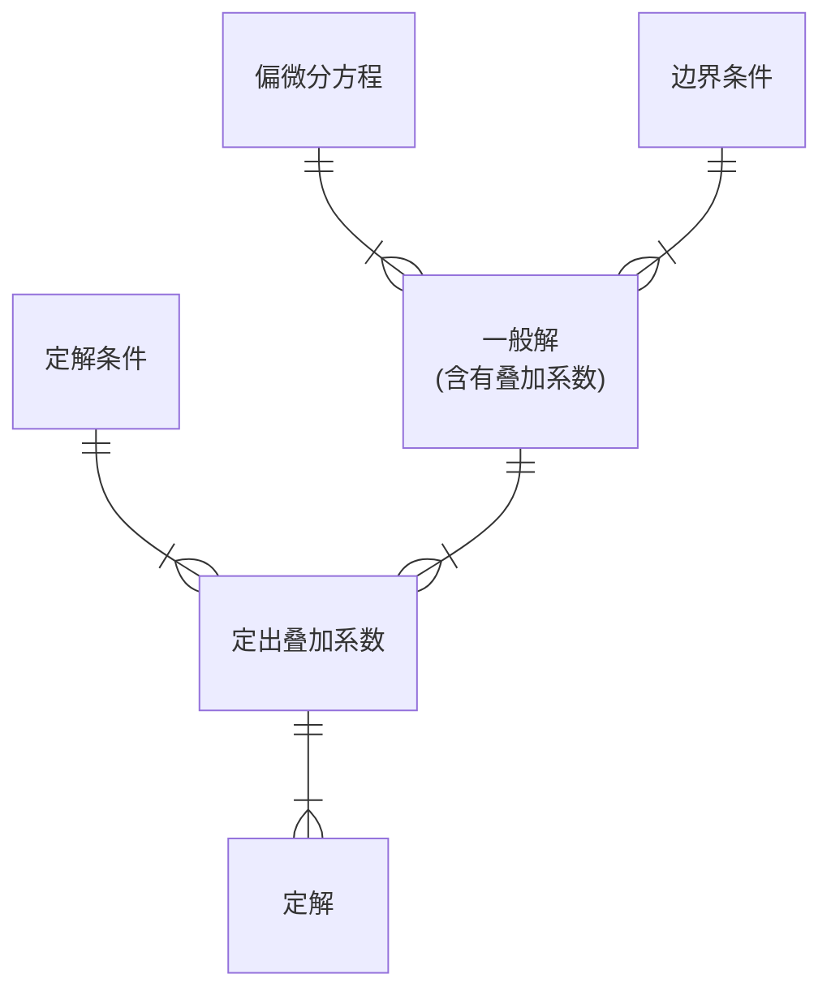

## 分离变量法 (一)

接着上节课的内容.

### 检验解的适定性

对于一段质元，动能为
$$
\int\frac{1}{2}(\rho\text{d}x)\left(\frac{\partial u}{\partial t}\right)^2
$$
势能为
$$
\int T\cdot\left[\sqrt{1+\left(\frac{\partial u}{\partial x}\right)^2}-1\right]\text{d}x\approx\int \frac{1}{2}T\left(\frac{\partial u}{\partial x}\right)^2\text{d}x
$$
直接把 $u$ 通解代入上面的表达式：
$$
u=\sum_{n=1}^\infty\left[C_n\sin\left(\frac{n\pi}{l}at\right)+D_n\cos\left(\frac{n\pi}{l}at\right)\right]\sin\left(\frac{n\pi}{l}x\right)
$$
其实因为三角函数的正交性 (虽然我们没有算过余弦函数的正交性，但是可以随便算一下来验证，就是用积化和差公式)，所以积分后的式子并没有那么复杂，得到
$$
\begin{aligned}
E_k&=\frac{1}{2}\rho\sum_{n=1}^\infty\frac{n^2\pi^2}{l^2}a^2[C_n\cos-D_n\sin]^2\cdot\frac{l}{2}\\\\
&=\frac{1}{4}\frac{\rho a^2}{l}\sum_{n=1}^\infty n^2\pi^2[C_n^2\cos^2+D_n^2\sin^2-2C_nD_n\sin\cos]\\\\
E_p&=\frac{1}{2}T\sum_{n=1}^\infty \frac{n^2\pi^2}{l^2}[C_n\sin+D_n\cos]\cdot\frac{l}{2}\\\\
&=\frac{1}{4}\frac{T}{l}\sum_{n=1}^\infty n^2\pi^2[C_n^2\sin^2+D_n^2\cos^2+2C_nD_n\sin\cos]
\end{aligned}
$$
因为我们知道 $T=\rho a^2$，所以上面两个能量的系数完全相等；另外，相加可以得到能量守恒：
$$
E=\frac{\pi^2\rho a^2}{4l}\sum_{n=1}^\infty n^2[C_n^2+D_n^2]
$$
对于积分形式，验证能量守恒
$$
\frac{\text{d}E}{\text{d}t}=\int_0^l\rho\frac{\partial u}{\partial t}\frac{\partial^2u}{\partial t^2}\text{d}x+\int_0^lT\frac{\partial u}{\partial x}\frac{\partial^2u}{\partial t\partial x}\text{d}x
$$
自然的想法是对后面一个积分做分部积分，同时利用 $T=\rho a^2$，得到
$$
\begin{aligned}
\frac{\text{d}E}{\text{d}t}&=\int_0^l\rho\frac{\partial u}{\partial t}\frac{\partial^2u}{\partial t^2}\text{d}x+\rho a^2\frac{\partial u}{\partial t}\left.\frac{\partial u}{\partial x}\right|_0^l-\int_0^l\rho a^2\frac{\partial u}{\partial t}\frac{\partial^2u}{\partial x^2}\text{d}x
\end{aligned}
$$
积分的部分直接是波动方程.

波动方程的能量守恒保证了其解的适定性 (唯一性和稳定性).

分离变量法得到的结果其实是把波动分解为很多驻波的叠加.

如果把驻波解利用积化和差写成两个行波解，并完成解析延拓 (驻波解只能在一小段范围成立，而行波解可以向远处传播)，可以建立起驻波解和行波解的关系.

---

上节课没有讲第三类边界条件，考虑本征值问题：
$$
X''+\lambda X=0\,,\quad X(0)=0\,,\quad X(l)-X'(l)=0
$$
首先知道 $\lambda=0$ 不是本征值，且因为左边是第一类边界条件，因此解的形式只能是
$$
X_\lambda=\sin\sqrt\lambda x
$$
代入第三类边界条件，本征值满足
$$
\sqrt\lambda=\tan\sqrt\lambda l
$$

### 分离变量法总结

::: steps

1. 分离变量
2. 求解本征值问题
3. 求出全部特解
4. 利用本征函数的正交性定叠加系数
5. 检查

:::

### 矩形区域内的稳定问题

分离变量法在热传导方程和稳定问题 (例如，Laplace 方程) 中的应用.

定解问题：
$$
\left\{\begin{aligned}
&\frac{\partial^2u}{\partial x^2}+\frac{\partial^2u}{\partial y^2}=0 &0<x<a\,,\quad0<y<b\\\\
&u|_{x=0}=0\,,\quad\left.\frac{\partial u}{\partial x}\right|_{x=a}=0 &0\leq y\leq b\\\\
&u|_{y=0}=f(x)\,,\quad\left.\frac{\partial u}{\partial y}\right|_{y=b}=0 &0\leq x\leq a
\end{aligned}\right.
$$
分离变量，令 $u(x,y)=X(x)Y(y)$，则
$$
X''(x)+\lambda X(x)=0\,,\quad Y''(y)-\lambda Y(y)=0
$$
对于 $X$，通解为 $X(x)=A\sin\sqrt{\lambda}x+B\cos\sqrt{\lambda}x$，边界条件得到 $B=0$，$A\neq0$，本征值
$$
\lambda_n=\left(\frac{2n+1}{2a}\pi\right)^2\,,\quad n=0,1,\cdots
$$
对于 $Y$，通解为双曲函数. 一般解为
$$
u(x,y)=\sum_{n=0}^\infty\left(C_n\sinh\frac{2n+1}{2a}\pi y+D_n\cosh\frac{2n+1}{2a}\pi y\right)\sin\frac{2n+1}{2a}\pi x
$$
代入边界条件求出
$$
D_n=\frac{2}{a}\int_0^af(x)\sin\frac{2n+1}{2a}\pi x\text{d}x\,,\quad C_n=-D_n\tanh\frac{2n+1}{2a}\pi b
$$

### 高维情况的讨论

最保险的方式是逐个分离变量.

## 分离变量法 (二)

这是用来解决非齐次的方程和边界条件的情况.

### 两端固定弦的受迫振动

先讨论方程为非齐次的情形. 定解问题：
$$
\left\{\begin{aligned}
&\frac{\partial^2u}{\partial t^2}-a^2\frac{\partial^2u}{\partial x^2}=f(x,t) &0<x<l\,,\quad t>0\\\\
&u|_{x=0}=0\,,\quad u|_{x=l}=0 &t\geq0\\\\
&u|_{t=0}=0\,,\quad\left.\frac{\partial u}{\partial t}\right|_{t=0}=0 &0\leq x\leq l
\end{aligned}\right.
$$
首先应该对方程以及边界条件同时齐次化，令
$$
u(x,t)=v(x,t)+w(x,t)
$$
其中 $w$ 对应方程中齐次的部分，$v$ 对应另一部分，关键在于求出 $v$ 这个特解，这在 $f$ 太复杂的时候其实很困难.

要求 $v$ 满足齐次方程和齐次边界条件，但是不要求初始条件，所以这样的 $v$ 存在但是不唯一；另外要求 $w$ 满足齐次方程和齐次边界条件，而且要满足初始条件.

