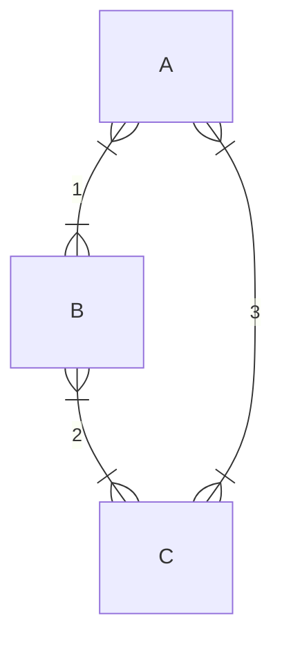

国庆前的最后一次课.

上节课说到生物问题中我们通常会把流体力学中的惯性项去掉，而主要考虑摩擦效应.

微观状态：一个格子上是 $0$ 还是 $1$；宏观状态：格子网络中一共有多少个 $1$. 这是我们传统的统计上的一些概念.

要固定系统的能量，我们让它和一个大热源接触，就能保证它的温度恒定. 在这个条件下我们得到了 Boltzmann 分布.

---

回到上节课结束时讨论的问题，一个 RNA 复制机器产生的错误是多少：我们只关心宏观状态，也就是一共有多少个错误. 错误概率：
$$
P_i=Me^{-\beta n\varepsilon}
$$
这里 $M$ 是熵造成的因子，可以想象是 $N$ 个点上出现 $n$ 个错误，也就是 $M=C_N^n$. 于是系统的熵是
$$
\begin{aligned}
S(n)&=k_B\ln C_N^n\\\\
&\approx k_B[N\ln N-n\ln n-(N-n)\ln(N-n)]\\\\
&=-k_BN\left(\frac{n}{N}\ln\frac{n}{N}+\frac{N-n}{N}\ln\frac{N-n}{N}\right)
\end{aligned}
$$
自由能：
$$
F=E-TS
$$
我们要求系统的自由能最低，$\partial F/\partial n = 0$，解得系统的分布是
$$
\frac{n}{N}=\frac{1}{e^{\varepsilon/k_BT}+1}
$$
一般在 DNA 的复制过程中，$\varepsilon$ 为出现一个错误氢键的能量的话，大概是 $9k_BT$ 量级，出错率非常低 ($10^{-4}$)，上面甚至可以约等于 $e^{-\varepsilon/k_BT}$.

但是生物的调控远远比这个平衡态系统要精细，实验中复制的错误率是 $10^{-9}$ 量级，这意味着生物的复制机器和调控机制根本不是平衡态的，而是存在更加优化的过程.

对于一个弹簧 $E_p=\frac{1}{2}kx^2$，我们可以计算这种势能的 Boltzmann 分布，算出所谓的能量均分定理，每个自由度的平均能量都是 $\frac{1}{2}k_BT$.

熵的另外一个效应是渗透压 (将溶液视为理想气体)：
$$
G=E-TS=-Nk_BT\ln V\,,\quad p=-\frac{\partial G}{\partial V}=\frac{Nk_BT}{V}=ck_BT
$$
在微观系统中我们把经典的能量换成自由能，是因为这时候熵的那部分能量占据了一些作用.

熵的下一个重要的效应和水的氢键相关. 如果有一个非极性分子进入水，它会阻挡水分子之间的氢键. 本来作为一个四面体中心的一个水分子拥有六个朝向，但是现在少了一个四面体的角，造成这个水分子少了三种可能的朝向. 于是水分子的熵和自由能变化：
$$
\Delta S=k_B\ln(3/6)=-k_B\ln 2\,,\quad\Delta G=k_BT\ln2
$$
这个效果产生的排斥作用
$$
\Delta G/A\sim3k_BT/nm^2
$$
这是疏水效应.

下一个熵效应来源于细胞内的拥挤状况，在这里大小两种分子会相互挤压，这种「排空力」的大小：
$$
f=-\frac{\partial\Delta G}{\partial d}\,,\quad\Delta G(d)=k_BT\ln\frac{\Delta V(x)}{V}
$$
同时大小分子的熵会产生竞争，小分子的量大，更倾向于混乱排布，这反而导致大分子被挤压、排布更加均匀，总体的熵还是增大的.

## 化学反应

在考虑粒子数变化的系统时，我们不再能像之前一样使用巨正则系综 ($\mu$ $V$ $T$ 系综)，而要换成 $N$ $V$ $T$ 系综，也就是正则系综. 化学势：
$$
\begin{aligned}
\mu&=\frac{\partial G}{\partial N_\mu}=\frac{\partial E}{\partial N_\mu}-T\frac{\partial S}{\partial N_\mu}\\\\
&=\varepsilon_p-\varepsilon_s+\ln N_p-\ln(N-N_p)
\end{aligned}
$$
($p$ 是溶质，$s$ 是溶剂)
$$
\begin{aligned}
&=\varepsilon_p-\varepsilon_s+\ln\frac{N_p/V}{N_s/V}\frac{c_p}{c_{p,0}}\\\\
&=\mu_{p,0}+\ln\frac{N_p/V}{N_s/V}\frac{c_p}{c_{p,0}}
\end{aligned}
$$
物理化学上把 $c_{p,0}$ 定义为标准浓度.

对于一个化学反应
$$
\nu_1X_1+\nu_2X_2+\cdots\longleftrightarrow\nu_kX_k+\cdots+\nu_NX_N
$$
这个反应的平衡点由自由能的最小值给出，
$$
\text{d}G=\sum_i\left(\frac{\partial G}{\partial N_i}\right)\text{d}N_i=\sum_i\mu_i\nu_i\text{d}N_i
$$
平衡条件：
$$
\sum_i\mu_i\nu_i=0
$$

> 这里我们定义反应 LHS 的 $\nu$ 是负的，因为它们在反应中减少.

代入上面的化学势，计算可以得到所谓的化学平衡方程
$$
\prod_i(C_i^{(e)})^{\nu_i}=K_{eq}
$$
(类似这种，反应物浓度乘积比生成物浓度乘积为常数). 

---

下面来先看看最简单的一种反应 —— 受体和配体的结合.

结合的概率：
$$
p_b=\frac{e^{-\beta(\varepsilon_b-\mu)}}{e^{-\beta(\varepsilon_b-\mu)}+e^{-\beta(\varepsilon_u-\varepsilon_b)}}=\frac{c}{c+K_d}
$$
(也就是：结合的 / (结合的 + 没结合的)) 上述概率在 $c\ll K_d$ 时 $\sim c/K_d$ (线性)，在 $c\gg K_d$ 时 $\sim1$ (饱和).

更加复杂的情况是配体一次结合两个受体，
$$
K_d=\frac{[R][L]^2}{[RL_2]}
$$
这时候
$$
p_b=\frac{[RL_2]}{[R]+[RL_2]}=\frac{c^2}{c^2+K_d^2}
$$
这个函数的图像和趋势已经和上面那个有很大区别. 更一般地，有广义的 Hill 函数
$$
p_b=\frac{c^n}{c^n+K_d^n}
$$
但是，这要求这两个位点的结合是相关的；如果两个位点和受体的结合是相互独立的，那么函数应该是
$$
p_b=\left(\frac{c}{c+K_d}\right)^2
$$
这两个函数完全不一样.

另外，如果加入更多中性的填充剂，我们能够计算出反应的解离常数和中性分子的体积分数 $r$ 有关：
$$
\frac{K_d(\phi_c)}{K_d^0}=(1-\phi_c)^r
$$
更多填充剂意味着更好地结合效果.

---

但是我们实际上更关心的是反应的速率而不是平衡状态. 反应速度通过速率常数来刻画，应该有
$$
\frac{\text{d}[P]}{\text{d}t}=-\frac{\text{d}[S]}{\text{d}t}=k_+[S]-k_-[P]
$$
解得体积分数 $x=[P]/([S]+[P])$ 满足
$$
x(t)=\frac{k_+}{k_++k_-}[1-e^{-(k_++k_-)t}]
$$

* 稳态 $x(\infty)=k_+/(k_++k_-)$；
* 反应平衡常数：$[S](\infty)/[P](\infty)=K_d$；
* Boltzmann 分布：$x=1/(1+e^{-\Delta E/k_BT})$.

这三个条件全部给出稳态的状况，于是「速率」和「平衡常数」被联系在一起，有
$$
\frac{k_-}{k_+}=K_d=e^{-\Delta E/k_BT}
$$
如果动力学 (LHS) 和热力学 (RHS) 想要有关系，就必须有上述条件成立. 当然仅凭这一个方程无法定出速率常数，所以我们还要知道特征时间. 我们定义
$$
k_-=Ae^{(-\Delta E^\dagger-\Delta E)/k_BT}\,,\quad k_+=Ae^{-\Delta E^\dagger/k_BT}
$$
(这样逆反应也更难发生，是合理的) 则特征时间：
$$
\tau=\frac{1}{k_++k_-}=\frac{e^{\Delta E^\dagger/k_BT}}{A(1+e^{-\Delta E/k_BT})}
$$
其中 $\Delta E^\dagger$ 是势垒高度，所以说势垒高度决定了反应速率，这也是酶催化的关键因素.

更加普遍地，对于反应
$$
\sum_s\nu_s[S]\longleftrightarrow\sum_p\nu_p[P]
$$
存在反应「流」：
$$
J_+=k_+\prod_sc_s^{\nu_s}\,,\quad J_-=k_-\prod_pc_p^{\nu_p}
$$
动力学平衡是 $J_+=J_-$，代入 $K_d$ 的表达式，上述等式还是给出 $k_-/k_+=K_d$ (这是应该发生的，因为我们没有引入什么新的理论). 然后这里化学势的变化
$$
\Delta\mu = \sum_s\nu_s\mu_s-\sum_p\nu_p\mu_p=k_BT\ln\left(\frac{k_+}{k_-}\right)+k_BT\left(\prod_sc_s^{\nu_s}/\prod_pc_p^{\nu_p}\right)=k_BT\ln\frac{J_+}{J_-}
$$
这是每进行单位反应的化学势变化，那么每单位时间的反应造成的功率就是
$$
(J_+-J_-)\Delta\mu = (J_+-J_-)\ln\frac{J_+}{J_-}\textcolor{red}{\geq0}
$$
这个功率再乘以 $1/k_BT$ 就是反应的熵产生率，这正是 **熵增**！

> 这里的概念是否需要在近平衡态才成立？
>
> 并不！这只是对反应做出了「没有中间态」的假设，除此之外对是否是近平衡态没有任何要求，也就是只要是基元反应 (无中间态)，就一定满足上述熵增的规律.

**细致平衡** - 如果有很多个同时进行的反应，比如：

转一圈，得到
$$
\frac{k_1k_2k_3}{k_{-1}k_{-2}k_{-3}}=1
$$
这是细致平衡.

::: warning

细致平衡条件强于单反应的平衡条件，结合稳态流的表达式，利用细致平衡条件可以证明稳态流为零，而普通的平衡不一定有这个效果.

:::