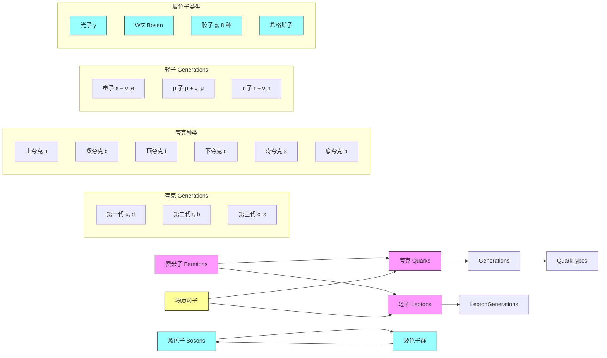

::: warning
==因为这节课和我的实验课冲突，所以只有后面一小部分是我记录的，其他的笔记出自 yqq 同学的贡献，在此感谢他！==
:::

## 推广的 Hubble 定律

我们定义沿着光走的路径在共动坐标中可以表为 $\psi_{comving}$ (这是共动距离). 共动距离和光所走的物理距离的关系可表为：
$$
\text{d}\psi_{com}=\frac{\text{d}s}{a(t)}=\frac{c\text{d}t}{a(t)}
$$
但是为了方便，我们重新定义 $\psi$ 作为今天的空间坐标固定的情况下光走过的弧长，它满足：
$$
\psi=a_0\psi_{com}=\int_t^{t_0}c\text{d}t'\frac{a_0}{a(t')}
$$
回到度规上来：
$$
\text{d}s^2=-(c\text{d}t)^2+a(t)^2\left(\frac{(\text{d}r)^2}{1-k r^2}+(r\text{d}\theta)^2+(r\sin\theta\text{d}\phi)^2\right)
$$
对光子：
$$
\text{d}s=0\,,\quad \text{d}\theta=\text{d}\phi=0\,,\quad c\text{d}t=\pm a(t)\frac{\text{d}r}{\sqrt{1-kr^2}}
$$

$$
\psi=a_0\int_t^{t_0}\frac{\text{d}r}{\sqrt{1-kr^2}}=a_0\sin^{-1}(r) \text{ or }a_0\text{ or }a_0\sinh^{-1}r
$$

这样我们就得到了 $r$ 和共动距离的关系. 

此时，我们可以定义四维的角度 $\theta_4$ 在四维球面上. 此时 $\theta_4=\psi_{com}$. 

假设我们 rescaling 一下尺度因子：
$$
a'(t')=\frac{a(t')}{a_0}=\frac{1}{1+z}
$$
求导：
$$
\frac{\text{d}a'}{\text{d}t'}=\frac{1}{a_0}\frac{\text{d}a}{\text{d}t}
$$
我们记得哈勃常数的定义：
$$
H=\frac{\dot a}{a}=\frac{\dot a'}{a'}
$$

由于在今天坐标架下的光动距离可表为：
$$
\psi=\int_t^{t_0}c\text{d}t'\frac{a_0}{a(t')}=\int_\frac{a}{a_0}^{1} c\text{d}t'\frac{\text{d}a'}{H(a')}
$$
用红移表征：
$$
a'=\frac{1}{1+z},\psi=\int_0^z\frac{c\text{d}z}{H(z)}
$$
我们还记得哈勃定律本来解读的是速度和距离的关系. 但其实在宇宙大爆炸的膨胀背景下，我们观测到的其实是红移. 因此我们更关心红移和距离的关系，所以我们会更重视上面的式子. 

现代宇宙学模型的预测，我们一般通过观测 $H(z)$ 后，再推算 $\psi(z)$,最后得到 $r(z)$，再通过这样的比较来进行理论预言我们的宇宙. 

至于如何写出我们的 $H(z)$，我们需要使用 Friedman 方程来处理这个问题. 

## 宇宙膨胀的简单检验

让我们回到（4）式和（13）式，我们不难发现，对于一个可以同时测量其视角和亮度的天体. 我们可以分别测出：
$$
d_A=\frac{a(t)}{a_0}a_0r\,,\quad d_L=\frac{a}{a(t)}a_0r
$$
不难发现，两者的商是固定的. 并且这样的结论是与模型无关的，也是有效地检验我们宇宙膨胀理论的证据：我们只需要对任何可以同时用两种方法测量距离的天体做商看其是否是个常数即可. 而目前的实验证据也是符合这一点的. 

## Friedman 方程

广相场方程：
$$
G_{\mu\nu}=8\pi GT_{\mu\nu}
$$
其中：$G_{\mu\nu}$ 是 Einstein 张量，描述了时空弯曲的几何性质，由 $g_{\mu\nu}$ 的函数表达. $T_{\mu\nu}$ 则是能动量张量，可以被理解为是一种物质分布. 

Friedman 方程就是广相场方程在膨胀宇宙这一问题下的解. 

等式左侧由度规决定，因此一旦承认了 FLRW 度规之后我们就可以得到，也就是说我们只需要确定尺度因子 $a(t)$ 和 $K$. 右侧我们则把物质简化成理想流体，它有着密度和压强，并且满足一定的物态方程，这两者决定了它的物质分布. 

“物质的分布如何确定时空的几何”. Friedman 方程就是这样一个事情. 
$$
\dot a^2+K=\frac{8}3 \pi G\rho a^2\\
\frac{\ddot a}{a}=-\frac{4}{3}\pi G(\rho+3P)
$$
这里多提一句，宇宙学研究者有时喜欢自然单位制，因此其实上面的这个方程本来有关系 $\rho=\frac{P}{c^2}$. 

我们如果强行代入可以得到：
$$
2\dot a\ddot a=\frac{8\pi}{3}G(\dot \rho a^2+2\rho a\dot a)
$$
再代入能量守恒应当满足的式子：
$$
\frac{\text{d}}{\text{d}t}(\rho V)=-P\frac{\text{d}V}{\text{d}t}
$$
（这里 $\rho$ 是被理解为能量密度，因为我们明白质量和能量的关系）化简得到：
$$
\dot\rho=-\frac{3\dot a}{a}(\rho+P)
$$

## 宇宙中的物质

在标准模型下粒子分类比较复杂：

::: details 该分类图由 deepseek 生成
建议点击右上角的“眼睛”符号全屏显示

:::

但在宇宙学下，我们一般遵循更简单的分类. 

(1) 辐射粒子：光子，大多数情况下，中微子. 

(2) “(冷) 物质”：静止质量占绝大多数的粒子，也就是所谓重子. 主要是质子、中子以及标准模型之外的暗物质. 

(3) 对于轻子，它的归类取决于速度. 在极端相对论效应下，我们知道：
$$
P=\frac 1 3 \rho
$$
因此像电子这类物质，如果质量和动能满足如下关系：
$$
m_0c^2\ll K\sim k_BT
$$
就称这样的的粒子有辐射性. 

回到原来的课题，对于一个足够“冷”的物质，考虑使用理想气体状态方程：
$$
P=nk_BT\ll nm_0c^2=\rho c^2
$$
这样我们认为物质足够冷，在 Friedman 方程中我们就只考虑 $\rho$. 

对于早期的宇宙，所有的粒子都有着极端相对论性，那我们就使用前面提到的极端相对论气体的物态方程. 

在宇宙学中，我们谈到重子，一般指所有由夸克组成的物质，也就是除了光子和中微子的所有粒子. 

下面我们来使用不同的状态方程代入求算 Friedman 方程. 

## 粒子的分类

我们可以用能标的大小把各种粒子分为辐射和物质两种.

(1) 对于辐射 (radiation)，有
$$
P=\frac{1}{3}\rho\,,\quad\dot{\rho}=-\frac{3\dot{a}}{a}\cdot\frac{4}{3}\rho=-\frac{4\dot{a}}{a}\rho\\\\
\Longrightarrow\frac{\dot{\rho}}{\rho}=-4\frac{\dot{a}}{a}\Longrightarrow \rho_R\propto a^{-4}
$$
而能量密度有
$$
\rho_R=\frac{\Delta E}{\Delta V}=\frac{h\nu\Delta N}{\Delta V}\,,\quad\nu\propto a^{-1}\,,\quad\Delta V\propto a^3\\\\
\Longrightarrow \rho_R\propto a^{-4}
$$
(2) 对于物质，很简单地计算出能量密度：
$$
\rho_M=\frac{\Delta E}{\Delta V}=\frac{m_0c^2\Delta N}{\Delta V}\propto a^{-3}
$$
(3) 事实上还有第三种物质，为真空能 / 宇宙常数 (或者叫暗能量)，它的能量密度是一个常数 $\rho_\Lambda$，因此其压强应当是：
$$
0=\dot{\rho}=-3\frac{\dot{a}}{a}(\rho_\Lambda+P_\Lambda)\Longrightarrow P_\Lambda=-\rho_\Lambda<0
$$
这是一个负压强. 因此外界对其做功将会使它膨胀，验证能量守恒：
$$
W=-P_\Lambda\Delta V=\rho_\Lambda\Delta V>0\,,\quad\Delta E=\rho_\Lambda\Delta V>0\,,\quad\Delta W=\Delta E
$$
总结为一般情况，则应该是 $P=w\rho$，有
$$
w=\left\{\begin{array}{lr}
1/3\,,\quad\text{radiation}\\\\
0\,,\quad\text{matter}\\\\
-1\,,\quad\text{vacuum energy}
\end{array}\right.
$$
对于能量密度，有 $\rho\propto a^{-3(1+w)}$.

回到 Friedman 方程，我们来考察物质的不同如何影响宇宙的膨胀行为.

## 宇宙的演化

Friedman 方程：
$$
\left\{\begin{array}{lr}
\dot{a}^2+K=\frac{8}{3}\pi G\rho a^2\\\\
\frac{\ddot{a}}{a}=-\frac{4}{3}\pi G(\rho+3P)\\\\
\dot{\rho}=-\frac{3\dot{a}}{a}(\rho+P)
\end{array}\right.
$$
其中已经把 $c=1$ 代入，事实上 $P/c^2$ 和 $\rho$ 量纲相同.

平坦宇宙情况下 ($K=0$)，$\dot{a}^2=\frac{8}{3}\pi G\rho a^2\propto\rho a^2$.

1. 辐射为主的宇宙，$\rho_R\propto a^{-4}$，因此得到 $a\propto t^{1/2}$，Hubble 常数 $H=\frac{\dot{a}}{a}=\frac{1}{2t}$，我们认为宇宙年龄大约为
   $$
   t_0=\frac{1}{2H_0}
   $$
   $H_0$ 是目前的 Hubble 常数.

2. 物质为主的宇宙，$\rho_M\propto a^{-3}$，那么得到 $a\propto t^{2/3}$，宇宙年龄大概是
   $$
   t_0=\frac{2}{3H_0}
   $$
   这里可以看出物质为主的宇宙的年龄更长. 从直观上理解，辐射所具有的压强会使得宇宙更快膨胀.

3. 真空能为主的宇宙，$\rho_\Lambda\propto1$，这里得到膨胀的方式是 $a\propto e^{H_0t}$，这是一个加速膨胀，指数增长.

如果我们考察宇宙膨胀的加速度 (第 2 个方程)，也可以看到，只要 $w<-1/3$，宇宙就会加速膨胀.

下节课我们将会考察 $K\neq0$ 的情况.