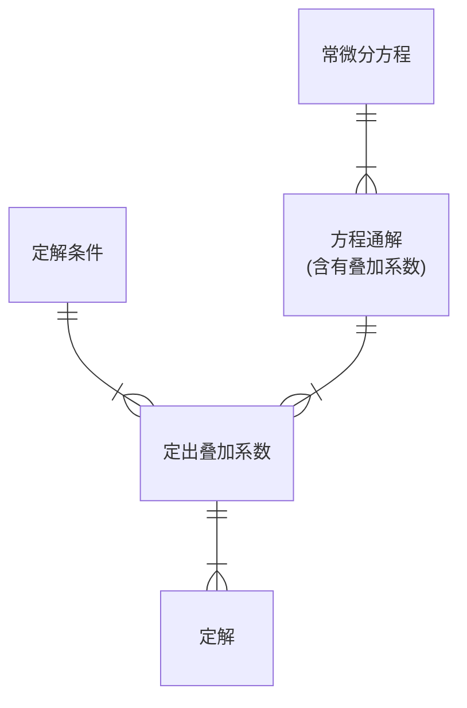
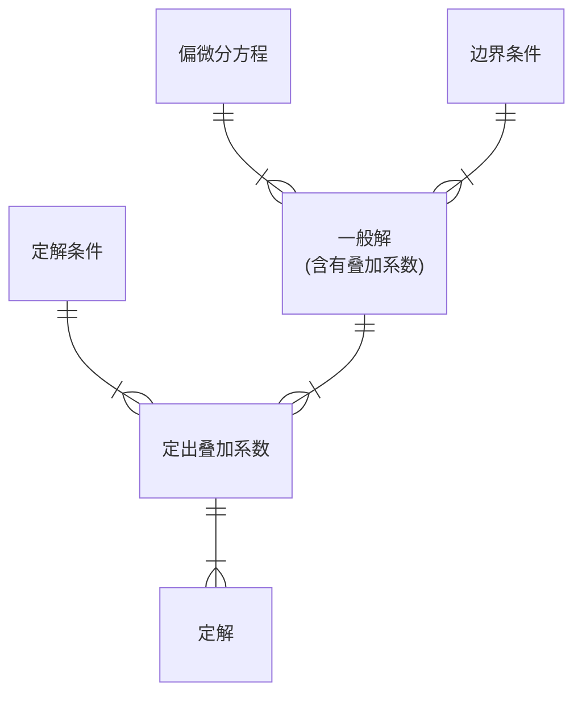

### 常系数线性齐次偏微分方程的通解 (1)

对于三种方程类型：波动方程、热传导方程和稳恒方程，都可以用线性算符
$$
L=\nabla\pm\frac{\partial}{\partial t}\,\text{ or }\nabla
$$
来描述为 $L[u]=f$. 这体现出这些方程都具有叠加原理，所以可以找出齐次方程的两个特解，叠加得到非齐次方程的通解.

两个自变量的线性偏微分方程的一般形式：
$$
\begin{aligned}
L[D_x,D_y]&=A_0D_x^n+A_1D_x^{n-1}D_y+\cdots+A_nD_y^n\\\\
&\quad+B_0D_x^{n-1}+\cdots+MD_x+ND_y+P
\end{aligned}
$$
其中 $D_i\equiv\partial/\partial x^i$. 我们发现这种方程我们不会解，所以把系数都换成常数.

现在还是不好解，所以我们要求对 $D$ 是齐次的：
$$
[A_0D_x^n+A_1D_x^{n-1}D_y+\cdots+A_nD_y^n]u(x,y)=0
$$
这一定可以因式分解 (虽然不一定能够有求根公式)，得到
$$
L[D_x,D_y]=A_0(D_x-\alpha_1D_y)\cdots(D_x-\alpha_nD_y)
$$
$\alpha$ 都是常数. 可以发现上式所有求导都能交换顺序.

我们发现对于 $(D_x-\alpha_kD_y)u=0$，存在一个解 $u=\phi(y+\alpha_kx)$.

> 这本质上就是把 $u(x,y)$ 变成以 $y+\alpha_kx$ 为单变量的单元函数！
>
> 这个解被称为行波解.

更加激进的猜解是「自相似」，假设 $y=\varphi(x)$.

如果用行波解，会得到一个代数方程
$$
A_0\alpha^n+\cdots+A_n=0
$$
最终的 $\varphi$ 是一系列 $\phi(y+\alpha_nx)$ 的叠加，$\phi$ 的形式不重要，但是里面的自变量必须是这样的式子.

> 如果出现重根，应该怎么处理？
>
> 考虑 $(D_x-\alpha D_y)^2[x\phi]$，或者 $(D_x-\alpha D_y)^2[y\phi]$，能够发现这个可以被消掉.
>
> 解为 $x\phi+\phi$.

### 一维波动方程通解

波动方程的通解是
$$
u=f(x-at)+g(x+at)
$$
前者是右行波、后者是左行波，这两列波独立传播、互不影响.

/Example/

> $$
> \begin{aligned}
> &\frac{\partial^2u}{\partial t^2}-a^2\frac{\partial^2u}{\partial x^2}=0\,,\quad-\infty<x<\infty\,,t>0\\\\
> &u(x,t)|_{t=0}=\phi(x)\,\quad-\infty<x<\infty\\\\
> &\left.\frac{\partial u}{\partial t}\right|_{t=0}=\psi(x)\,,\quad-\infty<x<\infty
> \end{aligned}
> $$
>
> ---
>
> 这是在无界的区域解的波动方程，如果有界，就会出现反射和透射之类的现象.
>
> 初始条件确定 $f,g$：
> $$
> f(x)+g(x)=\phi(x)\,,\quad a[f'(x)-g'(x)]=-\psi(x)
> $$
> 于是
> $$
> \begin{aligned}
> f(x)&=\frac{1}{2}\phi(x)-\frac{1}{2a}\int_0^x\psi(\xi)\text{d}\xi+\frac{C}{2}\\\\
> g(x)&=\frac{1}{2}\phi(x)+\frac{1}{2a}\int_0^x\psi(\xi)\text{d}\xi-\frac{C}{2}
> \end{aligned}
> $$
> 一维波动方程的行波解，被称为 **d'Alembert 解**.
>
> 这个解波速恒定、沿时间可逆 (==热传导方程没有这个性质！==).
>
> ==但是要注意 Schrödinger 方程不满足这个方程，因为它的波速可以变，不是恒定的.==

### Laplace 方程的定性讨论

$$
\nabla^2u=0
$$

通解是
$$
u=\phi_1(x+\text{i}y)+\phi_2(x-\text{i}y)
$$
::: warning

如果学过复变函数，一下就能看出这是构成解析函数实部或者虚部的条件，这个解称为二维调和函数.

解析函数满足均值定理，
$$
f(a)=u(x,y)+\text{i}v(x,y)=\frac{1}{2\pi}\oint_{|z-a|=R}f(z)\text{d}\theta
$$
:::

所以二维 Laplace 方程的解满足：
$$
u(x_0,y_0)=\frac{1}{2\pi R}\oint_Cu(x,y)\text{d}l
$$
因此只要 $u(x,y)\neq$ 常数，它的最大值和最小值，只能出现在圆周上. 均值定理和极值原理是二维调和函数的最基本特性，它们对三维调和函数同样成立.

### 常系数线性齐次偏微分方程的通解 (2)

现在假设是
$$
(D_x-\alpha D_y-\beta)u=0
$$
用所谓的常数变易法，假设 $\beta\neq0$ 时 $u=f(x)\phi(y+\alpha x)$，代入得到
$$
f(x)=e^{\beta x}
$$
通解是
$$
u(x,y)=e^{\beta x}\phi(y+\alpha x)
$$
当然也可以写 $e^{\beta y}\phi(y+\alpha x)$，对称的. 如果出现重根，还是乘一个 $x^{n-1}$ ($n$ 是重根个数).

### 常系数线性非齐次方程通解

$$
L[D_x,D_y]u=f(x,y)
$$

因为我们已经知道齐次方程通解，只用找一个特解 $u_0$，也就是求逆
$$
u_0=\frac{1}{L[D_x,D_y]}f(x,y)
$$
::: warning

这个「求逆」是干什么呢？

---

举个例子，若要求：
$$
\frac{1}{D_x+2D_y}e^{x-y}
$$
我们知道 $(D_x+2D_y)e^{x-y}=e^{x-y}-2e^{x-y}=-e^{x-y}$，所以应该有
$$
\frac{1}{D_x+2D_y}e^{x-y}=\frac{1}{-1}e^{x-y}=-e^{x-y}
$$
:::

/Example/

> $$
> (D_x-D_y)^2u=12xy
> $$
>
> ---
>
> 求逆运算的时候直接对算符 Taylor 展开，
> $$
> \begin{aligned}
> u_0&=\frac{12xy}{(D_x-D_y)^2}=\frac{12}{D_x^2}\left(1-\frac{D_y}{D_x}\right)^{-2}xy\\\\
> &=\frac{12}{D_x^2}\left[1+2\frac{D_y}{D_x}+\cdots\right]xy\\\\
> &=\frac{12}{D_x^2}\left[xy+\frac{2}{D_x}x\right]\\\\
> &=12\left(\frac{1}{6}x^3y+\frac{1}{12}x^4\right)=x^4+2x^3y
> \end{aligned}
> $$
> ::: tip
>
> 很妙的一点是如果 Taylor 展开算符，后面太高次的算符作用上去之后实际上是没有意义的，所以是有限项.
>
> 如果是 $xy^{100}$，那么应该对 $D_x/D_y$ 展开，这样会少算很多项.
>
> :::

对于 $D_x,D_y$ 的 $n$ 次齐次 $L$，
$$
\frac{1}{L[D_x,D_y]}f^{(n)}(ax+by)=\frac{1}{L[a,b]}f(ax+by)
$$

## 特殊的变系数线性齐次偏微分方程

先讨论形如 $x^my^nD_x^mD_y^nu$ 的项，令 $x=e^t$，$y=e^s$，则 $D_t=xD_x$，$D_s=yD_y$，有
$$
x^my^nD_x^mD_y^n=D_t\cdots(D_t-m+1)\cdot D_s\cdots(D_s-n+1)
$$

### 热传导方程的定性讨论

$$
(D_t-\kappa D_x^2)u=0
$$

它没有行波解，所以不要尝试去因式分解.

如果把 $\kappa D_x^2$ 看作与 $t$ 无关的常数，得到一个形式上的解，
$$
u(x,t)=e^{\kappa tD_x^2}\phi(x)=\sum_{n=0}^\infty\frac{(\kappa t)^n}{n!}D_x^{2n}\phi(x)
$$
这里 $\phi(x)=u(x,t)|_{t=0}$. 考虑到无穷远边界，$x\to\pm\infty$ 时函数应该有界，取
$$
\phi(x)=e^{\text{i}kx}
$$
代入得到 $u_k(x,t)=e^{\kappa k^2t+\text{i}kx}$，==每给定一个 $k$，都得到方程的一个特解，并且 $k$ 不同的特解是相互独立的，无穷多个特解叠加起来可以构成通解.==
$$
u(x,t)=\int_{-\infty}^\infty A(k)e^{-\kappa k^2t+\text{i}kx}\text{d}k
$$
这正是 Fourier 变换！

如果选 $A(k)=1$ (意味着一个冲击源，在 $t=0$ 时刻 $x=0$ 处有一个无限高的温度冲击)，得到
$$
u(x,t)=\sqrt{\frac{\pi}{\kappa t}}e^{-x^2/(4\kappa t)}
$$
这是 Gauss 分布.

::: danger

但是实际上这是不合理的，因为我们把应该在稳态下成立的 Fourier 热传导定律用在了一个变化的问题上，这本身就是不合理的，所以应该修正为
$$
\varepsilon\frac{\partial^2u}{\partial t^2}+\frac{\partial u}{\partial t}-\kappa\frac{\partial^2u}{\partial x^2}=0\,,\quad\varepsilon>0
$$
$\varepsilon$ 很小时这是热传导，$\varepsilon$ 保证热传导速度不是无限的；$\varepsilon$ 很大的时候是带阻尼的波动.

:::

回顾前面的这个特解 $u_k(t)=e^{-\kappa k^2t+\text{i}kx}$，把 $\kappa\to\text{i}\kappa$，可以得到一个波动，这里的波相速度是 $v=\kappa k$，这不是定值；对应的方程
$$
\frac{\partial u}{\partial t}-\text{i}\kappa\frac{\partial^2u}{\partial x^2}=0
$$
这是自由粒子的 Schrödinger 方程！

## 分离变量法 (一)

到这里开始就要考了.

基本方法是化为一阶线性常微分方程组.

/Example/

> 求 $u(x,y)$：
> $$
> \left\{\begin{aligned}
> &a(x,y,u)\frac{\partial u}{\partial x}+b(x,y,u)\frac{\partial u}{\partial y}=c(x,y,u)\\\\
> &u(x(t),y(t))=z(t)
> \end{aligned}\right.
> $$
>
> ---
>
> 有
> $$
> \text{d}u=\frac{\partial u}{\partial x}\text{d}x+\frac{\partial u}{\partial y}\text{d}y
> $$
> 用 $z$ 代替 $u$，得到
> $$
> \frac{\text{d}x}{a(x,y,z)}=\frac{\text{d}y}{b(x,y,z)}=\frac{\text{d}z}{c(x,y,z)}=\text{d}\lambda
> $$
> 但是这族「特征曲线」实际上充满了全空间，所以需要定解条件：
> $$
> (x,y,z)|_{\lambda=0}=(x(t),y(t),z(t))
> $$
> 加上上面三个一阶方程，就是一阶常微分方程组和定解条件.

下面来求一个满足一般边界条件的解，这不叫通解，而是所谓的一般解.

这种定解问题最常用的方法是 ==分离变量法==. 我们以两端固定弦的自由振动作为例子来学习.

### 两端固定弦的自由振动

长为 $l$、两端固定弦的自由振动，方程及定解条件：
$$
\left\{\begin{aligned}
&\frac{\partial^2u}{\partial t^2}-a^2\frac{\partial^2u}{\partial x^2}=0\\\\
&u|_{x=0}=0\,,\quad u|_{x=l}=0\\\\
&u|_{t=0}=\phi(x)\,,\quad\left.\frac{\partial u}{\partial t}\right|_{t=0}=\psi(x)
\end{aligned}\right.
$$
(一) 第一步是 **分离变量**，我们希望得到分离变量的解 $u(x,t)=X(x)T(t)$.

::: danger

为什么是相乘而不是相加之类的？

---

人们在之前试过很多种形式，只有这种可以解出来；而且也不是分离变量就一定是相乘，很多时候也有相加的、形式很奇怪的.

:::

代入方程会得到
$$
X(x)T''(t)=a^2X''(x)T(t)\Longrightarrow\frac{X''(x)}{X(x)}=\frac{1}{a^2}\frac{T''(t)}{T(t)}
$$
LHS 和 $t$ 无关，RHS 和 $x$ 无关，所以两者都等于常数，设为 $-\lambda$. 得到常微分方程组，
$$
X''(x)+\lambda X(x)=0\,,\quad T''(t)+\lambda a^2T(t)=0
$$
(二) 下一步是 **边界条件分离变量，这要求边界条件齐次**：
$$
u|_{x=0}=0\Longrightarrow X(0)=0\,,\quad u|_{x=l}=0\Longrightarrow X(l)=0
$$
但是初始条件
$$
u|_{t=0}=\phi(x)\text{ and }\left.\frac{\partial u}{\partial t}\right|_{t=0}=\psi(x)
$$
==不能分离变量！== 因此我们先放在这里不管它.

(1) 当 $\lambda=0$ 时，$X(x)$ 没有非零解，这是 trivial 的.

(2) 当 $\lambda\neq0$ 时，

::: danger

我们不能说 $\lambda>0$ 这样的表述，因为我们甚至不知道 $\lambda$ 是不是实数.

:::

解为 $X(x)=Ae^{\sqrt{-\lambda}x}+Be^{-\sqrt{-\lambda}x}$. 要满足那些边界条件，$\lambda$ 必须要是一个正实数，有
$$
X(x)=C\sin\left(\frac{n\pi}{l}x\right)
$$
这里要求 $\lambda=n^2\pi^2/l^2$，$n=1,2,\cdots$，这些有解的 $\lambda$ 被称为本征值.

::: danger

容易犯的错误：

* $\lambda$ 是复数，不要写 $\lambda>0$ 之类表述；
* 这不是量子力学，不要写叠加态出来，一个 $\lambda$ 对应一个解，不能线性叠加.

:::

(三) 下一步是 **求特解、叠加出一般解**：

全部特解
$$
u_n(x,t)=\left(C_n\sin\frac{n\pi}{l}at+D_n\cos\frac{n\pi}{l}at\right)\sin\frac{n\pi}{l}x
$$
($n=1,2,\cdots$)

把全部无穷多个特解叠加起来，是
$$
u(x,t)=\sum_{n=1}^\infty\left(C_n\sin\frac{n\pi}{l}at+D_n\cos\frac{n\pi}{l}at\right)\sin\frac{n\pi}{l}x
$$
这个就是所谓的一般解.

(四) 下一步是 **利用本征函数的正交性 & 初始条件定出叠加系数**.

初始条件给出
$$
\sum_{n=1}^\infty D_n\sin\frac{n\pi}{l}x=\phi(x)\,,\quad\sum_{n=1}^\infty C_n\frac{n\pi a}{l}\sin\frac{n\pi}{l}x=\phi(x)
$$
本征函数有正交性：
$$
\int_0^lX_n(x)X_m(x)\text{d}x=\frac{1}{2}\delta_{mn}l
$$
在初始条件给出的式子两边同时乘以 $\sin m\pi x/l$，再积分，就得到
$$
\begin{aligned}
\int_0^l\phi(x)\sin\frac{m\pi}{l}x\text{d}x&=\sum_{n=1}^\infty D_n\int_0^l\sin\frac{n\pi}{l}x\sin\frac{m\pi}{l}x\text{d}x\\\\
&=D_m\cdot\frac{l}{2}
\end{aligned}
$$
于是
$$
D_n=\frac{2}{l}\int_0^l\phi(x)\sin\frac{n\pi}{l}x\text{d}x
$$
同理，
$$
C_n=\frac{2}{n\pi a}\int_0^l\psi(x)\sin\frac{n\pi}{l}x\text{d}x
$$
::: tip

关于本征函数正交性的一般证明：要证明的是
$$
\int_0^l X_n(x)X_m(x)\text{d}x=0\,,\quad n\neq m
$$
这是对于
$$
\begin{aligned}
&X''+\lambda X=0\\\\
&\alpha_1X(0)+\beta_1X'(0)=0\\\\
&\alpha_2X(l)+\beta_2X'(l)=0
\end{aligned}
$$
而言的本征函数.

找到 $m$ 和 $n$ 两个指标对应的本征函数，用 $X_m(x)$ 乘 $X_n(x)$ 的方程、$X_n(x)$ 乘 $X_m(x)$ 的方程，相减：
$$
[X_m(x)X''_n(x)-X_n(x)X''_m(x)]+(\lambda_n-\lambda_m)X_m(x)X_n(x)=0
$$
在区间 $[0,l]$ 上积分，得到
$$
(\lambda_n-\lambda_m)\int_0^lX_n(x)X_m(x)\text{d}x=[X_n(x)X'_m(x)-X_m(x)X'_n(x)]^l_0
$$
再用边界条件，因为 $\alpha$ 和 $\beta$ 不同时为零，所以 (==这是二元一次方程组解的讨论问题，也就是 Krammer 法则==)
$$
\begin{vmatrix}
X_n(0)&X'_n(0)\\
X_m(0)&X'_m(0)
\end{vmatrix}=0\,,\quad\begin{vmatrix}
X_n(l)&X'_n(l)\\
X_m(l)&X'_m(l)
\end{vmatrix}=0
$$
且 $\lambda_n\neq\lambda_m$，得证正交性：
$$
\int_0^lX_n(x)X_m(x)\text{d}x=0\,,\quad n\neq m
$$
:::

(五) 最后是 **检验解的适定性**. 这一点考试不会考，物理上也很少问到.