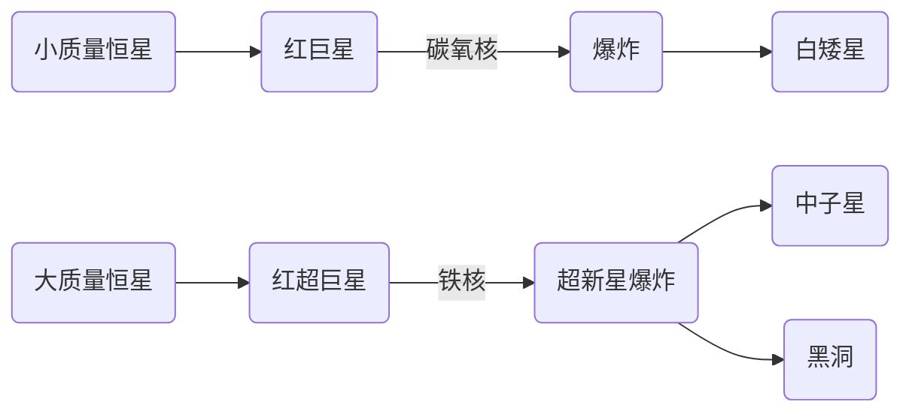

::: center

## 恒星末期的剧烈爆发

:::

::: right

—— 王晓峰

:::

课题组研究方向涉及大尺度时域天文学、观测天文学和恒星物理，老师开设天体物理和恒星物理课程.

恒星的一生：

影响恒星稳定的物理因素主要是：流体静力学平衡、质量守恒、光度产生和能量传输.

Chandrasekhar 提出了一个白矮星形成的极限.

超新星爆发分为两类：

* 热核聚变爆发 ($\text{I}a$ 型)：碳氧白矮星，质量达到 $M_{\text{ch}}$ (Chandrasekhar 极限)，中心的碳点火爆发.
* 引力塌缩爆发 ($\text{II}$ 型)：大质量恒星，中心铁核 ($8M_{\odot}$)，引力使物质向铁核落去然后形成爆炸.

当然在质量太大的时候 (hyper 级) 可能根本看不到超新星爆炸，直接经历引力塌缩变为黑洞.

Gamma 射线暴：以秒为量级产生的最高能量密度的爆发之一. 高于 $2\text{ s}$ 称为长暴，短暴一般来源于两个中子星并合产生的，同时也会释放出大量引力波. 这些观测解释了宇宙重元素起源，2017 年人类第一次同时观测到中子星合并事件的电磁波和引力波.

预测各类恒星爆发的重要项目：

* Radio 波段 (FRB)：LOFAR, AFA, MWA, FAST, ...
* Optical 波段 (SN)：Pan Starrs, ZTF Atlas, DES, ASAS TMTS, ...
* X / r-ray 波段 (GRB)：GLAST, ...

时域巡天的发展趋势现在「越来越卷」，从周间隔一直到分钟间隔 (凝视)，使得我们能够实现持续时间只有几十分钟的短时爆发、甚至只有几秒的射线暴.

对 $\text{II}$ 型超新星爆发使得人类对中微子的认知有很大进步、$\text{I}a$ 型超新星则是让宇宙学的观测提升一个台阶，也引发了现在的 Hubble 常数危机，两种测量方式得到的 $H_0$ 有 $6\sigma$ 以上的差异.

* 利用造父变星的确定光度对远方星系中的 $\text{I}a$ 型超新星定标，然后利用红移得到星系退行速度，测量的 Hubble 常数在 $74$ 左右.
* 利用 CMB 观测的结果来判断宇宙早期的膨胀速度，然后算相对速度得到当前的远处星系退行速度.

上述两者的差异产生了 Hubble tension，所谓的宇宙学危机. 但是现在美国的另一个小组抛弃造父变星，认为这种测量可能出现问题，换用 TRGB 天体 (最高亮度状态下的红巨星) 进行定标，这时 Hubble 常数的值被缩减到 $70$ 附近，和 CMB 的结果已经可以调和.

---

另外，恒星的塌缩过程有非常多物理效应，比如最早期会释放出中微子，中期末期有引力波释放、以及激波暴. 内核中子化过程中释放大量中微子，中微子的能量注入壳层才能推动外层离开星体，没有中微子能量就不会出现这个 shock.

脉动对不稳定超新星爆发：超新星中的高能光子转变为正负电子对，压强降低 (光压)，所以星体收缩，然后产生物质丢失，这样往复会得到一层一层的星周物质. 一旦中心天体产生超新星爆发，撞到外围的星周物质，会产生一个更为奇怪的光度演化曲线.