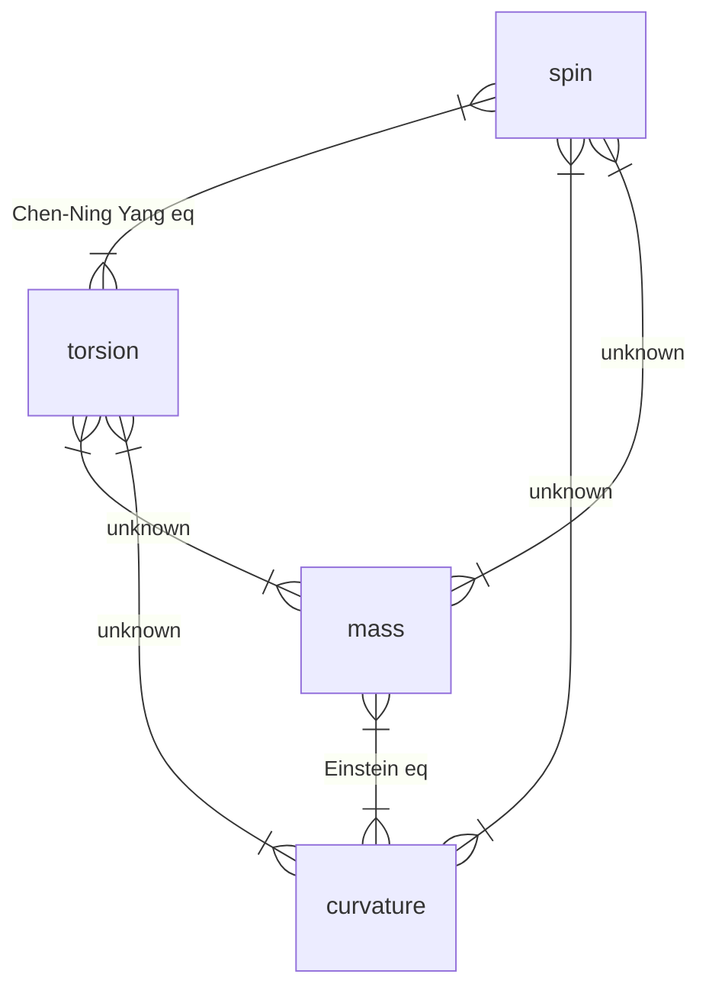

## 广义相对论中的时间与空间

(1) 坐标钟与标准钟：弯曲时空中的任意坐标系 $x^\mu(\mu=0,1,2,3)$，如果把 $x^0$ 当作时间坐标，则以速率 $x^0/c$ 运行的钟称为坐标钟，$t$ 称为坐标时间，$c$ 是真空中的光速.

狭义相对论中，我们把固定在一个惯性系中的中称为标准钟，它的时间是这个惯性系的固有时间：
$$
\text{d}s^2=-c^2\text{d}t^2+\text{d}x^2+\text{d}y^2+\text{d}z^2=-c^2\text{d}t^2\Longrightarrow\text{d}t=\frac{\text{i}\text{d}s}{c}
$$
习惯用 $\tau$ 来标记固有时间，也就写成
$$
\text{d}\tau=\frac{\text{i}\text{d}s}{c}
$$
固有时正比于观者 (标准钟) 的世界线长度，且都是标量.

广义相对论中，可以对任意的观者 $A$ 引入与它瞬时相对静止的局部惯性系 $B$，和狭义相对论一样，这个「局部惯性系」中的标准钟记录了这个系的固有时，$A$ 和 $B$ 的世界线 $L_A,L_B$ 在这一时空点 $P$ 相切. 那么
$$
\text{d}\tau_B=\frac{\text{i}\text{d}s_B}{c}
$$
根据微分几何，相切处 $\text{d}s_B=\text{d}s_A$，所以这里有 $\text{d}\tau_A=\text{d}\tau_B$.

::: warning

关于这个 $\text{d}s_B=\text{d}s_A$，非常简单的理解就是在 Euclidean 空间中拿勾股定理算. 微分几何中在流形上做同样的计算，得到相等的结果.

:::

因此，$A$ 的固有时也正比于自己的世界线长度，它的标准钟是随着自己移动的钟，也是瞬时静止局部惯性系的钟. 为了让这个正比关系更加自然，广义相对论中采用固有时为观者的世界线长度进行参数化.

下面具体计算观者的固有时 (通过与之 ==相对静止== 的坐标系的坐标时计算)：
$$
\text{d}\tau=\frac{\text{i}\text{d}s}{c}=\frac{1}{c}\sqrt{-g_{\mu\nu}\text{d}x^\mu\text{d}x^\nu}=\frac{1}{c}\sqrt{-g_{00}}\cdot\text{d}t
$$
这也说明非 Cartesian 坐标系中，固有时和坐标时一般不同.

强调以下四点：

1. 坐标钟是虚构的，仅有理论意义，不可直接测量. 标准钟是真实的，但是记录的是固有时.

   用两种钟是因为标准钟记录的固有时在弯曲时空中只有局部意义，在大范围内有意义的只有坐标时，所以广义相对论的公式和定律等要用坐标量表示.

2. 任何周期运动物体都可以作为标准钟. 标准钟可以沿任何类时世界线运动，并用自己的读数来参数化这条世界线.

3. 观者固有时有两种测量方式：它自己的标准钟；相对于观者瞬时静止的自由下落钟.

4. 固有时依赖于世界线，不依赖于坐标系；坐标时依赖于坐标系，不依赖于世界线.

   过一点的不同世界线，固有时不同；在一点建立不同坐标系，坐标时不同.

(2) 固有距离的测量：考虑相邻两点 $A,B$，光信号在 $A$ 钟的 $^{(1)}x^0_A$ 时刻从 $A$ 射向 $B$，在 $B$ 钟的 $x^0_B$ 时刻到达，并反射回 $A$，在 $A$ 的 $^{(2)}x^0_A$ 时刻到达 $A$ 点. 这里所需要的坐标时为
$$
\Delta x^0=\text{d}x^0_{(2)}-\text{d}x^0_{(1)}
$$
其中，$\text{d}x^0_{(1)}={}^{(1)}x^0_A-x^0_B$，$\text{d}x^0_{(2)}={}^{(2)}x^0_A-x^0_B$.

::: danger

本来想在这里画个图，但是折腾很久 Inkscape 感觉没什么好处… 还是算了. 之后或许会补上.

:::

因为光速各向同性不是在坐标时下说的，所以 $|\text{d}x^0_{(1)}|$ 不一定等于 $|\text{d}x^0_{(2)}|$. 需要在 $B$ 点引入瞬时静止的局部惯性系，与 $\Delta x^0$ 相对应的固有时间是
$$
\Delta\tau = \frac{1}{c}\sqrt{-g_{00}}\cdot\Delta x^0
$$
在这个系中，固有时表达的光速是各向同性的，并且值是 $c$，因此两点间空间距离是

$$
\text{d}l=\frac{c\Delta\tau}{2}=\frac{1}{2}\sqrt{-g_{00}}\cdot\Delta x^0\tag{1}
$$
这和之前标准钟测得的时间相对应，是「标准尺」测得的距离. 但是 **广义相对论中并无「标准尺」概念，固有距离应该依据固有时间来间接测定**. 我们知道，
$$
\text{d}s^2=0=g_{00}(\text{d}x^0)^2+2g_{0i}\text{d}x^0\text{d}x^i+g_{ik}\text{d}x^i\text{d}x^k
$$
这是「来」和「去」两个过程的光信号都满足的方程. 解得

$$
\text{d}x^0=\frac{-g_{0i}\text{d}x^i\pm\sqrt{(g_{0i}g_{0k}-g_{00}g_{ik})\text{d}x^i\text{d}x^k}}{g_{00}}\tag{2}
$$
这里因为二次方程而得到的「$\pm$」分别对应「来」和「去」的光信号，而且要求的 $\Delta x^0$ 是它们的差：
$$
\Delta x^0=\frac{2\sqrt{(g_{0i}g_{0k}-g_{00}g_{ik})\text{d}x^i\text{d}x^k}}{-g_{00}}
$$
代入 <a href="#1">(1)</a> 式，得到
$$
\Delta l=\sqrt{\left(g_{ik}-\frac{g_{0i}g_{0k}}{g_{00}}\right)\text{d}x^i\text{d}x^k}
$$
或者写成 $\text{d}l^2=\gamma_{ik}\text{d}x^i\text{d}x^k$，这里的

$$
\gamma_{ik}=g_{ik}-\frac{g_{0i}g_{0k}}{g_{00}}\tag{3}
$$
是纯空间度规 (不含时间部分)，和 $g_{\mu\nu}$ 的空间部分 $g_{ik}$ 并不等价. 这个 $\text{d}l$ 就是 $A,B$ 两邻点之间的纯空间距离 —— 固有距离.

(3) 物理上可实现的最普遍的时空坐标：

按照等效原理，引力场中的任一点都可以引入局部惯性系，采用 Cartesian 坐标
$$
x^\mu=(x^0,x^1,x^2,x^3)\,,\quad x^0=ct
$$
$t$ 是局部惯性系的坐标时. 线元为
$$
\text{d}s^2=\eta_{\mu\nu}\text{d}x^\mu\text{d}x^\nu\,,\quad\mu,\nu=0,1,2,3
$$
这里的 $\eta$ 是之前在 Chapter 2 中提到过的 Minkowski 度规. 引入连续、可微且 Jacobi 行列式满足
$$
\det\left|\frac{\partial x'^\mu}{\partial x^\nu}\right|\neq0
$$
的坐标变换 $x'^\mu=x'^\mu(x^\nu)$，光速不变原理要求线元在坐标变换下不变，所以

$$
\text{d}s^2=\eta_{\mu\nu}\text{d}x^\mu\text{d}x^\nu=g_{\mu\nu}\text{d}x'^\mu\text{d}x'^\nu\Longrightarrow g_{\mu\nu}=\eta_{\alpha\beta}\frac{\partial x^\alpha}{\partial x'^\mu}\frac{\partial x^\beta}{\partial x'^\nu}\tag{4}
$$
这正是度规的变换规则.

另外，时间是一维的、空间是三维的，一个有物理意义的坐标变换必须要保证新的坐标系中有一个时间坐标和三个空间坐标. 我们提出如下定理：

/Theorem/

> 欲使点变换 $x'^\mu=x'^\mu(x^\nu)$ 所得的四个新坐标 $(x'^0,x'^1,x'^2,x'^3)$ 的第一个坐标表示时间，剩下表示空间，那么新的度规张量必须符合下述充要条件：
> $$
> \begin{aligned}
> g_{00}<0\,,\quad\begin{vmatrix}
> g_{00}&g_{01}\\
> g_{10}&g_{11}
> \end{vmatrix}<0\,&,\quad\begin{vmatrix}
> g_{00}&g_{01}&g_{02}\\
> g_{10}&g_{11}&g_{12}\\
> g_{20}&g_{21}&g_{22}
> \end{vmatrix}<0\\\\
> \begin{vmatrix}
> g_{00}&g_{01}&g_{02}&g_{03}\\
> g_{10}&g_{11}&g_{12}&g_{13}\\
> g_{20}&g_{21}&g_{22}&g_{23}\\
> g_{30}&g_{31}&g_{32}&g_{33}
> \end{vmatrix}&<0
> \end{aligned}
> $$

/Proof/

> 设 $x^\mu$ 是局部惯性系坐标，$x'^\mu$ 是新的坐标.
>
> 对于新坐标空间中的一个固定点，应该有
> $$
> x'^i=\text{const.}\,,\quad\text{d}x'^i=0
> $$
> ::: warning
>
> 特别说明，一般指标是 $i,j,k$ 都是指 $1,2,3$；如果是 $\mu,\nu,\cdots$ 这些希腊字母，指 $0,1,2,3$，用以区分空间和时空.
>
> :::
>
> 这个固定点相对于局部惯性系的速度是
> $$
> v'=\frac{\text{d}x^i}{\text{d}t}=\frac{c\text{d}x^i}{\text{d}x^0}
> $$
> 考虑到 $\text{d}x'^i=0$，所以
> $$
> \begin{aligned}
> \text{d}x^i&=\frac{\partial x^i}{\partial x'^\mu}\text{d}x'^\mu=\frac{\partial x^i}{\partial x'^0}\text{d}x'^0\\\\
> \text{d}x^0&=\frac{\partial x^0}{\partial x'^\mu}\text{d}x'^\mu=\frac{\partial x^0}{\partial x'^0}\text{d}x'^0
> \end{aligned}
> $$
> 上面的相对速度被化为
> $$
> v'=c\left(\frac{\partial x^i}{\partial x^0}/\frac{\partial x^0}{\partial x'^0}\right)
> $$
> 这个速度不能超过光速，这是限制条件. 因此：
> $$
> v^iv^i<c^2\Longrightarrow\left(\frac{\partial x^i}{\partial x'^0}\right)\left(\frac{\partial x^i}{\partial x'^0}\right)<\left(\frac{\partial x^0}{\partial x'^0}\right)\left(\frac{\partial x^0}{\partial x'^0}\right)
> $$
> 由我们之前的定义 <a href="#4">(4)</a>，这等价于
> $$
> g_{00}<0
> $$
> 这就证明了第一个式子，它来源于光速的限制.
>
> ---
>
> 另外，固有距离 $\text{d}l$ 必须是实数，这要求 $\text{d}l^2=\gamma_{ik}\text{d}x'^i\text{d}x'^k>0$，由二次型正定的充要条件 (Jacobi 公式) 可得
> $$
> \gamma_{11}>0\,,\quad\begin{vmatrix}
> \gamma_{11}&\gamma_{12}\\
> \gamma_{21}&\gamma_{22}
> \end{vmatrix}>0\,,\quad\begin{vmatrix}
> \gamma_{11}&\gamma_{12}&\gamma_{13}\\
> \gamma_{21}&\gamma_{22}&\gamma_{23}\\
> \gamma_{31}&\gamma_{32}&\gamma_{33}
> \end{vmatrix}>0
> $$
> $\gamma_{ik}$ 的表达式是 <a href="#3">(3)</a>，代入得到剩下三个不等式条件：
> $$
> \begin{aligned}
> \begin{vmatrix}
> g_{00}&g_{01}\\
> g_{10}&g_{11}
> \end{vmatrix}<0\,,\quad\begin{vmatrix}
> g_{00}&g_{01}&g_{02}\\
> g_{10}&g_{11}&g_{12}\\
> g_{20}&g_{21}&g_{22}
> \end{vmatrix}<0\,,&\\\\
> \begin{vmatrix}
> g_{00}&g_{01}&g_{02}&g_{03}\\
> g_{10}&g_{11}&g_{12}&g_{13}\\
> g_{20}&g_{21}&g_{22}&g_{23}\\
> g_{30}&g_{31}&g_{32}&g_{33}
> \end{vmatrix}<0\quad\quad\quad&
> \end{aligned}
> $$
> ::: warning
>
> 简单总结，这些对度规的限制来源于「光速不变」和「距离是实数」，也就是分别对时间和空间的限制.
>
> :::

下节会对坐标系 (也就是相应地对度规) 有更多限制.

::: danger

我觉得自己还是没弄懂固有距离那里的推导，或许我该画个图.

:::

## 同时的传递性

狭义相对论中，我们知道静止于同一惯性系的不同空间点的钟，因为光速不变，总可以用光信号来校准，使它们「同时」/「同步」，这样可以建立起所谓的「同时面」.

::: warning

这里我们要对「同时」和「同步」两个概念做一下区分：「同时」指的是两个钟的时刻校准，而「同步」指钟的快慢校准.

:::

(1) 「同时传递性」的条件：在狭义相对论中，校准空间中各处的钟是非常容易做到的，可以建立全空间的同时面. 但是广义相对论中时空是弯曲的，这使得同时传递性受到了挑战.

仍然用光信号来校准静止于各个空间点的钟，并在这个概念下定义「同时性」.

设 $A,B$ 为 Riemann 时空中两个相邻的空间点，$L,M$ 分别为两点的世界线. 在 $A$ 的坐标时 $^{(1)}x^0_A$，从 $A$ 向 $B$ 发射一个光信号，这个信号在 $B$ 点的坐标时 $x^0_B$ 到达 $B$，并反射回 $A$，在 $A$ 点坐标时 $^{(2)}x^0_A$ 到达. 定义如下中间量：
$$
\begin{aligned}
\text{d}x^0_{(1)} &\equiv {}^{(1)}x^0_A-x^0_B\\\\
\text{d}x^0_{(2)} &\equiv {}^{(2)}x^0_A-x^0_B\\\\
x^0_A &\equiv\frac{^{(1)}x^0_{A}+{}^{(2)}x^0_A}{2}
\end{aligned}
$$
这里，$A,B$ 之间的距离是没有变化的，所以我们认为 $x^0_A$ 应该是和 $x^0_B$ 同时的一个时刻. 显然有 (仅仅是由定义)：
$$
x^0_A = \frac{1}{2}[(x^0_B+\text{d}x^0_{(1)})+(x^0_B+\text{d}x^0_{(2)})]=x^0_B+\frac{1}{2}(\text{d}x^0_{(1)}+\text{d}x^0_{(2)})
$$
所以两个异地的事件「同时」发生时，坐标时会相差：
$$
\Delta x^0=x^0_A-x^0_B=\frac{1}{2}(\text{d}x^0_{(1)}+\text{d}x^0_{(2)})
$$
利用 <a href="#2">(2)</a> 式，得到
$$
\Delta x^0 = -\frac{g_{0i}}{g_{00}}\text{d}x^i
$$
到这里，可以沿着某一条路径对 $\Delta x^0$ 积分，来定义广义相对论中的「同时面」为时刻相差
$$
\int_L-\frac{g_{0i}}{g_{00}}\text{d}x^i
$$
的点的集合. 但是容易发现，这里的 $\Delta x^0$ 甚至不一定是全微分，沿着闭合路径的积分不等于零，所以如果两点相距有限的空间距离，沿着不同路径来校准这两点的坐标钟，得到的结果是不一样的，这导致 $A$ 和 $B$ 同时、$B$ 和 $C$ 同时不意味着 $A$ 和 $C$ 同时，也就是 ==同时性不一定具有传递性==. 在广义相对论中，同时性具有传递性的充要条件是 $\Delta x^0$ 为全微分，即
$$
\oint\Delta x^0=\oint\left(-\frac{g_{0i}}{g_{00}}\right)\text{d}x^i=0
$$
最直观的情况就是时轴正交，也就是 $g_{0i}=0$ (这是一个充分条件). 当采用时轴正交坐标系时，可以把空间各点的坐标钟调整到同时，建立同时面 —— 因此时轴正交系在广义相对论中非常重要.

(2) 「钟速同步传递性」的条件：刚才是在讨论「同时」，现在尝试讨论「同步」. 这个条件比建立同时面要弱一些.

还是 $A,B$ 两点，第一个同时时刻和第二个同时时刻，坐标钟分别相差
$$
\begin{aligned}
\Delta x^0_{(1)}&={}^{(1)}x^0_{A}-{}^{(1)}x^0_B=-\left(\frac{g_{0i}}{g_{00}}\right)_{(1)}\text{d}x^i\\\\
\Delta x^0_{(2)}&={}^{(2)}x^0_{A}-{}^{(2)}x^0_B=-\left(\frac{g_{0i}}{g_{00}}\right)_{(2)}\text{d}x^i
\end{aligned}
$$
两处时间流速之差：
$$
\begin{aligned}
\delta(\Delta x^0) &\equiv ({}^{(2)}x^0_A-{}^{(1)}x^0_A)-({}^{(2)}x^0_B-{}^{(1)}x^0_B)\\\\
&=\Delta x^0_{(2)}-\Delta x^0_{(1)}\\\\
&=-\left[\left(\frac{g_{0i}}{g_{00}}\right)_{(2)}-\left(\frac{g_{0i}}{g_{00}}\right)_{(1)}\right]\text{d}x^i
\end{aligned}
$$
这个量为零的充分条件是
$$
\frac{\partial}{\partial x^0}\left(\frac{g_{0i}}{g_{00}}\right)=0
$$
这个充分条件弱于 $g_{0i}=0$. 同时相应的充要条件是
$$
\oint\left(-\frac{g_{0i}}{g_{00}}\right)_1\text{d}x^i=\oint\left(-\frac{g_{0i}}{g_{00}}\right)_2\text{d}x^i
$$
这等价于
$$
\frac{\partial}{\partial x^0}\oint\Delta x^0=\frac{\partial}{\partial x^0}\oint\left(-\frac{g_{0i}}{g_{00}}\right)\text{d}x^i=0\Longrightarrow\oint\left(-\frac{g_{0i}}{g_{00}}\right)\text{d}x^i=\phi
$$
其中 $\phi$ 是与 $x^0$ 无关的一个常数. 这个充要条件也弱于之前同时面存在的充要条件 (那里要求闭合路径积分为零).

在满足 $\phi=\text{const.}$ 但是 $\phi\neq0$ 的坐标系中，可以把空间中静止各点的坐标钟「调得一样快」，但是不存在同时面.

::: warning

特别需要注意：上面讨论的「同时」和「同步」都是在说坐标钟，即使坐标钟同步了，标准钟依然不一定同步，这是不一样的两个概念.

:::

## 场方程与运动方程

::: warning

这是相对论的核心：Einstein 场方程.

:::

### 几点考虑

Einstein 建立场方程时，有下面几点考虑：

1. 等效原理：Einstein 是根据等效原理猜测引力是一种几何效应的. 等效原理预期引力在数学上和惯性力具有同样的表现，即：度规 $g_{\mu\nu}$ 偏离 Lorentz 度规 $\eta_{\mu\nu}$、Christoffel 符号不为零.

   也就是，引力在数学上应该用度规张量和 Christoffel 符号的泛函来表示，Einstein 猜测这个泛函和时空的曲率有关.

   ::: tip

   Einstein 当时并没有考虑到挠率，但是这恰好符合等效原理，因为等效原理同时要求时空的挠率为零.

   :::

2. Mach 原理：Mach 认为惯性力来源于加速物体和遥远星系的相互作用. Einstein 据此设想，场方程的一端应该反映时空的曲率，另一端则是物质 & 物质的运动.

3. 广义相对性原理：物理规律是广义协变的，所以场方程必须是张量方程；同时场方程在没有引力源的真空中也应该成立，所以场方程要是一个微分方程.

   ::: warning

   对于「微分方程」的一点理解：个人觉得是因为在真空中场方程仍然要能够描述时空的曲率这一局部的特性，并且和有源的时空区域建立联系，而描述局域性质的正是微分方程.

   :::

4. 光速不变原理：这等价于要求 $\text{d}s$ 是标量.

5. 质点运动的短程线原理：这个原理假定，时空中的自由质点应该沿短程线运动. 也就是质点的运动路径满足
   $$
   \delta\int\text{d}s=0
   $$
   即测地线.

   ::: warning

   这不就是 Fermat 原理吗？

   :::

6. 对应原理：弱场近似下，场方程应该近似为 Newton 引力的 Poisson 方程：
   $$
   \nabla^2\varphi=4\pi G\rho
   $$
   ($\varphi$ 为万有引力势)

   ::: warning

   这一点和 Bohr 的量子力学很相似，「在 $\hbar\to0$ 的情况下，氢原子轨道应该和经典情况的结果相等价」.

   :::

### 场方程的建立

从上面 1.、2.、3. 三个考虑，Einstein 推测场方程一端是物质场的能动张量 $T_{\mu\nu}$，另一侧是反映时空几何的某一个张量 $M_{\mu\nu}$，也就是
$$
M_{\mu\nu} = \kappa T_{\mu\nu}
$$
这里 $\kappa$ 是一个常数. 因为能动张量是对称张量，有 $10$ 个独立分量，所以 $M_{\mu\nu}$ 也应该有 $10$ 个独立分量，据此我们想到的是 Ricci 张量、度规张量 $g_{\mu\nu}$ 以及这两个张量的组合.

::: warning

感觉还是有必要弄清楚「能动张量」是什么. 下面这一段参考： [+1]

[+1]:[[广义相对论基础] 能动张量和 Einstein 场方程 | 知乎](https://zhuanlan.zhihu.com/p/601255696)

在电动力学中我们已经了解到电荷密度和电流密度可以构成一个四维矢量. 于是联想到：动量密度 (三维矢量) 和动量流密度 (三维二阶张量) 是否可以构成一个协变的量？!!也就是张量!!{.blur .hover}

考虑一组由 $1\sim n$ 编号标记的粒子流，它们的四维动量可以写成 $p^\alpha{}_n(t)$，四维的动量密度就是
$$
P^\alpha(x^i, t) = \sum_n p^\alpha{}_n(t)\delta^3(x^i-x^i{}_n(t))
$$

> 后面的 $\delta^3$ 函数作何理解？只需要理解为这是在求 $t$ 时刻、$x^i$ 这一空间点的动量密度即可.

四维动量流密度 (单位时间内，通过单位面积的动量) 应当是：
$$
T^{\alpha j}(x^i, t) = \sum_n p^\alpha{}_n(t)\frac{\text{d}x^j{}_n(t)}{\text{d}t}\delta^3(x^i-x^i{}_n(t))
$$

> 这里的 $n$ 不是一种指标... 只是一个标记粒子序号的符号罢了

可以发现，如果给前面的 $P^\alpha$ 两边乘上一个因子
$$
\frac{\text{d}x^0{}_n(t)}{\text{d}t}=\frac{\text{d}t}{\text{d}t}
$$
就能构造出一个四维二阶逆变张量 $T^{\alpha\beta}$，这就是能动张量：
$$
T^{\alpha\beta}(x^i,t) = \sum_n p^\alpha{}_n(t)\frac{\text{d}x^\beta{}_n(t)}{\text{d}t}\delta^3(x^i-x^i{}_n(t))
$$

---

为了探究这个张量的一些性质，回忆狭义相对论中，我们有关系 (自然单位制)：
$$
\frac{p^i}{E} = \frac{\gamma m\dot{x}^i}{\gamma m}=\dot{x}^i = \frac{\text{d}x^i}{\text{d}t}
$$

> 对于 $p^0$ 这个分量，$p^0 = \gamma mc$，$E=\gamma mc^2$，在自然单位制下也可以得到上面的结果

所以上式能够改写成对称形式
$$
T^{\alpha\beta}(x^i,t) = \sum_n\frac{p^\alpha{}_n p^\beta{}_n}{E_n}\delta^3(x^i-x^i{}_n(t))\Longrightarrow T^{\alpha\beta}=T^{\beta\alpha}
$$

---

接下来考察能动张量在无外力作用下的守恒性质. 在狭义相对论中，先仅仅考虑能动张量对空间分量的导数：
$$
\begin{aligned}
\frac{\partial}{\partial x^i}T^{\alpha i}(x^k,t) &= \sum_np^\alpha{}_n(t)\frac{\text{d}x^i(t)}{\text{d}t}\frac{\partial\delta^3(x^k-x^k{}_n(t))}{\partial x^i}\\\\
&=-\sum_n p^\alpha{}_n(t)\frac{\text{d}x^i(t)}{\text{d}t}\frac{\partial\delta^3(x^k-x^k{}_n(t))}{\partial x^i{}_n}
\end{aligned}
$$

> 这里用到的是，$\delta$ 函数内部的两个变量反号，所以求导可以换一个变量，得到的结果只是加一个负号而已.
>
> 另外，为什么只求 $T^{\alpha i}$ 对 $x^i$ 的导数，不求对 $x^j$ 的导数？显然如果 $i\neq j$，

实际上上式是一个链式法则，虽然后面看起来是偏导数，但是 $x^k$ 和 $x^k{}_n(t)$ 没有任何关系，所以其实是全导数. 化简掉这个链式法则：
$$
\frac{\partial}{\partial x^i}T^{\alpha i}(x^k,t) = -\sum_n p^\alpha{}_n(t)\frac{\partial\delta^3(x^k-x^k{}_n(t))}{\partial t}
$$
利用 Leibniz 法则，得到
$$
\frac{\partial T^{\alpha i}}{\partial x^i}=-\frac{\partial}{\partial t}\left[p^\alpha{}_n(t)\delta^3(x^k-x^k{}_n(t))\right]+\sum_n\frac{\partial p^\alpha{}_n(t)}{\partial t}\delta^3(x^k-x^k{}_n(t))
$$
容易发现前面一项正是 $T^{\alpha0}$ 对 $x^0$ 的偏导数. 合并之后得到四维的式子
$$
\frac{\partial T^{\alpha\beta}}{\partial x^\beta}=\sum_n\frac{\partial p^\alpha{}_n(t)}{\partial t}\delta^3(x^k-x^k{}_n(t))
$$
RHS 正好是所谓的「力密度」，因为粒子体系不受外力，这一项自然为零，这就在狭义相对论下证明了能动张量守恒.

> 一个我在看这一段的时候产生的疑问：为什么只证明 $\partial_\beta T^{\alpha\beta}=0$ 就说明能动张量守恒了？不应该是 $\partial_\mu T^{\alpha\beta}$ 的所有分量都是零才算守恒吗？
>
> 实际上这是我对能动张量的物理意义产生了一些曲解. 考虑能动张量本身的物理意义，$T^{00}$ 分量是能量密度、$T^{0i}$ 分量是动量密度 (能流密度)，$T^{ij}$ 则是动量流密度 (或者说应力张量)；$\partial_\beta T^{\alpha\beta}$ 按照 $\alpha$ 的取值有四个方程，其中 $\partial_\beta T^{0\beta}=0$ 表示能量守恒、$\partial_\beta T^{i\beta}=0$ 表示动量守恒，这已经满足了物理上所要求的守恒定律. 因此，能动张量的守恒方程只要求 **能动张量的散度为零**.

广义相对论下的推导要把原来的散度改为协变散度，这导致
$$
\begin{aligned}
T^{\alpha\beta}{}_{;\beta} &= -\Gamma^\alpha_{\rho\beta}T^{\rho\beta}-\Gamma^\beta_{\rho\beta}T^{\alpha\rho}+\sum_n\frac{\partial p^\alpha{}_n(t)}{\partial t}\delta^4(x^k-x^k{}_n(t))\\\\
T^{\alpha\beta}{}_{;\beta} &=-\Gamma^\alpha_{\rho\beta}T^{\rho\beta}-\partial_\rho\ln\sqrt{-g}\cdot T^{\alpha\rho}+\sum_n\frac{\partial p^\alpha{}_n(t)}{\partial t}\delta^4(x^k-x^k{}_n(t))
\end{aligned}
$$

> 这里用到了 Christoffel 符号的缩并，在 [Chapter 2 - 一个特殊的 Christoffel 符号](/self-learn-GR/chapter-2/#一个特殊的-christoffel-符号) 提到过.

另外，广义相对论中的 $T^{\alpha\beta}$ 和之前不一样，要做修正，因为 $T^{\alpha\beta}$ 中包含的 $\delta^4(x)$ 并不是协变的，为了保证能动张量在广义相对论下仍然是一个 **张量**，我们需要给它乘上一个 $|g|^{-1/2}$.

> 这里的原因是张量密度. 简单来讲，张量密度是一类和张量的坐标变换遵循类似规则的量，张量密度的变换规则类似下面：
> $$
> \varepsilon'_{\mu'_1\mu'_2\mu'_3} = \underset{\text{Jacobi}}{\underline{\left|\frac{\partial x'^{\mu'}}{\partial x^\mu}\right|}}\varepsilon_{\mu_1\mu_2\mu_3}\frac{\partial x^{\mu_1}}{\partial x'^{\mu_1}}\frac{\partial x^{\mu_2}}{\partial x'^{\mu_2}}\frac{\partial x^{\mu_3}}{\partial x'^{\mu_3}}
> $$
> 前面多了一个 Jacobi 行列式的因子. 因为度规行列式的变换：
> $$
> g_{\mu'\nu'} = \frac{\partial x^\mu}{\partial x^{\mu'}}\frac{\partial x^\nu}{\partial x^{\nu'}}g_{\mu\nu}\Longrightarrow g'=\left|\frac{\partial x^{\mu'}}{\partial x^\mu}\right|^{-2}g
> $$
> 所以在变换中要乘上 $w$ 次幂的 Jacobi 行列式的张量密度，在前面乘上 $|g|^{w/2}$ 就能构造一个张量，$w$ 称为张量密度的 **权**.
>
> 本段参考： [+2]
>
> [+2]:[张量密度 | 知乎](https://zhuanlan.zhihu.com/p/561027676)
>
> ---
>
> 因为 $\text{d}^4x$ 的权是 $+1$，而
> $$
> \int\text{d}^4x\cdot\Phi(x)\cdot\delta^4(x-y)=\Phi(y)
> $$
> 所以 $\delta^4$ 函数的权是 $-1$. 所以
> $$
> T^{\mu\nu} = \sum_n\int\underset{\text{time}}{\underline{\text{d}\tau}}\cdot p^\mu{}_n\frac{\text{d}x^\nu{}_n}{\text{d}\tau}\delta^4(x^i-x^i{}_n(\tau))
> $$
> 前面乘一个 $1/\sqrt{-g}$ 才能构造出张量.

于是公式变为
$$
\frac{1}{\sqrt{-g}}\partial_\mu(\sqrt{-g}\cdot T^{\mu\nu})=-\Gamma^\nu_{\mu\lambda}T^{\mu\lambda}+\frac{1}{\sqrt{-g}}\sum_n\frac{\partial p^\alpha{}_n(t)}{\partial t}\delta^4(x^k-x^k{}_n(t))
$$
RHS 仍然是力密度，虽然是四维，而且同样经过 $|g|^{-1/2}$ 因子的构造成为了张量；另外，含有联络的那一项表征了引力的影响，也就是说在广义相对论中引力的属性和其他力不一样，是时空弯曲带来的 (Christoffel 符号就表征了时空的弯曲). LHS 则是能动张量的散度.

这仍然证明了能动张量守恒，用公式表达，为

$$
T^{\mu\nu}{}_{;\nu}=0\Longrightarrow\frac{1}{\sqrt{-g}}\frac{\partial}{\partial x^\nu}(\sqrt{-g}\cdot T^{\mu\nu})+\Gamma^\mu_{\alpha\nu}T^{\alpha\nu}=0\tag{5}
$$
:::

因为能动张量是守恒的，也就是 $T^{\mu\nu}{}_{;\nu}=0$，所以 $M^{\mu\nu}{}_{;\nu}=0$，这个候选者被锁定为 Einstein 张量，因为它满足 Bianchi 恒等式 (我们在 [Chapter 2 - 三个派生的重要张量](/self-learn-GR/chapter-2/#三个派生的重要张量) 中提到过这一事实).

于是场方程写成：
$$
R^{\mu\nu}-\frac{1}{2}g^{\mu\nu}R = \kappa T^{\mu\nu}
$$
当然也可以写出它的协变形式和混合形式.

### 运动方程的建立

按照 Einstein 的设想 4.、5.，自由质点 (这里指的是不受引力 & 惯性力之外的任何力的质点) 的运动方程应该是 Riemann 时空的测地线：
$$
\frac{\text{d}^2x^\mu}{\text{d}s^2}+\Gamma^\mu_{\alpha\beta}\frac{\text{d}x^\alpha}{\text{d}s}\frac{\text{d}x^\beta}{\text{d}s}=0
$$
这就是自由质点的运动方程.

### 宇宙项

场方程两侧都是协变散度为零的张量，因此，加入任何一项协变散度为零的量不会影响等式. 1917 年 Einstein 试图建立静态的宇宙模型，曾经尝试在场方程中加入一个与度规成正比的项 $\Lambda g_{\mu\nu}$，并称这一项为宇宙项、常数 $\Lambda$ 为宇宙学常数. 此时，场方程变为：
$$
R^{\mu\nu}-\frac{1}{2}g^{\mu\nu}R+\Lambda g_{\mu\nu} = \kappa T^{\mu\nu}
$$
这一项是否应该加入的问题直到现在仍然在被争论.

(见 [星系与宇宙 笔记](/cosmos/))

### 关于挠率的考虑

前面所有讨论全部都是没有挠率的情况，Einstein 理论没有考虑时空的「扭曲」.

但是近年来的研究表明：描述时空对称的 Poincaré 群有两个重要的 Casimir 算符，一个和质量有关，一个和自旋有关. 据此很多人推测，除了质量在影响时空的几何结构，自旋也会对时空几何产生影响.

如果上述推测是对的，Einstein 方程就只能像 Maxwell 方程组中的某一个方程，应该还有关系描述挠率、自旋和曲率、质量的关系. 一种思路是这两组之间互不影响，有所谓的杨振宁方程描述「挠率 - 自旋」关系；另一种想法是这四者关系比较复杂：

但是等效原理 (这是有高精度实验支持的) 要求挠率在真空区极小 / 没有传播性，因此上述理论难以得到验证.

### 关于 Mach 原理的讨论

Newton 力学和狭义相对论都没有指出惯性力的本质是什么，也没有说明为什么惯性场和引力场能够等效 (或者说，惯性质量和「引力荷」成正比，可以利用单位制把它们化为相等的).

Mach 原理说，所有的惯性都来自遥远星系对加速物体施加的引力. Einstein 认同这一原理，并指出 Mach 原理导致：

1. 在物体附近有物质堆积时，它的惯性质量应该增加；
2. 邻近物质加速时，该物体应该受到一个与物质加速方向相同的惯性力；
3. 转动的中空物体，一定会在内部产生径向离心力 & Coriolis 力.

Einstein 和 H.Thirring (他研究了转动的中空球壳) 认为广义相对论符合 Mach 原理. 但是有很多疑点：

1. Mach 原理没有实验支持.
2. Mach 原理没有统一的文字表述 / 计算公式.
3. Mach 自己否认广义相对论符合他的思想；同时简单解场方程就能发现矛盾，比如纯真空的场方程 $R_{\mu\nu}=0$，可以解得一个特解 $g_{\mu\nu}=\eta_{\mu\nu}$，在这个解中质点加速运动是有惯性力的.

C.Brans & R.H.Dicke 明确指出广义相对论和 Mach 原理不一致，他们提出了一个符合 Mach 原理的标量 - 张量理论，当然并没有被实验验证.

而且直到广义相对论提出，Newton 水桶实验所讨论的惯性力起源问题仍然没有解决.

## 运动方程的导出及 Newton 近似

20 世纪 30 年代，Einstein 和 Фок (Vladimir Aleksandrovich Fock) 分别独立从场方程导出了运动方程，减少了广义相对论的基本方程.

(1) 4 - 速度：

固有时间
$$
\text{d}\tau = \frac{\text{i}\text{d}s}{c}\Longrightarrow\text{d}\tau^2=-\frac{\text{d}s^2}{c^2}=-\frac{g_{\mu\nu}}{c}\text{d}x^\mu\text{d} x^\nu
$$
这样就可以定义质点的四维速度 (4 - 速度)：
$$
u^\mu \equiv \frac{\text{d}x^\mu}{\text{d}\tau}
$$
且满足
$$
u^\mu u_\mu = g_{\mu\nu}u^\mu u^\nu = \frac{g_{\mu\nu}\text{d}x^\mu\text{d}x^\nu}{\text{d}\tau^2} = -c^2
$$
如果用 $c=1$ 的自然单位制，那么上面的式子就简化为 $u^\mu u_\mu = -1$.

但是和狭义相对论一样，对于静质量为零的粒子，要分开考虑，有
$$
c^2\text{d}\tau^2=-\text{d}s^2=0
$$
需要找另外的仿射参量定义 4 - 速度，
$$
u^\mu \equiv \frac{\text{d}x^\mu}{\text{d}\lambda}
$$
且 $u^\mu u_\mu = 0$.

(2) 从场方程导出运动方程：一个粒子的能动张量可以表示为
$$
T^{\mu\nu} = \rho u^\mu u^\nu
$$
这里 $\rho$ 是瞬时静止的局部惯性系中的静质量密度. 场方程要求了能动张量守恒，所以利用 <a href="#5">(5)</a> 式：
$$
\frac{1}{\sqrt{-g}}\frac{\partial}{\partial x^\nu}(\sqrt{-g}\cdot T^{\mu\nu})+\Gamma^\mu_{\alpha\nu}T^{\alpha\nu}=0
$$
也就是
$$
\frac{\partial}{\partial x^0}(\sqrt{-g}\cdot T^{\mu0})+\frac{\partial}{\partial x^i}(\sqrt{-g}\cdot T^{\mu i})+\sqrt{-g}\cdot\Gamma^\mu_{\alpha\nu}T^{\alpha\nu}=0
$$
对这个式子体积分，有
$$
\int\frac{\partial}{\partial x^0}(\sqrt{-g}\cdot T^{\mu0})\text{d}^3x+\int\frac{\partial}{\partial x^i}(\sqrt{-g}\cdot T^{\mu i})\text{d}^3x+\int\sqrt{-g}\cdot\Gamma^\mu_{\alpha\nu}T^{\alpha\nu}\text{d}^3x=0
$$
但是我们考察的是一个「质点」，所以在体积的边界上 $\rho = 0$，中间一项用 Gauss 定理化简：
$$
\int\frac{\partial}{\partial x^i}(\sqrt{-g}\cdot T^{\mu i})\text{d}^3x=\iint\sqrt{-g}\cdot\rho u^\mu u^i\text{d}s=0
$$
于是简化为 
$$
\frac{\text{d}}{\text{d}x^0}\int\rho u^\mu u^0\sqrt{-g}\cdot\text{d}^3x+\int\Gamma^\mu_{\alpha\beta}\cdot\rho u^\alpha u^\beta\sqrt{-g}\cdot\text{d}^3x=0\tag{6}
$$

> 第一项用了一下偏导数提到积分号外的方法，并且考虑到其他三个变量都被积分了，剩下的只是 $x^0$ 的函数，所以改成了全导数.

另外，质量守恒的连续性方程：
$$
(\rho u^\nu)_{;\nu} = \frac{1}{\sqrt{-g}}(\sqrt{-g}\cdot\rho u^\nu)_{,\nu}=0
$$

> 也就是质量流的散度为零，第一个等号仅仅起到化简的作用.

上式两端乘 $\sqrt{-g}$ 因子再积分，得到的是
$$
\frac{\text{d}}{\text{d}x^0}\int\rho u^0\sqrt{-g}\cdot\text{d}^3x+\int\frac{\partial}{\partial x^i}(\sqrt{-g}\cdot\rho u^i)\text{d}^3x=0
$$

> 已经将空间分量和时间分量分开写出.

第二项也可以像之前一样，使用 Gauss 定理得到为零. 同时在局部静止惯性系中，$u^0=c$，$\text{d}t=\text{d}\tau$，所以：
$$
\frac{\text{d}}{\text{d}x^0}\int\rho u^0\sqrt{-g}\cdot\text{d}^3x=\frac{\text{d}}{\text{d}t}\int\rho\text{d}^3x=\frac{\text{d}}{\text{d}\tau}\int\rho\text{d}^3x=0
$$
::: warning

一开始我有疑问：为什么 $\sqrt{-g}$ 莫名其妙消失了？其实这是因为我们始终在局部静止惯性系中讨论问题，在这样的系中，不要忘记 $g_{\mu\nu} = \eta_{\mu\nu}$，局部的时空是平直的！所以这里 $g=-1$，当然可以更进一步化简公式.

:::

我们将上述式子的 LHS 记作 $m$ (正是该粒子的静止质量)，很明显，质点的静止质量沿着它的世界线守恒.

回到 <a href="#6">(6)</a> 式，因为我们考虑的是质点的运动，所以可以把积分限制在一个很小的区域内，这个区域中 $u^\mu$ 和 $\Gamma^\mu_{\alpha\beta}$ 都几乎不变化，可以提到积分号外面：
$$
\begin{aligned}
\frac{\text{d}}{\text{d}x^0}\left(u^\mu\int\rho u^0\sqrt{-g}\cdot\text{d}^3x\right)&+\Gamma^\mu_{\alpha\beta}u^\alpha u^\beta\cdot\frac{1}{u^0}\int\rho u^0\sqrt{-g}\cdot\text{d}^3x=0\\\\
\frac{\text{d}}{\text{d}x^0}(mu^\mu)&+\frac{m\Gamma^\mu_{\alpha\beta}u^\alpha u^\beta}{u^0}=0\\\\
\frac{\text{d}x^0}{\text{d}\tau}\frac{\text{d}}{\text{d}x^0}(mu^\mu)&+m\Gamma^\mu_{\alpha\beta}u^\alpha u^\beta=0\\\\
\frac{\text{d}}{\text{d}\tau}(mu^\mu)&+m\Gamma^\mu_{\alpha\beta}u^\alpha u^\beta=0
\end{aligned}
$$
这是在局部惯性系导出的. 但是仔细看，能够发现这是一个张量方程，也就是说这个方程能够在任意的参考系下成立. 当 $m$ 为常数时，可化为测地线方程：
$$
\begin{aligned}
\frac{\text{d}u^\mu}{\text{d}\tau}+\Gamma^\mu_{\alpha\beta}u^\alpha u^\beta&=0\\\\
\frac{\text{d}^2x^\mu}{\text{d}\tau^2}+\Gamma^\mu_{\alpha\beta}\frac{\text{d}x^\alpha}{\text{d}\tau}\frac{\text{d}x^\beta}{\text{d}\tau}&=0
\end{aligned}
$$
$\text{d}\tau\propto\text{d}s$，所以这就是测地线方程.

(3) 协变导数：

::: danger

不是为什么这个要拖到这个地方来讲啊，早点讲不好吗？

:::

引入协变导数的概念：
$$
\begin{aligned}
\frac{\text{D}A_\mu}{\text{d}\tau}&=A_{\mu;\nu}u^\nu = \frac{\text{d}A_\mu}{\text{d}\tau}-\Gamma^\lambda_{\mu\nu}A_\lambda u^\nu\\\\
\frac{\text{D}A^\mu}{\text{d}\tau}&=A^{\mu}{}_{;\nu}u^\nu = \frac{\text{d}A^\mu}{\text{d}\tau}+\Gamma^\mu_{\lambda\nu}A^\lambda u^\nu
\end{aligned}
$$
测地线方程可以简化为：
$$
\frac{\text{D}u^\mu}{\text{d}\tau}=0\quad\text{ or }\quad\frac{\text{D}}{\text{d}\tau}\left(\frac{\text{d}x^\mu}{\text{d}\tau}\right)=0
$$
(4) 运动方程的 Newton 近似：条件有很多，

1. 引力场为弱场：
   $$
   g_{\mu\nu} = \eta_{\mu\nu}+h_{\mu\nu}\,,\quad |h_{\mu\nu}|\ll1
   $$
   (体现在与 Minkowski 的度规偏移很小)

2. 引力场是静态的：$g_{\mu\nu,0} = \eta_{\mu\nu,0}=0$.

3. 引力场空间缓变：$|g_{\mu\nu,i}|=|h_{\mu\nu,i}|\ll1$.

4. 粒子低速运动：
   $$
   \left|\frac{\text{d}x^i}{\text{d}x^0}\right|\ll1\,,\quad\left|\frac{\text{d}x^i}{\text{d}\tau}\right|\ll\left|\frac{\text{d}x^0}{\text{d}\tau}\right|\,,\quad\left|\frac{\text{d}x^i}{\text{d}\tau}\right|\ll c
   $$

在这些条件下，Christoffel 符号的一阶近似是
$$
\Gamma^\mu_{\alpha\beta} = \frac{1}{2}\eta^{\mu\rho}(h_{\rho\alpha,\beta}+h_{\rho\beta,\alpha}-h_{\alpha\beta,\rho})
$$
运动方程化为下面的时间和空间部分：
$$
\begin{aligned}
&\frac{\text{d}}{\text{d}\tau}\left(m\frac{\text{d}x^0}{\text{d}\tau}\right)=0\\\\
&\frac{\text{d}}{\text{d}\tau}\left(m\frac{\text{d}x^i}{\text{d}\tau}\right)+m\Gamma^i_{00}\left(\frac{\text{d}x^0}{\text{d}\tau}\right)^2=0
\end{aligned}
$$
$m=\text{const.}$ 时 (粒子不分裂)，由第一个方程就得到直线：$x^0=a\tau+b$. 代入下面的第二个方程，得到
$$
\frac{\text{d}^2x^i}{\text{d}\tau^2}=-\Gamma^i_{00}a^2\Longrightarrow\frac{\text{d}^2x^i}{(\text{d}x^0)^2}=-\Gamma^i_{00}=\frac{1}{2}h_{00,i}
$$
而 $x^0=ct$，因此
$$
\frac{\text{d}^2x^i}{\text{d}t^2}=\frac{1}{2}c^2h_{00,i}
$$
Newton 定律写成
$$
m_I\frac{\text{d}^2x^i}{\text{d}t^2}=m_g\left(-\frac{\partial\varphi}{\partial x^i}\right)
$$
对比上面两个式子，可以写出 Newton 引力势的形式：
$$
\varphi=-\frac{c^2}{2}h_{00}+\text{const.}\tag{7}
$$
边界条件是在无穷远处引力的作用趋于零，这时候度规与 Minkowski 度规的偏移量 $h_{00}\to0$，如果将此处作为引力势的零点，那么常数项也是零. 代入经典的 Newton 引力势公式，我们就能得到这种情况下的度规：
$$
h_{00} = \frac{2\varphi}{c^2}=-\frac{2GM}{rc^2}\,,\quad g_{00} = -1+h_{00} = -\left(1+\frac{2GM}{rc^2}\right)
$$
所以弱场近似条件意味着
$$
r\gg r_g=\frac{2GM}{c^2}
$$
这个 $r_g$ 被称为星体的引力半径，当然我们早就知道，这也是质量 $M$ 的黑洞的半径.

::: tip

最后的 tip：在推导过程中我们发现 $m$ 是作为同一个量出现在运动方程的两侧，而不是像 Newton 力学中一样，两边分别是引力荷和惯性质量. 这是理论的本质带来的.

:::

## 广义相对论中的力学和电磁学方程

### 质点力学

狭义相对论中我们已经接触了四维动量、四维力等等
$$
\begin{aligned}
u^\mu &= (\gamma c, \gamma\vec{v})\\\\
P^\mu &= (\gamma m_0c, \gamma m_0\vec{v})=(E/c, \vec{p})\\\\
F^\mu &= \left(\gamma \vec{f}\cdot\frac{\vec{v}}{c}, \gamma\vec{f}\right)
\end{aligned}
$$
广义相对论就是作下面的协变化：
$$
\left.\begin{array}{}
,\to;\\\\
\frac{\text{d}}{\text{d}\tau}\to\frac{\text{D}}{\text{d}\tau}\\\\
\gamma\to\frac{\text{d}t}{\text{d}\tau}
\end{array}\right\}
$$
上面的量分别改写成：
$$
\begin{aligned}
u^\mu &= \frac{\text{d}x^\mu}{\text{d}\tau} = \left(c\frac{\text{d}t}{\text{d}\tau}, \vec{v}\frac{\text{d}t}{\text{d}\tau}\right)\\\\
P^\mu &= m_0u^\mu = (E/c, \vec{p}) = \left(m_0c\frac{\text{d}t}{\text{d}\tau}, m_0\vec{v}\frac{\text{d}t}{\text{d}\tau}\right)\\\\
F^\mu &= \left(\frac{\vec{f}\cdot\vec{v}}{c}\frac{\text{d}t}{\text{d}\tau}, \vec{f}\frac{\text{d}t}{\text{d}\tau}\right)
\end{aligned}
$$
原来的 Newton 定律写成
$$
\frac{\text{D}P^\mu}{\text{d}\tau}=F^\mu
$$

> 这里的 $F^\mu$ 不包括引力和惯性力，这两个是参考系和时空本身的作用.

### 电动力学

先回顾经典的 Maxwell 方程组，
$$
\left\{\begin{aligned}
&\nabla\cdot\vec{E}=4\pi\rho\\
&\nabla\cdot\vec{B}=0\\
&\nabla\times\vec{E}+\frac{1}{c}\frac{\partial\vec{B}}{\partial t}=0\\
&\nabla\times\vec{B}-\frac{1}{c}\frac{\partial\vec{E}}{\partial t}=\frac{4\pi}{c}\vec{j}
\end{aligned}\right.\,,\quad\mu_0 = \varepsilon_0=1
$$
狭义相对论下可以写成四维协变形式，
$$
\begin{aligned}
&F_{\mu\nu,\tau}+F_{\tau\mu,\nu}+F_{\nu\tau,\mu}=0\\\\
&F_{\mu\nu,\nu}=\frac{4\pi}{c}J_\mu
\end{aligned}\tag{8}
$$
式中的 $F_{\mu\nu}$ 是电磁场张量，分量形式是
$$
F_{\mu\nu}=\begin{pmatrix}
0&E_1&E_2&E_3\\
-E_1&0&-B_3&B_2\\
-E_2&B_3&0&-B_1\\
-E_3&-B_2&B_1&0
\end{pmatrix}
$$
四维电流密度：
$$
J^\mu = \rho_0u^\mu = (c\rho_0, \vec{j})=(\gamma\rho_0c, \gamma\rho_0\vec{v})
$$
电荷守恒在狭义相对论下可以改写成 $J^\mu{}_{,\mu}=0$. 另外，电磁场张量可以用电磁 4 - 矢量 $A_\mu=(\varPhi,A_i)$ 表示：
$$
F_{\mu\nu} = A_{\nu,\mu}-A_{\mu,\nu}\Longleftarrow\left\{\begin{aligned}
&\vec{E}=-\nabla\varPhi-\frac{1}{c}\frac{\partial\vec{A}}{\partial t}\\
&\vec{B}=\nabla\times\vec{A}
\end{aligned}\right.
$$
如果将这个表述代入 <a href="#8">(8)</a>，则第一个式子成为恒等式，第二个式子简化为
$$
A_{\mu,\alpha,\alpha}=-\frac{4\pi}{c}J_\mu\Longleftarrow\left\{\begin{aligned}
&\nabla^2\varPhi-\frac{1}{c^2}\frac{\partial^2\varPhi}{\partial t^2}=-4\pi\rho\\
&\nabla^2\vec{A}-\frac{1}{c^2}\frac{\partial^2\vec{A}}{\partial t^2}=-\frac{4\pi}{c}\vec{j}
\end{aligned}\right.
$$
这里已经用了 Lorentz 规范，即
$$
\nabla\cdot\vec{A}+\frac{1}{c}\frac{\partial\varPhi}{\partial t}=0\quad(A_{\nu,\nu}=0)
$$

---

上面是狭义相对论，在广义相对论中方程应该改成协变形式，也就是
$$
\begin{aligned}
&F_{\mu\nu;\tau}+F_{\tau\mu;\nu}+F_{\nu\tau;\mu}=0&(9)\\\\
&F^{\mu\nu}{}_{;\nu}=\frac{1}{\sqrt{-g}}(F^{\mu\nu}\sqrt{-g})_{,\nu} = \frac{4\pi}{c}J^\mu&(10)\\\\
&J^\mu{}_{;\mu}=\frac{1}{\sqrt{-g}}(\sqrt{-g}\cdot J^\mu)_{,\mu}=0&(11)\\\\
&F_{\mu\nu}=A_{\nu;\mu}-A_{\mu;\nu}&(12)\\\\
&A_{\mu;\nu}{}^{;\nu}-R_{\mu\alpha}A^\alpha = -\frac{4\pi}{c}J_\mu&(13)\\\\
&A^\nu{}_{;\nu}=\frac{1}{\sqrt{-g}}(\sqrt{-g}\cdot A^\nu)_{,\nu}=0&(14)
\end{aligned}
$$
这里用到了 [Chapter 2 - 几个重要的运算](/self-learn-GR/chapter-2/#几个重要的运算) 的一些公式.

::: warning

上面其他的公式都好理解，唯独这第五个显得非常奇怪. 首先我不明白的是这个「$;\nu$」怎么写到上面去了，后来一想原来是对协变坐标求导. 但是这里 Ricci 张量的来源也比较奇妙... 还是看教材的证明吧.

:::

/Proof/ (第五个式子的证明)

> 把 (12) 式代入 (10) 式 (的协变形式)：
> $$
> A_{\nu;\mu}{}^{;\nu}-A_{\mu;\nu}{}^{;\nu} = \frac{4\pi}{c}J_\mu
> $$
> ::: warning
>
> 还是没讲清楚为什么要对协变坐标求导. 但是这个符号简单理解就是 $g^{\nu\lambda}A_{\nu;\mu;\lambda} = A_{\nu;\mu}{}^{;\nu}$. 为什么可以直接升这个「被求导」的指标呢？因为指标提升是对张量的一个标准操作，在定义上可以直接对求协变微商后已经是一个张量进行，即使这个指标是带「$;$」的.
>
> 虽然升降指标之前说过了，但是我觉得不加说明直接对「$;\nu$」使用有点流氓... 没有什么理由啊.
>
> :::
>
> 在 [Chapter 2 - 曲率与挠率](/self-learn-GR/chapter-2/#曲率与挠率) 这里引入曲率时，我们曾经考虑交换两次协变微商的顺序，研究它们的差值：
> $$
> A_{\lambda;\mu;\nu}-A_{\lambda;\nu;\mu}=R^\rho{}_{\lambda\mu\nu}A_\rho-2\Gamma^\rho{}_{[\mu\nu]}A_{\lambda;\rho}
> $$
> 套用到这里，两边同时升一下指标，
> $$
> \begin{aligned}
> A_{\nu;\mu}{}^{;\nu}-A_{\nu}{}^{;\nu}{}_{;\mu}&=R^\rho{}_{\nu\mu}{}^{\nu}A_\rho
> \end{aligned}
> $$
>
> > 这里没有挠率，所以 RHS 后面反称项没了.
>
> 继续，利用曲率张量的一系列对称性：
> $$
> \begin{aligned}
> R^\rho{}_{\nu\mu}{}^\nu A_\rho &= g^{\alpha\rho}R_{\alpha\nu\mu\beta}g^{\beta\nu}A^\gamma g_{\gamma\rho} = R_{\alpha\nu\mu\beta}A^\gamma g^{\beta\nu}\cdot(g^{\alpha\rho}g_{\gamma\rho})\\\\
> &= R_{\alpha\nu\mu\beta}A^\gamma g^{\beta\nu}\cdot\delta^\alpha{}_\gamma = R_{\alpha\nu\mu\beta}A^\alpha g^{\beta\nu}\\\\
> &= R_{\mu\beta\alpha\nu}A^\alpha g^{\beta\nu} = R_{\beta\mu\nu\alpha}A^\alpha g^{\beta\nu}\\\\
> &= R^\nu{}_{\mu\nu\alpha}A^\alpha = R_{\mu\alpha}A^\alpha = R_{\mu\rho}A^\rho
> \end{aligned}
> $$
> ::: warning
>
> 曲率张量的对称性太好了，所以到处变都没什么关系，各种各样奇妙的上下指标都能换来换去.
>
> 不过这里作者违背了自己之前的定义 —— Ricci 张量是 13 指标缩并，而是改成了别的教材里面的 14 缩并，幸好 Ricci 张量是对称张量...
>
> :::
>
> 把我们得到的公式套进证明一开头的式子，得到
> $$
> A_\nu{}^{;\nu}{}_{;\mu}+R_{\mu\rho}A^\rho - A_{\mu;\nu}{}^{;\nu} = \frac{4\pi}{c}J_\mu
> $$
> 而 Lorentz 规范早已要求 $A_\nu{}^{;\nu}=0$，所以证得所求式，
> $$
> A_{\mu;\nu}{}^{;\nu}-R_{\mu\rho}A^\rho = -\frac{4\pi}{c}J_\mu
> $$
> $A_{\mu;\nu}{}^{;\nu}$ 又可以写成 d'Alembert 算子的形式：$\Box A_{\mu}$.

### 能动张量

还是从狭义相对论说起，在这里能动张量写成：
$$
T_{\mu\nu} = \begin{pmatrix}
\varepsilon&S_1/c&S_2/c&S_3/c\\
M_1c&T_{11}&T_{12}&T_{13}\\
M_2c&T_{21}&T_{22}&T_{23}\\
M_3c&T_{31}&T_{32}&T_{33}
\end{pmatrix}
$$
其中，$T_{ik}$ 是三维空间的「动量流密度张量」，$S_{k}$ 是三维能流密度矢量，$M_i$ 是三维动量密度矢量，$\varepsilon$ 是能量密度标量.

$T_{\mu\nu}$ 是一个对称张量，满足能量守恒定律 $T_{\mu\nu,\nu}=0$ (我们之前已经说过了). 能量守恒在三维中表示为
$$
\nabla\cdot\vec{S}=-\frac{\partial\varepsilon}{\partial t}\,,\quad\nabla\cdot[T]=-\frac{\partial\vec{M}}{\partial t}
$$
广义相对论只是把能量守恒变为 $T^{\mu\nu}{}_{;\nu}=0$ (变成协变微商).

下面是一些具体的表达式.

1. 电磁场：
   $$
   T^{\mu\nu} = \frac{1}{4\pi}\left(F_\lambda{}^\mu F^{\lambda\nu}-\frac{1}{4}g^{\mu\nu}F_{\rho\lambda}F^{\rho\lambda}\right)
   $$

2. 理想流体：
   $$
   T^{\mu\nu} = \left(\rho+\frac{p}{c^2}\right)u^\mu u^\nu + pg^{\mu\nu}
   $$
   这里 $\rho$ 是局域静止惯性系的质量密度、$p$ 是这个系的压强.

3. 无相互作用的松散物质：
   $$
   T^{\mu\nu}=\rho u^\mu u^\nu
   $$

## 场方程的 Newton 近似

之前我们已经讲过质点运动方程的 Newton 近似，现在来说场方程的. 这一讨论可以由 Newton 的引力定律来确定场方程中的比例系数 $\kappa$，这一点和 Bohr 的氢原子模型很像.

场方程先写在这里：
$$
R^{\mu\nu}-\frac{1}{2}g^{\mu\nu}R = \kappa T^{\mu\nu}
$$
两边同时降一个指标再缩并，得
$$
R-2R=\kappa T\Longrightarrow R=-\kappa T
$$
这里把能动张量的迹记作 $T$. 把这个关系代回原来的场方程，得到
$$
R_{\mu\nu} = \kappa\left(T_{\mu\nu}-\frac{1}{2}g_{\mu\nu}T\right)
$$

> 不得不说这似乎是我们更加经常见到的形式，我中二时期在笔记本上抄的就是这个版本.

这是场方程的另外一个表述形式罢了.

设引力源由非相对论性的理想流体构成 (粒子热运动速度远小于光速、粒子之间没有很强的相互作用、没有能量损耗)，这个假设至少在我们做 Newton 近似的时候绝对是合理的. 因为这个假设，引力源内部的压强 $p$ 远远小于其密度 $\rho$，能动张量正好符合上一节最后提到的第三种 —— 无相互作用的松散介质，为
$$
T^{\mu\nu} = \rho u^\mu u^\nu
$$
假定介质宏观上静止 (这也是 Newton 近似下允许的)，采用与介质相对静止的坐标系，有
$$
u^\mu \equiv \frac{\text{d}x^\mu}{\text{d}\tau} = \frac{1}{\sqrt{-g_{00}}}(c, 0, 0, 0)
$$
所以能动张量不为零的分量只有 $T^{00} = -\rho c^2/g_{00}$，张量的迹为
$$
T=g_{\mu\nu}T^{\mu\nu} = \rho u^\mu u_\mu = -\rho c^2
$$
而 Ricci 张量表示为
$$
R_{\mu\nu} = R^\lambda{}_{\mu\lambda\nu} = \Gamma^\lambda{}_{\mu\nu,\lambda}-\Gamma^\lambda{}_{\mu\lambda,\nu}+\Gamma^\lambda{}_{\mu\nu}\Gamma^\rho{}_{\lambda\rho}-\Gamma^\lambda{}_{\nu\rho}\Gamma^\rho{}_{\mu\lambda}
$$
所以先来对联络进行近似，和运动方程的 Newton 近似一样，
$$
\Gamma^\lambda{}_{\mu\nu}\approx\frac{1}{2}\eta^{\lambda\rho}(h_{\rho\mu,\nu}+h_{\rho\nu,\mu}-h_{\mu\nu,\rho})
$$
具体计算分量：
$$
\left\{\begin{aligned}
&\Gamma^0{}_{00}=-\frac{1}{2}(h_{00,0}+h_{00,0}-h_{00,0})=0\\\\
&\Gamma^0{}_{0i}=-\frac{1}{2}(h_{00,i}+h_{0i,0}-h_{0i,0})=-\frac{1}{2}h_{00,i}\\\\
&\Gamma^0{}_{ij}=-\frac{1}{2}(h_{0i,j}+h_{0j,i}-h_{ij,0})=-\frac{1}{2}(h_{0i,j}+h_{0j,i})\\\\
&\Gamma^i{}_{00}=\frac{1}{2}(h_{i0,0}+h_{i0,0}-h_{00,i})=-\frac{1}{2}h_{00,i}\\\\
&\Gamma^i{}_{0j}=\frac{1}{2}(h_{i0,j}+h_{ij,0}-h_{0j,i})=\frac{1}{2}(h_{0i,j}-h_{0j,i})\\\\
&\Gamma^i{}_{jk}=\frac{1}{2}(h_{ij,k}+h_{ik,j}-h_{jk,i})
\end{aligned}\right.
$$
明显，$\Gamma^\alpha{}_{\mu\nu}$ 的所有分量全部是小量，这使得我们可以忽略 $R_{\mu\nu}$ 表达式的后两项 $\Gamma^\alpha{}_{\mu\nu}$ 二阶项. 具体计算 Ricci 张量的各个分量：
$$
R_{\mu\nu}=\Gamma^\lambda{}_{\mu\nu,\lambda}-\Gamma^\lambda{}_{\mu\lambda,\nu}=\left\{\begin{aligned}
&R_{00}=-\frac{1}{2}h_{00,i,i}\\\\
&R_{0i}=\frac{1}{2}(h_{0k,i,k}-h_{0i,k,k})\\\\
&R_{ij}=-\frac{1}{2}(-h_{00,i,j}+h_{kk,i,j}-h_{ki,j,k}-h_{kj,i,k}+h_{ij,k,k})
\end{aligned}\right.
$$
重复指标仍然表示求和，即使都是协变指标.

为了得到 Newton 近似，我们只对 $_{00}$ 分量方程感兴趣，把上面的所有结果代入场方程：
$$
\begin{aligned}
-\frac{1}{2}h_{00,i,i}&=\kappa\left(-\frac{\rho c^2}{g_{00}}-\frac{1}{2}g^{00}\cdot(-\rho c^2)\right)\\\\
&\approx\kappa\left(-\frac{\rho c^2}{\eta_{00}}+\frac{1}{2}\eta^{00}\cdot\rho c^2\right)=\frac{1}{2}\kappa\rho c^2
\end{aligned}
$$
注意这里用的是场方程的逆变形式，因为之前我们求的是 $T^{00}$ 分量的值. 上式可以化为
$$
h_{00,i,i} = -\kappa\rho c^2
$$
而引力势是：
$$
\varphi = -\frac{c^2}{2}h_{00}
$$
这是 <a href="#7">(7)</a> 式. 所以引力势的 Laplace 算子为
$$
\nabla^2\varphi = \frac{c^4}{2}\kappa\rho
$$
Newton 力学中的引力势 Poisson 方程则是 $\nabla^2\varphi=4\pi G\rho$，形式上是完全一样的，同时我们还确定了 $\kappa$ 的具体形式为
$$
\kappa=\frac{8\pi G}{c^4}
$$
如果是自然单位制，就是 $\kappa = 8\pi G$.

## 坐标条件与边界条件

(1) 坐标条件的引入：场方程中的各个张量有十个独立分量，因此场方程由十个分量方程构成. 方程以度规张量为未知数，其中包含 $g_{\mu\nu}$ 的分量、一阶、二阶偏导数，所以：==场方程是由 10 个方程组成的二阶非线性偏微分方程组==.

10 个方程 10 个未知量，理论上可以在给定边界条件的情况下确定度规. 但是 Bianchi 恒等式 $G^{\mu\nu}{}_{;\nu}=0$ 和能动张量守恒 $T^{\mu\nu}{}_{;\nu}=0$ 将 10 个独立方程的个数减少到了 6 个，这时我们已经不能唯一确定 10 个独立的 $g_{\mu\nu}$ 分量了.

::: warning

这里不得不吐槽作者了：我一开始看这一段，以为是恒等式共同减少了场方程的自由度；但是这两个恒等式 ($G^{\mu\nu}{}_{;\nu}=0$ & $T^{\mu\nu}{}_{;\nu}=0$) 完全是互相等价的，所以剩 6 个自由度的原因仅仅是因为一个恒等式有 4 个分量式.

那为什么要同时提到这两个等价的恒等式？这不是掩人耳目吗？

:::

我们现在遇到的情况和在 Maxwell 理论中遇到的非常类似，在那里，我们有四个分量方程：
$$
F_{\mu\alpha,\sigma}=A_{\alpha,\mu,\alpha}-A_{\mu,\alpha,\alpha}=\frac{4\pi}{c}J_\mu
$$
但是电荷守恒定律 $J_{\mu,\mu}=0$ 减少了这组方程的一个自由度，需要额外引入一个「规范条件」来定解. 但是引入了规范条件 (Lorentz 规范 $A_{\mu,\mu}=0$ / Coulumb 规范 $\nabla\cdot\vec{A}=0$) 之后，仍然不能定解. 以 Lorentz 规范为例，规范后的方程为
$$
\Box A_\mu = A_{\mu,\alpha,\alpha} = -\frac{4\pi}{c}J_\mu
$$
这时候 $A_\mu$ 还能任意加上一个 $\Box\alpha(x^\mu)=0$ 的标量函数，这样的规范变换 $A_\mu\to A_\mu+\partial_\mu\alpha$ 称为第二类规范变换，也因此一次规范不能定解.

所以我们在场方程的语境下也要有相应的「规范条件」，这样的规范条件实际上是对坐标系做出选择 (选择坐标系有 4 个分量). 从物理的视角来说，度规是一个张量，所以其物理实际不依赖于坐标系的选择，具体的数学表达当然受限于坐标系.

当然，引力场的规范条件一般也不能完全确定坐标系 (或者说 $g_{\mu\nu}$)，例如：满足谐和条件 (下面会提到) 的坐标系就是不唯一的.

(2) 坐标条件与边界条件的非协变性：坐标条件 & 边界条件和场方程不同，这两者是非协变的，与坐标系的选择相关. 这种非协变性和广义相对性原理并不矛盾.

::: warning

这个问题提得有点蠢来着，那 Newton 力学在不同系里面定解也是一个道理，没看见说违反了相对性原理啊.

:::

(3) 谐和坐标条件：谐和条件在广义相对论中比较重要，因为作弱场线性近似时，用谐和坐标比较方便；而且当引力场消失时，谐和坐标系能够自然地回到平直时空的惯性系.

谐和条件定义为：
$$
\Gamma^\lambda\equiv g^{\mu\nu}\Gamma^\lambda{}_{\mu\nu}=\frac{1}{2}g^{\mu\nu}g^{\lambda\rho}(g_{\rho\mu,\nu}+g_{\rho\nu,\mu}-g_{\mu\nu,\rho})=0
$$
为什么叫「谐和」条件？

> 因为满足上式的坐标 $x^\mu$ 是调和函数，又叫谐和函数. 也就是这坐标满足谐和方程
> $$
> \Box x^\mu = 0
> $$

/Proof/ (证明满足谐和条件的坐标是谐和函数)

> 先化简谐和条件. 我们已经知道 Christoffel 符号的缩并是
> $$
> \Gamma^\mu{}_{\alpha\mu} = \frac{1}{2}g^{\mu\rho}g_{\mu\rho,\alpha} = \frac{\partial}{\partial x^\alpha}(\ln\sqrt{-g})
> $$
> 另外，Kronecker 符号的微商
> $$
> \delta^\lambda{}_{\mu,\nu} = (g^{\lambda\rho}g_{\rho\mu})_{,\nu}=g^{\lambda\rho}g_{\rho\mu,\nu}+g_{\rho\mu}g^{\lambda\rho}{}_{,\nu} = 0
> $$
> 由这两式可得
> $$
> \begin{aligned}
> \Gamma^\lambda&\equiv\frac{1}{2}g^{\mu\nu}(-g_{\rho\mu}g^{\lambda\rho}{}_{,\nu})+\frac{1}{2}g^{\mu\nu}(-g_{\rho\nu}g^{\lambda\rho}{}_{,\mu})-\frac{1}{2}g^{\mu\nu}g^{\lambda\rho}g_{\mu\nu,\rho}\\\\
> &=-\frac{1}{2}g^{\mu\nu}g_{\rho\mu}g^{\lambda\rho}{}_{,\nu}-\frac{1}{2}g^{\mu\nu}g_{\rho\nu}g^{\lambda\rho}{}_{,\mu}-g^{\lambda\rho}\frac{\partial}{\partial x^\rho}(\ln\sqrt{-g})\\\\
> &=-\delta^\mu{}_{\rho}g^{\lambda\rho}{}_{,\mu}-\frac{g^{\lambda\rho}}{\sqrt{-g}}\frac{\partial}{\partial x^\rho}(\sqrt{-g})\\\\
> &=-g^{\lambda\rho}{}_{,\rho}-\frac{g^{\lambda\rho}}{\sqrt{-g}}\frac{\partial}{\partial x^\rho}(\sqrt{-g})\\\\
> &=-\frac{1}{\sqrt{-g}}\frac{\partial}{\partial x^\rho}(g^{\lambda\rho}{\sqrt{-g}})
> \end{aligned}
> $$
>
> > 最后一步是凑出了一个全微分.
>
> 而调和方程本身可以展开来写：
> $$
> \Box\varphi=0\Longrightarrow\frac{1}{\sqrt{-g}}\frac{\partial}{\partial x^\rho}\left(g^{\lambda\rho}\sqrt{-g}\cdot\frac{\partial\varphi}{\partial x^\lambda}\right)=0
> $$
> 和上面的 $\Gamma^\lambda$ 对比，如果 $\varphi = x^\lambda$，则刚好相等，所以说这里其实是
> $$
> \Gamma^\mu = -\Box x^\mu = 0
> $$
> 坐标就是一个调和函数.

如果空间中不存在引力场，则度规变成 Minkowski 度规，刚刚的谐和条件自然被满足.

Фок 和周培源都认为满足谐和条件的坐标系比其他坐标系更加优越.

(4) 谐和坐标下的弱场近似：刚刚我们提到作线性弱场近似时用谐和座标很方便. 在这种情况下，度规可以写成：
$$
g_{\mu\nu}=\eta_{\mu\nu}+h_{\mu\nu}\,,\quad|h_{\mu\nu}|\ll1
$$

> 还是之前 Newton 近似的老套路.

Christoffel 符号：
$$
\Gamma^\mu{}_{\alpha\beta} = \frac{1}{2}\eta^{\mu\nu}(h_{\nu\alpha,\beta}+h_{\nu\beta,\alpha}-h_{\alpha\beta,\nu})=\frac{1}{2}(h^\mu{}_{\alpha,\beta}+h^\mu{}_{\beta,\alpha}-h_{\alpha\beta}{}^{,\mu})
$$
Ricci 张量：
$$
\begin{aligned}
R_{\mu\nu} &= \Gamma^\lambda{}_{\mu\nu,\lambda}-\Gamma^{\lambda}{}_{\mu\lambda,\nu}\\\\
&=\frac{1}{2}(h^\lambda{}_{\mu,\nu,\lambda}+h^\lambda{}_{\nu,\mu,\lambda}-h_{\mu\nu}{}^{,\lambda}{}_{,\lambda}-h^\lambda{}_{\mu,\lambda,\nu}-h^\lambda{}_{\lambda,\mu,\nu}+h_{\mu\lambda}{}^{,\lambda}{}_{,\nu})
\end{aligned}
$$
注意到第 4 项和第 6 项，有
$$
\begin{aligned}
-h^\lambda{}_{\mu,\lambda,\nu}+h_{\mu\lambda}{}^{,\lambda}{}_{,\nu} &= -g^{\lambda\rho}h_{\rho\mu,\lambda,\nu}+h_{\mu\lambda}{}^{,\lambda}{}_{,\nu}\\\\
&=-h_{\rho\mu}{}^{,\rho}{}_{,\nu}+h_{\mu\lambda}{}^{,\lambda}{}_{,\nu}=0
\end{aligned}
$$
所以
$$
R_{\mu\nu}=\frac{1}{2}(h^\lambda{}_{\mu,\nu,\lambda}+h^\lambda{}_{\nu,\mu,\lambda}-h_{\mu\nu}{}^{,\lambda}{}_{,\lambda}-h^\lambda{}_{\lambda,\mu,\nu})
$$
定义一个差值：
$$
\bar{h}_{\mu\nu} = h_{\mu\nu}-\frac{1}{2}\eta_{\mu\nu}h^\alpha{}_\alpha
$$
则场方程 (自然单位制) 化成：
$$
\bar{h}_{\mu\nu}{}^{,\alpha}{}_{,\alpha}+\eta_{\mu\nu}\bar{h}_{\alpha\beta}{}^{,\alpha,\beta}-\bar{h}_{\mu\alpha}{}^{,\alpha}{}_{,\nu}-\bar{h}_{\nu\alpha}{}^{,\alpha}{}_{,\mu}=-16\pi GT_{\mu\nu}
$$
谐和条件也可以化成：$\bar{h}_{\mu\alpha}{}^{,\alpha}=0$，于是上式 LHS 后三项都是零，得到
$$
\bar{h}_{\mu\nu}{}^{,\alpha}{}_{,\alpha}=-16\pi GT_{\mu\nu}
$$

> $\bar{h}_{\mu\alpha}{}^{,\alpha}=0$ 称为引力势的 Lorentz 规范条件.

和电磁场一样，上述方程无法完全定解. 在谐和条件下，方程解为
$$
\bar{h}_{\mu\nu}(\vec{r},t)=\frac{\kappa}{2\pi}\int\frac{T_{\mu\nu}\left(\vec{r}',t-\frac{r}{c}\right)}{r}\text{d}V'
$$
式中，$\text{d}V'$ 是体积元，$r=[(x^i-x'^i)(x^i-x'^i)]^{1/2}$，这是推迟解. 把 $T_{\mu\nu}$ 看作场源，LHS 表示离源距离为 $\vec{r}$ 处的引力势，这个引力势由 $t-r/c$ 时刻的引力源物质分布和运动状态决定，这说明引力场以光速传播.

如果引力源局限在一个小区域，场点又距离引力源很远时，可以简化为
$$
\bar{h}_{\mu\nu} = \frac{\kappa}{2\pi r_0}\int T_{\mu\nu}{}^*\text{d}V'
$$
$r_0$ 是引力源到观测点的平均距离，「$*$」表示推迟.

如果把引力场看成以 Minkowski 时空为背景的二阶张量场 $h_{\mu\nu}$，量子化之后可以得到一种自旋为 2、静质量为 0 的引力子，它是一种以光速传播的 Boson.
