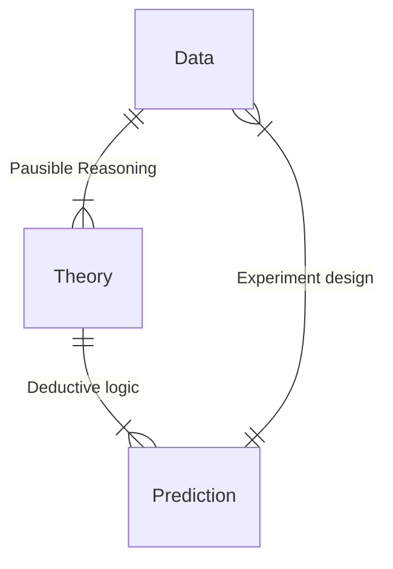

::: center

## 中高能核物理简介

:::

::: right

—— 施舒哲

:::

大家都认识的何教授就是这一个课题组的.

我们从元素周期表说起，在遥远的过去，人们猜想物质是由元素构成的，但是并没有什么检验手段，有些「玄学」的意味. 第一次工业革命后，我们有了更多的实验手段，那时 Avogadro 提出物质由分子构成，分子是保持化学成分的单元；Dalton 提出，分子可以分为原子，原子是化学反应的基本单元. 那时人们觉得这些就是最基本的粒子.

Mendeleev 发现了元素周期表，他发现原子也具有一定的组成规律，**各种原子的化学性质表现出来的规律揭示着它们也存在内部结构**. 后来人们发现，原子由质子、中子和电子组成.

第二次工业革命后，人们能够建造大型的粒子对撞机，发现很多和电子、质子、中子相似的基本粒子，比如 $\mu$ 子、$\tau$ 子等轻子；$\Sigma_+$ 等重子 (约 100 个)；$\pi$、$K$ 等介子 (数百个).

我们能够用质量、奇异荷 (在粒子反应中的新的一种守恒荷)、电荷三种指标作为三角形来排布那些重子.

这样的规律同样揭示了重子存在内部结构，我们引入 quark，每个 quark 有 flavour 和电荷量，三个 quark 组成一个表中的重子. 但是我们并没有看到自由的 quark，理论家们提出的解释是，quark 禁闭在粒子内，quark 的另一个内禀自由度 —— 颜色 (类似自旋的某种属性)，要求它们形成色单态，色多态的 quark 态是不存在的，它们互相排斥且能量发散. Quark 之间传递相互作用由胶子进行，胶子的作用被 Yang - Mills 场描述.

怎么验证？

1. 深度非弹性碰撞

   将两个原子核对撞，能量非常大，这对应一个很小的空间分辨率，能看到所谓的「部分子」.

2. 相对论重离子对撞

   形成 quark - gluon 等离子体.

相对论重离子碰撞中，我们只能探测到末态产生的那些粒子，而不能直接探测高温的等离子体. 因此需要理论预测某种等离子态的热力学性质，来推断末态各种粒子的产额：
$$
N\propto(2J+1)\int\frac{\text{d}^3\vec{p}}{e^{\displaystyle{\frac{\sqrt{m^2+p^2}}{T}}}\pm1}
$$
相对论流体力学：
$$
\partial_\mu T^{\mu\nu}=0\,,\quad T^{\mu\nu}=(\varepsilon+P+\Pi)u^\mu u^\nu-(P+\Pi)g^{\mu\nu}+\pi^{\mu\nu}
$$
这里，$\varepsilon$ 和 $P$ 都是热力学量，可以由第一性原理 QCD 计算得到；$\Pi$ 是非平衡项，$\pi^{\mu\nu}$ 是粘滞修正.

::: center

## Cosmology with Large-Scale Structures

:::

::: right

—— 赵成

:::

又是这个图，我已经看他放了三遍了：

当我们观测星空，会发现星空绕着北极星旋转，所以东西方的古人提出了类似的地心学说. 当人们观测到行星退行，日心说又逐渐占了主导. 我们的认知取决于我们看到了什么，而不是我们比古人更加聪明.

大爆炸理论：光子和重子会在膨胀过程中脱耦，那时候的光子形成了 CMB.

---

我突然发现 PPT 和天体物理前沿讲座的一模一样，所以不记笔记了.