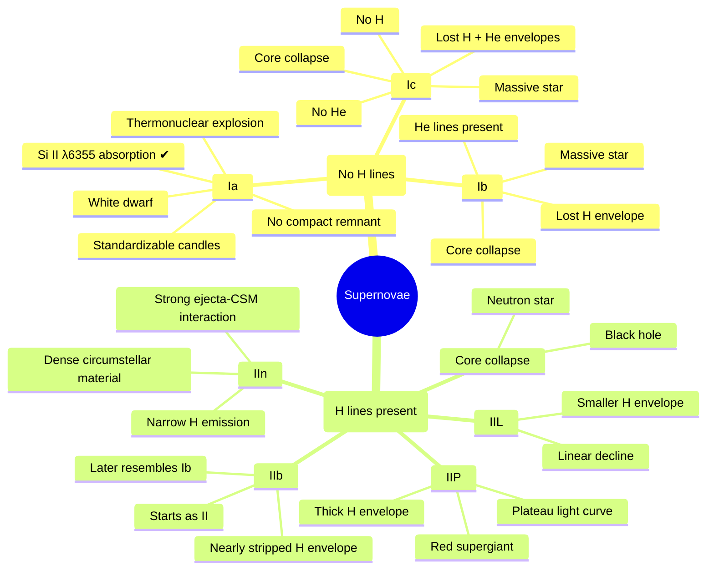

::: right

Prof. Chiaki Kobayashi, from the University of Hertfordshire

:::

::: danger

由于第一天不太适应加上听不太懂教授的发音，而且前半段试图用手写方式记录但是后来发现效率不够高，漏记错记想必数不胜数，本篇权当试水.

:::

### Wolf–Rayet Stars

Wolf–Rayet (WR) stars are evolved massive stars with extremely powerful stellar winds.

These winds strip away **most or all of the hydrogen envelope**, exposing helium-burning products beneath.

> Binary Evolution: Binary mass transfer can also remove the hydrogen envelope. Consequently, even stars with somewhat lower initial masses can become Wolf–Rayet stars.

## Supernova Classification



### Chemical Enrichment

($f_g$ 是气体分数)

$$
\frac{\mathrm{d}(Zf_g)}{\mathrm{d}t} = \underbrace{E_{\text{SW}}+E_{\text{SNcc}}+E_{\text{SNIa}}}_{\text{Metal ejection rates}}\underbrace{\underset{\text{decreased by star evolution}}{\underline{-Z\psi}}\underset{\text{inflow}}{\underline{+Z_{\text{inflow}}}}\underset{\text{outflow}}{\underline{-ZR_{\text{outflow}}}}}_{\text{Galaxy Evolution}}
$$

Initial Mass Function (IMF)：一般而言这是一个 power law，它是一个经验性的概率分布函数，描述恒星的质量分布. 一般而言它来源于恒星的光度分布，然后再用恒星演化模型来导出.

> Is IMF universal？

### Ejection rates from SWs and SNe

一颗星，初始质量 $m$，lifetime $\tau_m$，剩下的质量 $w_m$，在时刻 $(t-\tau_m)$ 出生、在时刻 $t$ 死亡. 终止质量 ($\tau_m=t$) 为 $m_t$.

$$
E=\int_{m_t}^{m_u}(1-w_m)\psi(t-\tau_m)\phi(m)\mathrm{d}m
$$

大于终止质量的星体是死掉的星体. SNe 由 nucleosynthesis yields (核合成产率) $p_{zm}$ 给出，

$$
E_{Z,\text{cc}} = \int_{m_t}^{m_u}p_{zm}\psi(t-\tau_m)\phi(m)\mathrm{d}m
$$

同理，SW 也是一样.

### Galactic terms

- Star formation rate: $\psi\propto f_g$
- Inflow rate: $R_{\text{in}}\propto e^{-t/\tau}$ or $te^{-t/\tau}$
- Outflow rate: $R_{\text{out}}\propto\psi$ (SN-driven) or $\psi=0$ for $t>t_w$ (AGN-driven)

## Numerical Solutions

这里有三种模型：

- Closed：封闭的状态
- Infall：系统不断吸收气体，气体向中心塌缩
- Outflow：气体塌缩的同时还存在 ejection，失去 metal

初始情况都是 $f_{g,0}=1$. 三种模型的演化曲线有很大的差异. 我们只讨论 one-zone model 情况下的结论，从观测数据来看，$[\text{O}/\text{Fe}]$ - $[\text{Fe}/\text{H}]$ 关系有一个开始时比较慢、之后比较快的下降，拟合最好的模型是 infall model.

### The Origin of Elements


> 这里 $\text{Be}$ 和 $\text{B}$ 不包含在模型内，因为它们很多来源于高能量宇宙射线的作用.

## NS-NS Merger Model

为了解释银河系内部的 r-process (也就是快中子捕获过程，被认为是产生一半以上重于铁的元素的过程)，有一种思路是双中子星并合事件. 但是仍然有很多争议.

::: collapse

- GPT's Explanation

  The **Neutron Star Merger (NSM)** model is currently the leading explanation for the production of the heaviest **r-process** elements (e.g. Au, Pt, Th, U), especially after the discovery of the kilonova associated with GW170817. However, it faces several challenges, and a number of alternative or complementary models have been proposed.

  A useful way to organize them is:

  ```text :no-line-numbers
  Origin of heavy r-process elements
  │
  ├── Neutron Star Mergers (standard model)
  │
  ├── Magnetorotational Supernovae
  │
  ├── Collapsars (Hypernovae)
  │
  ├── Electron-Capture Supernovae
  │
  ├── Neutrino-driven Winds
  │
  └── Exotic Models
      ├── Quark nova
      ├── Primordial black holes
      └── Others
  ```

  Below are the major competing models.

  ***

  _Magnetorotational Supernovae (Jet Supernovae)_

  The basic idea is a rapidly rotating massive star with an extremely strong magnetic field collapses.

  Instead of producing a roughly spherical explosion, rotation and magnetic fields launch bipolar relativistic jets.

  ```text :no-line-numbers
  Massive star
      ↓
  Core collapse
      ↓
  Rapid rotation
  + Strong magnetic field
      ↓
  Jet explosion
      ↓
  Neutron-rich ejecta
      ↓
  r-process
  ```

  > **Advantages**
  >
  > Very early in Galactic history. Unlike neutron star mergers, so no binary evolution and merger delay. Therefore they naturally explain extremely metal-poor stars and large star-to-star scatter in Eu abundances.

  > **Problems**
  >
  > Very rare.
  >
  > Requires rapid rotation and magnetic field. Both conditions are uncommon. Simulations still disagree about whether enough neutron-rich material is ejected.

  ***

  _Collapsars_

  Currently the strongest competitor. The basic idea is a very massive star $M\gtrsim25\sim30,M_\odot$ collapses directly into a black hole. An accretion disk forms.

  ```text :no-line-numbers
  Massive star
      ↓
  Black hole
      ↓
  Accretion disk
      ↓
  Disk wind
      ↓
  r-process
  ```

  This is closely related to
  - Hypernovae
  - Long Gamma-Ray Bursts (GRBs)

  > **Advantages**
  >
  > Produces enormous r-process mass. Typically $0.05-0.3,M_\odot$ per event, much larger than many core-collapse supernovae. Occurs immediately after star formation.
  >
  > Can explain
  >
  > - early Eu enrichment
  > - high [Eu/Fe]
  > - Galactic chemical evolution.

  > **Problems**
  >
  > Event rate is uncertain. Need enough collapsars without overproducing GRBs.

  ***

  _Neutrino-driven Winds_

  This was the "classical" model before neutron star mergers became popular.

  After core collapse,

  ```text :no-line-numbers
  Proto-neutron star
      ↓
  Neutrino heating
      ↓
  Neutrino wind
      ↓
  Heavy nuclei
  ```

  The idea was that neutrino winds become neutron rich.

  > **Problems**
  >
  > Modern simulations generally find $Y_e$ is too high.
  >
  > The ejecta become proton-rich rather than neutron-rich.
  >
  > Usually only produce Sr, Y, Zr instead of Au, Pt, U.
  >
  > Thus today they are thought to produce the **weak r-process**, not the main r-process.

  ***

  _Electron-Capture Supernovae (ECSNe)_

  Occurs in stars of roughly $8-10,M_\odot.$

  Core collapse begins when $e^-+{}^{24}\mathrm{Mg}$ or $e^-+{}^{20}\mathrm{Ne}$ captures reduce electron pressure.

  > **Advantages**
  >
  > More common than magnetorotational SNe.

  > **Problems**
  >
  > Ejecta are usually not neutron rich enough.

  Mostly produce light trans-iron elements rather than heavy r-process nuclei.

  ***

  _Quark Nova_

  Very speculative.

  Idea

  ```text :no-line-numbers
  Neutron star
      ↓
  Quark matter transition
      ↓
  Second explosion
      ↓
  Neutron-rich ejecta
  ```

  Could in principle create ideal r-process conditions.

  No convincing observational evidence exists.

  ***

  _Primordial Black Hole Scenarios_

  Another speculative idea. Tiny primordial black holes interact with neutron stars. This can eject neutron-rich matter.

  But current observational support is essentially absent.

  ***

  _Why was NSM challenged?_

  The biggest historical problem was **time delay**.

  Neutron star mergers require

  ```text :no-line-numbers
  Massive binary
      ↓
  Two supernovae
      ↓
  Binary inspiral
      ↓
  Merger
  ```

  The inspiral time may be $10^8-10^9\ \text{yr}.$

  However, very metal-poor stars $[\mathrm{Fe}/\mathrm{H}]<-3$ already contain Eu and Ba, indicating r-process enrichment almost immediately after star formation.

  This motivated prompt sources like magnetorotational supernovae or collapsars.

  Today, population synthesis and the discovery of fast-merging binaries suggest that **some neutron star mergers can occur within only a few to tens of Myr**, reducing (though not completely eliminating) this tension.

  ***

  _Current Consensus_

  Rather than a single source, most researchers now favor **multiple r-process sites**.

  ```text :no-line-numbers
  Heavy r-process
  │
  ├── Neutron star mergers
  │      ✔ Main contributor today
  │
  ├── Collapsars
  │      ✔ Possibly important in early galaxies
  │
  ├── Magnetorotational SNe
  │      ✔ Rare but prompt
  │
  └── Ordinary CCSNe
      ✔ Weak r-process only
  ```

  The main debate today is **not whether neutron star mergers produce r-process elements** —— GW170817 established that they do —— but **whether they are sufficient to explain all Galactic r-process enrichment**, especially in the earliest generations of stars. Many recent Galactic chemical evolution models therefore combine neutron star mergers with a prompt source, most commonly collapsars or magnetorotational supernovae, to reproduce both the abundance patterns and the observed evolution of Eu with metallicity.

:::

## Chemodynamics

对于一个 UV 背景辐射，考虑一团正在冷却的气体，星体形成条件为

- $\nabla\cdot\vec{v}<0$
- $t_{\text{cool}}<t_{\text{dyn}}$
- $t_{\text{dyn}}<t_{\text{sound}}$

有多个过程构成一个循环，进行元素的生成.

这里有好几种模拟方法：

- Direct summation —— $\mathcal{O}(N^2)$

$$
m_i\frac{\mathrm{d}^2x_i}{\mathrm{d}t^2}=\sum_{j\neq i}Gm_im_j\frac{x_j-x_i}{|x_j-x_i|^3}
$$

- 网格数值法
- ……
- SPH Method (Smoothed-particle hydrodynamics，平滑粒子流体力学)：处理大尺度的流体模拟比较有效，不需要建立一个网格来进行计算.

---

## Cosmological 'Zoom in' Simulation

展示了一个完整的星系形成过程：从最初的气体到形成 disk，最终的结构中能看到 thin disk 和中间的 bulge，以及 halo (通过卫星星系来体现).

## Inhomogenous Enrichment

The scatter of $[X/\text{Fe}]$ at given $[\text{Fe}/\text{H}]$ is increased / decreased by

1. 动力学效应导致的 star mixing
2. Local variation in flows
3. Stellar yields depend on M, Z, E rot. of stars (intrinsic variation, 固有的差异)
4. ISM may be mixed before the next star formation by other effects like diffusion / turbulence (涡流)

因此，不会存在 strong age-metallicity relation；另外，大多数 metal-poor stars 不是最老的那一批恒星.

> more explanation on「大多数 metal-poor stars 不是最老的那一批恒星」：
>
> 根据模拟的数据 (Age-Metallicity relation figure)，可以观察到这些恒星确实处于年龄较大的那一批恒星中，但是并不是最老的恒星.
>
> 我们说这个结论实际上是想纠正观测上的一些常识性的错误认知.


## Extra-Galactic Archaeology

这个领域 thanks to JWST，是一个非常新的领域.

具体的做法是，对整个星系做光谱，看吸收线. 但是难点在于 UV 的光谱本来就足够 faint，因此难以在地面上完成光谱观测，只能用空间望远镜.

……技术层面的东西……

### Mass-Metallicity Relation (MZR)

在红移比较高的情况下 (我们说这是 $z$ 在 $7\sim 11$ 左右)，JWST 给出了某种联系. 在之前的观测数据中，人们发现 mass, metallicity, SFR (Star Forming Rate) 三者构成的立体图中，星系基本处于一个曲面上.

## Cosmologic Simulation

其实和之前的化学动力学类似，仍然有这个过程：


> 这个过程在前面 Chemodynamics 那个部分也提到了.

这里唯一的区别在于这里多了一个 Black Hole 的效应.

## Reference

- [https://arxiv.org/abs/2506.20436](https://arxiv.org/abs/2506.20436)
- [https://arxiv.org/abs/2302.07255](https://arxiv.org/abs/2302.07255)
- [https://arxiv.org/pdf/1802.03353v1](https://arxiv.org/pdf/1802.03353v1)
- [https://arxiv.org/pdf/1012.5144](https://arxiv.org/pdf/1012.5144)
