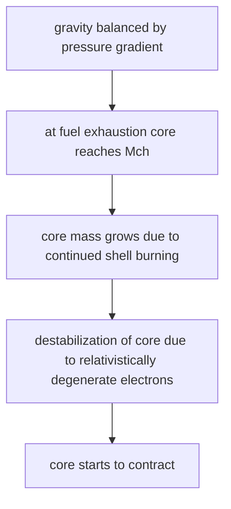

::: right

Prof. Friedrich Röpke, from Heidelberg University

:::

## Computational fluid dynamics

我们选择使用流体力学来进行模拟 —— 这件事有很多好处，比如它能够应用一些统计力学的基本规律，能够唯象解决部分问题，同时其采用的假设是「物质连续性假设」. 能够进行这种假设，需要满足如下条件：

1. $\ell\gg\ell_{\text{mfp}}$ (mean free path)：我们可以看作连续物质，研究宏观行为. 如果流体体元的尺度远大于平均自由程、又远小于问题尺度，那么我们就能够很好的定义密度分布和温度分布等等.
2. $\underset{N\to\infty}{\lim} E/N$ 有限 ($=\text{const.}$)，也就是仅有短程力.

对于大尺度的天文研究对象，第一个条件基本满足；但是因为引力起主导作用，因此第二个条件有很多问题.

Conservation laws：考虑一个广延量 $A$ 在体积 $V$ 中，仅有两种可能的改变 $A$ 的方式，
$$
\frac{\mathrm{d}A}{\mathrm{d}t} = \frac{\mathrm{d}_fA}{\mathrm{d}t}+\frac{\mathrm{d}_sA}{\mathrm{d}t}
$$
第一项是 flow，也就是流入流出对 $A$ 造成的变化；第二项是产生或者消耗. 定义 $A$ 的密度为 $a$，那么
$$
A=\int_Va\mathrm{d}V
$$
流密度 $j_a$ 和源密度 $s(a)$ 满足：
$$
\frac{\mathrm{d}_fA}{\mathrm{d}t}=-\int_{\partial V}\vec{j}_a\cdot\mathrm{d}\vec{S},\quad \frac{\mathrm{d}_sA}{\mathrm{d}t}=\int_Vs(a)\mathrm{d}V
$$
得到连续性定律：
$$
\frac{\mathrm{d}}{\mathrm{d}t}\int_Va\mathrm{d}V =-\int_{\partial V}\vec{j}_a\cdot\mathrm{d}\vec{S}+\int_Vs(a)\mathrm{d}V
$$
其微分形式是
$$
\frac{\partial a}{\partial t} = -\nabla\cdot\vec{j}_a+s(a)
$$
对质量、动量和能量写连续定律：
$$
\begin{aligned}
&\frac{\partial\rho}{\partial t}+\nabla\cdot(\rho\vec{v})=0\\\\
&\frac{\partial (\rho\vec{v})}{\partial t}+\nabla\cdot(\rho\vec{v}\otimes\vec{v})+\nabla P=\rho \vec{f}\\\\
&\frac{\partial (\rho e_{\text{tot}})}{\partial t} +\nabla\cdot(\rho e_{\text{tot}}\vec{v})+\nabla\cdot(P\vec{v})=\rho\vec{v}\cdot\vec{f},\quad e_{\text{tot}}=\frac{1}{2}|\vec{v}|^2+\frac{\epsilon}{\rho}
\end{aligned}
$$
这是流体力学的 Euler 表述. 这些方程并不完整，必须再引入物态方程.

对于非理想流体，更进一步有 Navier-Stokes 方程，把压强变为一个压强张量 $\Pi$：
$$
\Pi  =-P\mathbb{1}+\tau
$$
$\tau$ 是 viscous stress tensor，
$$
\tau\equiv\mu[\nabla\vec{v}+(\nabla\vec{v})^T]-\left(\frac{2}{3}\mu-\kappa\right)(\nabla\cdot\vec{v})\mathbb{1}
$$
湍流和层流的判据：Reynolds 数，
$$
\mathscr{Re} = \frac{\rho v^2/L}{\mu v/L^2} = \frac{\rho vL}{\mu}
$$
天文上，尺度一般非常巨大；但是黏度不高，基本都是气体. 所以会遇到 $10^{10}$ 以上的巨大 Reynolds 数. 这种情况下完全可以看作理想流体，用 Euler equations 来进行计算.

在电脑上，一般把微分方程转为差分进行计算，我们采用的方法一般叫作 finite volume methods (有限元方法)，用 $q_j^n$ 估计 $q$ 在一个区间 $C_j=[x_{j-1/2}, x_{j+1/2}]$ 上的平均值. 定义
$$
q_j^n\equiv\frac{1}{\Delta x}\int_{x_{j-1/2}}^{x_{j+1/2}}q(x,t^n)\mathrm{d}x=\frac{1}{\Delta x}\int_{C_j}q(x,t^n)\mathrm{d}x
$$
::: steps

1. 从连续性定律开始，
   $$
   \int_{C_j}q(x,t^{n+1})\mathrm{d}x-\int_{C_j}q(x,t^n)\mathrm{d}x=\int_{t^n}^{t^{n+1}}f[q(x_{j-1/2},t)]\mathrm{d}t-\int_{t^n}^{t^{n+1}}f[q(x_{j+1/2},t)]\mathrm{d}t
   $$
   (也就是 $C_j$ 区间上 $q$ 平均值在两个时间戳之间的变化，来源于这段时间内相邻两个区间对这个区间造成的影响)

2. Rearrange：
   $$
   \frac{1}{\Delta x}\int_{C_j}q(x,t^{n+1})\mathrm{d}x = \frac{1}{\Delta x}\int_{C_j}q(x,t^n)\mathrm{d}x+\frac{1}{\Delta x}\left\{\int_{t^n}^{t^{n+1}}f[q(x_{j-1/2},t)]\mathrm{d}t-\int_{t^n}^{t^{n+1}}f[q(x_{j+1/2},t)]\mathrm{d}t\right\}
   $$

3. 写成平均形式，
   $$
   q_j^{n+1}=q_j^n+\frac{\Delta t}{\Delta x}(f_{j-1/2}^n-f_{j+1/2}^n)
   $$

:::

上面这个叫作 Godunov's scheme，本质上是把原先连续的函数重构一次，变成每段区间上为一个常数的阶梯状函数.

## Modeling Stellar Hydrodynamics

对于星际物质，具有自引力，我们有 Poisson 方程来描述引力：
$$
\nabla^2\Phi = 4\pi G\rho
$$
另一个重要效应是核反应，它造成组元变化，
$$
\dot{Y}_i = \sum_jc_i^j\lambda_i^jY_j+\sum_{j,k}c_i^{j,k}\rho N_A\langle j, k\rangle Y_jY_k+\sum_{j,k,l}c_i^{j,k,l}\langle j,k,l\rangle Y_jY_kY_l
$$
这里的系数分别是
$$
c_i^j=N_i,\quad c_i^{j,k}=\frac{N_i}{\displaystyle{\prod_{m=1}^{n_m}|N_{jm}|!}},\quad c_i^{j,k,l}=\frac{N_i}{\displaystyle{\prod_{m=1}^{n_m}|N_{jm}|!}}
$$
对于每个 species，仍然有连续性，
$$
\frac{\partial(\rho X_i)}{\partial t} +\nabla\cdot(\rho X_i\vec{v})=\rho f_i
$$
核反应还有能量释放，会影响整体的能量方程.

考虑这些效应后，总的方程变为
$$
\begin{aligned}
\frac{\partial \rho}{\partial t}
+ \nabla \cdot (\rho \boldsymbol{v})
&= 0,
\\[6pt]
\frac{\partial (\rho \boldsymbol{v})}{\partial t}
+ \nabla \cdot
  \left(\rho \boldsymbol{v}\otimes\boldsymbol{v}\right)
+ \nabla P
&= -\rho \nabla \Phi,
\\[6pt]
\frac{\partial (\rho X_i)}{\partial t}
+ \nabla \cdot (\rho X_i\boldsymbol{v})
&=
-\nabla \cdot
  \left(\rho \boldsymbol{v}_i^{D}X_i\right)
+\rho f_i,
\qquad i=1,\ldots,N,
\\[6pt]
\frac{\partial (\rho e_{\mathrm{tot}})}{\partial t}
+ \nabla \cdot
  \left(\rho e_{\mathrm{tot}}\boldsymbol{v}\right)
+ \nabla \cdot (P\boldsymbol{v})
&=
-\rho \boldsymbol{v}\cdot\nabla\Phi
+\rho\sum_{i=1}^{N}
 X_i\boldsymbol{v}_i^{D}\cdot\boldsymbol{f}_i
-\nabla\cdot\boldsymbol{q}
+\rho S.
\end{aligned}
$$
维持流体平衡：小 Mach 数 (物体速度与介质声速之比) 的流会因为小的微扰而被激发，要维持流体在小扰动下的基本稳定并不是 trivial 的.

::: danger

这节精神恍惚了好多没记下来的.

:::

## Modeling Supernova Explosions and Nucleosynthesis

考虑一个超新星爆炸，其能量来源是引力，如果简单计算一个恒星塌缩为中子星产生的能量，
$$
E_g = -\frac{3}{5}\frac{GM^2}{R}\sim 10^{53}\text{ erg}
$$
足以将 $1M_\odot$ 的喷流加速到 $10^4$ km/s 的速度.

SNIa 的亮度有一部分来源于 $^{56}$Ni 的衰变链.

Chandrasekhar 极限：$M_{\text{Ch}}\sim 1.43(2Y_e)^2M_\odot$，其中 $Y_e\equiv Z/A$. 因此这里有两种方式达成这个极限，一种是简单的质量增加，另一种是减小 $Y_e$.

fate of massive stars depends on initial stellar mass：

- stars with $M\approx 7\sim 10 M_\odot$ form degenerate O-Ne cores $\rightarrow$ collapse by rapid electron capture $\rightarrow$ electron-capture SNe
- stars with $M \geqslant 10 M_\odot$ form Fe cores $\rightarrow$ collapse by nuclear photodisintegration $\rightarrow$ ordinary core-collapse SNe
- for higher masses: formation of black hole (quiescent, or very energetic as hypernova in case of rapid rotation)
- stars with $M \geqslant 100 M_\odot$ apporach gravitational instability before onset of O-burning $\rightarrow$ collapse by electron-positron pair formation $\rightarrow$ pair-instability SNe, or thermonuclear explosion

Electron-capture Supernovae (ECSNe)：由于大量的电子捕获，$Y_e$ 被减小，因此容易达到 Ch 极限；但是其具体机制仍然在研究中. 能量大多数由中微子携带离开.

Ordinary CCSNe：形成铁核，依靠质量累积达成爆炸.

主要爆炸流程：

main effects: photodissociation, efficient electron captures $\rightarrow$ runaway process.

---

为什么 SNIa 被认为是白矮星的爆炸？

* 它有特殊的谱线红移，$6150\,\AA$ 的谱线在喷流中出现，以 $10^4$ km/s 远离爆炸源，因此会有特征红移；
* 另外爆炸后很短时间就无法观测到，有的例子短于 $4$ h.

Combustion waves：一般处理作一个 sharp front，作为截断面，这种处理称为非连续性估计. 问题在于之前的理论从来没有包含过非连续性的解，因此这时候只能用积分形式的解法尝试求解.

在边界上，用跳变的边界条件：取中间值 (插值)，同时加入一项焓增量表达燃烧前后的物质能量变化. 出现跳变之后，模拟模型的压强随时间变化曲线变为一条斜率跳变的折线，更好地拟合原先的曲线.

Beyond 非连续性估计：我们用非连续性估计来体现燃烧前后的物态变化，这件事情有更深层的物理依据. 根据微观的 deflagration (爆燃) 模型，一个爆燃反应包含微观传输过程，从燃烧区传递到非燃烧区. 传导用的是简单的 Newton 定律，$\mathbf{q}=-\sigma\nabla T$. 在白矮星热爆炸的极端条件下，此过程能够看作非连续的.

## Practical Exercise

做了一个小的数据分析练习.