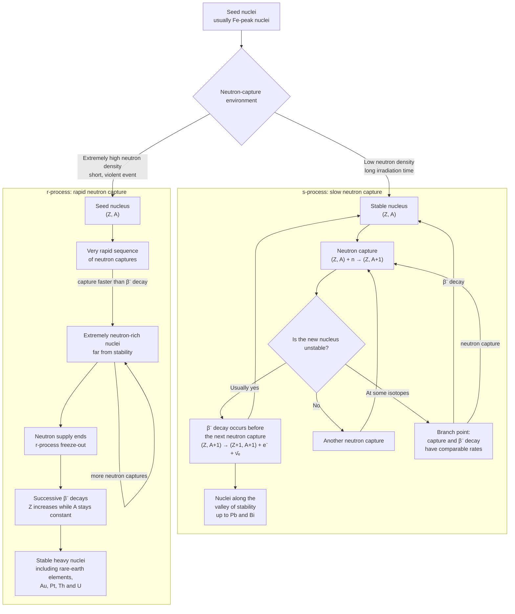

::: right

Prof. Marco Limongi, from University of Tokyo

:::

我们建立了 Stellar Model，这个历史上的模型仅仅是一维的，它包含了 $L$, $P$, $T$, $\rho$, 化学组分等等内容，用几个微分方程来尝试描述. 这个模型中所谓的 input physics 是物态方程以及 EoS、opacity 和 nuclear reaction rates，这些条件和边界条件结合在一起才能够解出整个模型，然后进行 stellar evolution 的模拟.

> 很多都是 [恒星与行星](/star-planet/) 的内容，比如 $\nabla_{\text{ad}}$ 和 $\nabla_{\text{rad}}$ 等等.

比较普通的情况是流体平衡，
$$
\frac{\partial P}{\partial m}=-\frac{GM}{4\pi r^4}
$$
另外用理想气体物态方程，$T^3\sim M^2\rho$.

在能量方面，位力定理和能量守恒共同作用给出能量关系.
$$
\left.\begin{aligned}
&\zeta E_i+E_g=0,\quad \zeta=3(\gamma-1)>1\\\\
&L+\frac{\partial W}{\partial t}=0
\end{aligned}\right\}
$$
现实的模拟和上述 $T\propto M^{2/3}\rho^{1/3}$ 相差不远. 但是我们从现实的模拟中可以发现一个事实，小质量恒星在生命的末期，其核会进入简并的状态，而大质量的恒星则可能永远无法进入简并状态，而是不断进入下一个阶段，进行新的核反应. 从这个意义上，我们定义「大质量恒星」：它们是那些能够经历所有主要核反应阶段 (也就是 H, He, C, Ne, O, Si 的燃烧阶段) 的那些恒星.

**He burning**：主要反应是
$$
^4\text{He}(2\alpha,\gamma){}^{12}\text{C}(\alpha,\gamma){}^{16}\text{O}
$$
其产物是 $^{12}$C 和 $^{16}$O，这两者能够在产物中平衡. 存在二级反应：
$$
\underbrace{^{14}\text{N}(\alpha,\gamma){}^{18}\text{F}(\beta^+,\nu){}^{18}\text{O}(\alpha,\gamma){}^{22}\text{Ne}}_{T\lesssim250\text{ MK}}\underset{T\gtrsim 300\text{ MK}}{\underline{(\alpha,n){}^{25}\text{Mg}}}
$$
这里提供了中子. 因此作为一个中子源反应，它能够推动两种中子捕获过程.

---

**C burning**：主要反应是
$$
\begin{aligned}
&^{12}\text{C}(^{12}\text{C},\alpha){}^{20}\text{Ne}(\alpha,\gamma){}^{24}\text{Mg}\\\\
&^{12}\text{C}(^{12}\text{C},p){}^{23}\text{Na}\left\{\begin{aligned}
&(p,\alpha){}^{20}\text{Ne}\\\\
&(p,\gamma){}^{24}\text{Mg}\\\\
&(\alpha,p){}^{26}\text{Mg}
\end{aligned}\right.
\end{aligned}
$$
$^{22}$Ne 可以经过一个 s-process 合成 $^{25}$Mg，下一步形成 $^{27}$Al. 因此 C 燃烧的主产物是 $^{20}$Ne, $^{23}$Na, $^{24}$Mg, $^{27}$Al，而同时还产生副产物 $^{25}$Mg, $^{26}$Mg 以及 s-process.

---

**Ne Burning**：主产物为 $^{16}$O, $^{24}$Mg, $^{28}$Si；副产物为磷等.

**O Burning**：主产物是硅、硫和氩；副产物有氯、氩和钾.

另一个现象是细致平衡，也就是对于 $i(k,l)j$ 和 $j(l,k)i$，存在 $r_{ij}=r_{ji}$.

定义一个描述平衡状态的量：
$$
\varphi(i,j) = \frac{|r_{ik}-r_{jl}|}{\max(r_{ik}-r_{jl})}
$$
这个量越接近 $1$，就越不平衡；反之，接近 $0$ 表示完全平衡. 可以用这个量标识所有的可能反应，在 Si burning 的开始阶段，两个同位素表上的 quasi-equilibrium clusters 合并为同一个大的 cluster，包含 $A\geqslant 24$ 以上的同位素. 用 Saha 方程和 Maxwell 分布能够写出下面的同位素分布式：
$$
\begin{aligned}
Y(N,Z)
={}&
(\rho N_A)^{\delta_\alpha+\delta_p+\delta_n}
\frac{\omega_{N,Z}}{\omega_{{}^{28}\mathrm{Si}}}
\,2^{-\delta_p+\delta_n}
\left[
\frac{A_{N,Z}}
{A_{{}^{28}\mathrm{Si}}A_\alpha^{\delta_\alpha}}
\right]^{3/2}
\\[4pt]
&\times
\left(
\frac{m_H kT}{2\pi\hbar^2}
\right)^{-\frac{3}{2}
(\delta_\alpha+\delta_p+\delta_n)}
\exp\left(\frac{Q(N,Z)}{kT}\right)
Y({}^{28}\mathrm{Si})
Y_\alpha^{\delta_\alpha}
Y_p^{\delta_p}
Y_n^{\delta_n}.
\end{aligned}
$$
很明显这东西极度复杂.

在 Si burning 之后的最后一个阶段是所谓的 NSE 阶段，也就是 Nuclear Statistical Equilibrium 阶段.

::: window img no-padding

:::

* Central burning $\longrightarrow$ formation of a convective zone
* Central exhaustion $\longrightarrow$ shell burning $\longrightarrow$ convective shell
* Local exhaustion $\longrightarrow$ shell burning shifts outward in mass $\longrightarrow$ convective shell

最终爆炸阶段，Fe 核开始不稳定，向中心坍缩到一个非常高的密度，然后反弹，这造成一个冲击波，推动整颗星体爆炸.

爆炸时核反应仍然在发生，但是反应速度很快，对于 explosive burning，

* Si burning：$T\gtrsim4\times 10^9$ K
* O burning：$T\gtrsim 3.3\times10^9$ K
* Ne burning：$T\gtrsim2.1\times10^9$ K
* C burning：$T\gtrsim 1.9\times10^9$ K

在不同的温度区间内，爆炸能在秒量级的时间内形成 equilibrium clusters.

---

定义产率为 $Y_i/Y_i^{\text{ini}}$，也就是损失总质量和初态质量之比，在上面作用一个 IMF (我们在之前的 lecture 中讲过，这是 initial mass function, 它是一个经验性的概率分布函数，描述恒星的质量分布. 一般而言它来源于恒星的光度分布，然后再用恒星演化模型来导出)，这样就能得到一个总产率分布.

---

星体旋转会造成额外的 instabilities，在这些情况中需要用更复杂的模型进行处理.

## Practical Exercise

老师直接发了一个虚拟机，封装了编译好的二进制文件 FRANEC.

两个配置文件：

* `network`：里面写好了不同 burning 阶段的可能反应.
* `mosta.par`：最后一个数字表示 mass，可以更改；第一行最后一个 $0$ 改为 $1$ 可以激活对于 rotation 的模拟；第二行最后一个数字是某种步长.

当然，这里仅提供 solar metallicity 的模拟，修改 metallicity 要修改多个文件，不建议执行.

::: tip

Marco 似乎在 `cons` 文件里塞了一个彩蛋，是一首意大利语诗歌.

:::