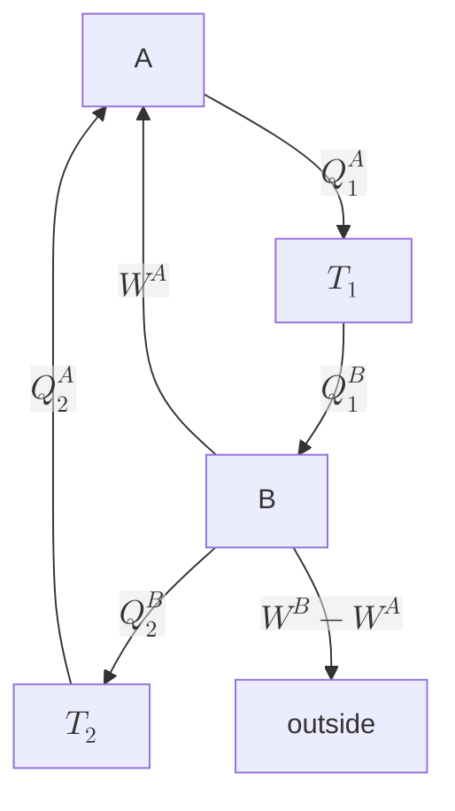

今天我们学热力学第一和第二定律.

首先我们需要简介一下什么是准静态过程. 准静态过程指的是每一个瞬时，状态无限接近平衡态的一种过程；这个过程需要相对弛豫时间而言足够慢. 同时，准静态过程是可逆的，不能是自发的过程.

## 热力学第一定律

热力学第一定律说的是能量的转换. 区别于其他的研究领域所说的「能量守恒」，热力学将能量分成系统的内能 $U$ 和整体运动的能量，其中前者不产生宏观运动；同时将能量交换分为两种，分为功 $W$ (粒子的有序运动，与过程相联系，不是态函数) 和热量 (非功) $Q$ (粒子的无序运动).

准静态过程的功：

> 对于静流体系统，$\mathrm{d}\kern{-4.3pt}\bar{\small\phantom{q}}\kern{-0.7pt}w=pA\text{d}x = -p\text{d}V$.
>
> 对于表面系统，$\mathrm{d}\kern{-4.3pt}\bar{\small\phantom{q}}\kern{-0.7pt}w = \sigma\text{d}A = \textcolor{red}{2}\sigma l\text{d}x$.
>
> 电介质，$\mathrm{d}\kern{-4.3pt}\bar{\small\phantom{q}}\kern{-0.7pt}w = E\text{d}P$.
>
> 磁介质，$\mathrm{d}\kern{-4.3pt}\bar{\small\phantom{q}}\kern{-0.7pt}w = B\text{d}M = \mu_0H\text{d}M$.
>
> 一般而言，准静态过程的功的一般形式是
> $$
> \mathrm{d}\kern{-4.3pt}\bar{\small\phantom{q}}\kern{-0.7pt}w = \sum_iY_i\text{d}y_i
> $$
> 其中 $Y_i$ 是广义力，$y_i$ 是广义坐标.
>
> ::: warning
>
> 我们用 $\mathrm{d}\kern{-4.3pt}\bar{\small\phantom{q}}\kern{-0.7pt}$ 来表达和过程有关的量的微元，但是在前端很难直接打出来这个符号. 理论上在 $\LaTeX$ 中调用宏包 `\usepackage[T1]{fontenc}` 之后可以在文本环境中用 `\dj` (或者公式环境中 `\text{\dj}`) 打出此符号，不过前端并不能调用宏包，所以我在上面用的是 `\mathrm{d}\kern{-4.3pt}\bar{\small\phantom{q}}\kern{-0.7pt}` 来获得此符号，感谢知乎的网友.
>
> 为了方便，我在之后的笔记中不会用这个符号，而是直接用 $\text{d}$.
>
> :::

热力学第一定律的发现历经很长时间：最开始是 Mayer (一名医生) 于 1842 年在观察水手的进食情况之后提出能量守恒和转化的基本思想，由 Helmholtz 经过多方论证将这个思想验证，由 Joule 经过实验研究，把热、机械和电等能量的单位统一起来. 接下来 Clausius 写出了定律的数学形式，Thomson 将能量分为动能和势能.

/Theorem/ (热力学第一定律)

> 对于封闭系统，
> $$
> \text{d}U = \text{d}w + \text{d}Q
> $$
> 对于开放系统，
> $$
> \text{d}U = \text{d}w+\text{d}Q + \underset{\text{chemical potential}}{\sum_i\textcolor{red}{\mu_i}\text{d}N_i}
> $$

热容量：定义为
$$
C = \lim_{\Delta T\to0}\frac{\Delta Q}{\Delta T}
$$
是一个过程相关的量，比如等温过程热容量是 $\infty$，绝热过程热容量是 $0$. 一般讨论定容热容和定压热容，以静流体系统为例，
$$
C_V = \lim_{\Delta T\to0}\left(\frac{\Delta Q}{\Delta T}\right)_V = \left(\frac{\partial U}{\partial T}\right)_V,\quad C_p = \lim_{\Delta T\to0}\left(\frac{\Delta Q}{\Delta T}\right)_p = \left(\frac{\partial H}{\partial T}\right)_p
$$
其中焓 $H$ 定义为
$$
(\Delta Q)_p = (U_f-U_i)-\Delta W_p = H_f-H_i\Longrightarrow H = U+pV
$$
很明显，在正常情况下 $C_p>C_V$. 同时对于所有的单项功系统的准静态过程，我们都可以类似地讨论热容.

以理想气体作为特例，$U = \displaystyle{\frac{3}{2}nRT}$，$pV=nRT$，计算得
$$
C_V = \frac{3}{2}nR,\quad C_p = C_V+nR = \frac{5}{2}nR
$$
定义 $\gamma=C_p/C_V$ (因为可能有单原子气体或者多原子气体，它们热容的系数有些差别，但是我们定义 $\gamma$ 后可以统一表述)，则表达为
$$
C_V = \frac{nR}{\gamma-1},\quad C_p = \frac{\gamma nR}{\gamma-1}
$$
我们知道，并没有直接的方式测量内能，我们需要逐项计算内能的各个部分，为了将内能表达为可测量量的表达式，我们需要计算「内能标准全微分式」(我想这就是能态方程？).
$$
\text{d}U(T,V) = \left(\frac{\partial U}{\partial T}\right)_V\text{d}T+\left(\frac{\partial U}{\partial V}\right)_T\text{d}V
$$
第一项的系数就是 $c_V$. 对于第二项：
$$
\begin{aligned}
c_p &= \left(\frac{\text{d}Q}{\text{d}T}\right)_p = \left(\frac{\text{d}U+p\text{d}V}{\text{d}T}\right)_p\\\\
&= p\left(\frac{\partial V}{\partial T}\right)_p+c_V+\left(\frac{\partial U}{\partial V}\right)_T\left(\frac{\partial V}{\partial T}\right)_p\\\\
\Longrightarrow \left(\frac{\partial U}{\partial V}\right)_T&= (c_p-c_V)\left(\frac{\partial T}{\partial V}\right)_p-p\\\\
\Longrightarrow\text{d}U(T,V) &= c_V\text{d}T+\left[(c_p-c_V)\left(\frac{\partial T}{\partial V}\right)_p-p\right]\text{d}V
\end{aligned}
$$
针对理想气体，这个内能只和温度有关.

## 热力学第二定律

1824 年，由 Carnot 提出 Carnot 循环.

> 因为 Carnot 在 36 岁时就因为瘟疫去世，其手稿因防疫要求被烧毁，所以我们其实无从得知 Carnot 的很多思想.

1850 年 Clausius 发表第二定律；1851 年 Thomson 明确了第二定律的表述形式，他声称自己是 1850 年完成的此项工作. 又过了十几年，1865 年 Clausius 提出了熵的概念. 到这个时候就有热寂的说法，当然我们现在已经知道宇宙的结局不会是热寂.

热力学第二定律表现了过程的方向性.

/Theorem/ (热力学第二定律)

> Clausius 表述：不可能把热量从低温物体传到高温物体而不引起其他变化.
>
> Kelvin 表述：不可能从单一热源吸热使之完全变成有用功而不引起其他变化.

也就是第二类永动机不存在.

::: tip

Feynman 棘轮类的永动机：棘轮或者卡扣，或者弹簧门这些机构，都有弹性势能，这里的阻尼会放热，导致不能实现永动.

:::

Maxwell's Demon：Demon 需要储存信息，它的记忆会有多余的熵 (信息熵)，对应 1 bit 信息熵增 $k_BT\ln2$，删除这段记忆会产生能量消耗.

/Theorem/ (Carnot 定理)

> 在相同高、低温热源之间工作的热机，以可逆机的效率最高. 最高效率
> $$
> \eta = 1-\frac{Q_2}{Q_1} = 1-\frac{T_2}{T_1}
> $$
> Carnot 循环由两个绝热过程和两个等温过程构成.

为证明，利用可逆机的性质，用一个可逆机 A 和一个任意机 B，假设 Carnot 定理是错的，那么反向运行 A，B 的做功 $W^B$ 更大，用 B 驱动 A (已经设定 $Q_1^A = Q_1^B$). 如图：

这等价于直接从单一热源吸热对外做功，这是违反热力学第二定律的. 这就证明了 Carnot 定理.